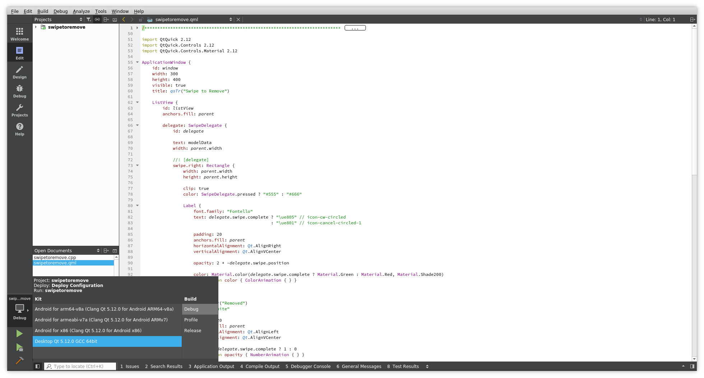

==============
Qt for Android
==============

.. sectionauthor:: `e8johan <https://github.com/e8johan>`_

.. github:: ch107

.. note::

    Last Build: |today|

    The source code for this chapter can be found in the `assets folder <../../assets>`_.

One of the biggest strenghts of Qt is the ability to develop cross platform applications. This means that the same code base can be deployed to a number of platforms including the major desktop platforms, the major mobile platforms, and custom embedded Linux devices.

In this chapter we will look at how you can use QML to build Android applications. This includes who to work with various form factors, as well as peculiarities of Android development.

Setting up the Environment
--------------------------

The Android platform moves quickly, so the exact installation procedures are updated far to often to keep track of in this text. However, from a Qt perspective, what is interesting is the integration into Qt world. This is handled from Qt Creator.

Installing the Tools
====================

Start Qt Creator and navigate to *Tools* -> *Options* in the menus, then select the *Devices* section and the *Android* tab. This brings you to the dialog shown below.

    The Android tab of the Devices section in the Options dialog.
    
The dialog can be used as a guide, where each section needs to be satisfied from the top down. Details of this process are described in the Qt documentation as well under the topic `Getting Started with Qt for Android <http://doc.qt.io/qt-5/androidgs.html>`_. Looking at the dialog, the first task of the day is to install and locate the JDK. It is possible to use the Java SE Development Kit or OpenJDK, as explained in the Qt documentation.

.. note:: For Debian Linux on 64-bits Intel architecture, install the package ``openjdk-8-jdk-headless`` and all its dependencies. Then point Qt Creator to the ``/usr/lib/jvm/java-1.8.0-openjdk-amd64`` directory.

When the JDK has been properly installed and located, the dialog will show this in the status box under the *JDK Location* field. This is shown in the dialog below.

    The JDK has been properly installed.
    
The next step is to install and locate the Android SDK. Clicking the button with the green arrow next to the *Browse* button will open a web browser on the correct download page. On the web site, the default choise is to download Android Studio, an Android specific complete integrated development environment. As we plan to use Qt Creator, you can save some disk space by selecting *Download Options* and then downloading the *Command line tools only* option. This gives you a zip-file that you can extract to a location of your choice.

When installed, point Qt Creator to the directory in which you extracted the SDK. The top level directory inside the SDK is ``tools``, so Qt Creator should be pointed to the directory *containing* the ``tools`` directory and not to the ``tools`` directory itself.

Repeat the same process for the Android NDK. Use the button with the green arrow to find the download page. Then download the latest stable NDK. This consists of another zip-file. This time, point Qt Creator to the top level directory in the zip-file, e.g. ``android-ndk-r18b``.

The result of this is a partially completed Android checklist as shown below.

    The Android SDK and NDK installed.

The Qt documentation tells you to "*...update the Android SDK by installing the API and build tools packages required for development.*" To do so, you must open a command line prompt in your ``tools/bin`` directory from the Android SDK. From there, use the ``sdkmanager`` to install the *platform* and *build tools*. You can list the available packages using the ``sdkmanager``::

    ./sdkmanager --list

From the list, pick the platform for the android API level you want to develop for and the associated build tools. The API level defines what APIs are available to you, but also what Android versions your application can work on. The `API Levels <https://developer.android.com/guide/topics/manifest/uses-sdk-element#ApiLevels>`_ table from the Android documentation shows this in detail.

In my case, I choose to target API level 28, meaning that I run the following commands to install the required platform and build tools::

    ./sdkmanager "platforms;android-28"
    ./sdkmanager "build-tools;28.0.3"

Now open the *Options* dialog again (if it is already open, close it and open it again). This will result in the following prompt. If the prompt does not appear, simply change the Android SDK path and you will see it.

    Qt Creator offering to help with the installation.

Clicking *Yes* causes Qt Creator to start installing the missing parts. The tricky part here is that this requires the user, i.e. you, to accept the licenses from Android. This is shown further down in the dialog, so unless you have a really large screen, you need to know that you have to scroll down to be able to read the license test and approve it. This is shown below.

.. note:: It is important not to close the *Options* dialog during the installation process.

    Approving the Android licenses further down in the dialog.

Having completed the installation, you will have the relevant Android toolchains setup and ready to be used. You can use the *SDK Manager* tab in the dialog to install more parts of the SDK.

Creating Virtual Devices
========================

Having setup the platform and build tools, we need to have a target. You can of course develop against a physical device, but it is much more convenient to develop against a virtual device until the application is ready for testing on a physical device. To do this you need a system image, and then you can create a virtual device.

To install a system image, use the *SDK Manager* tab and expand the android version that you just installed the tools for. If you followed the example above, this means ``android-28``. Now select the *Intel x86 Atom System Image* or *Google Play Intel x86 Atom System Image* (or both). The difference is if the `Google Play Services <https://developers.google.com/android/guides/overview>`_ are included or not. Now click on the *Apply* button to the right of the list and follow the on-screen instructions to install the image.

    Installing an x86 system image.

When the system image has been installed it is time to create a virtual devices. Switch to the *AVD Manager* tab and click the *Add...* button. This takes you to the *Create new AVD* dialog shows below. Here, select the correct ABI (``x86``), the correct target API (``android-28``), and specify a size for the SD card size. Then click *Ok* and the device is created.

.. note::

    If you want to create the device outside of Qt Creator you can do so from the command line using the ``avdmanager`` tool. The following command creates the image described above, based on the *Google Play Intel x86 Atom System Image* system image::

        ./avdmanager -v create avd --sdcard 1024M --name "Testdevice" --device pixel --package "system-images;android-28;google_apis_playstore;x86"
    
    The Qt Creator AVD manager reflects the system wide set of virtual devices, so this device can be found via Qt Creator, and the devices created there can be administred using ``avdmanager``.

Testing the Environment
=======================

When the tools and virtual devices have been installed and setup, we should be able to build a program and deploy it to the virtual device. For this, we start from the examples available from the welcome screen of Qt Creator. I choose the *Qt Quick Controls 2 - Swipe to Remove* example. When configuring the example project, make sure to check the relevant android targets as shown in the figure below.

    Configuring a project for android development.
    
This will allow you switch between the projects by clicking the target selection button just over the run button in the lower left corner of Qt Creator.

    Selecting which target to build for and deploy to.
    
As we created a virtual device for an x86 ABI, select the Android x86 target and click build. The first time you build an Android application it will download a few dependencies. This only happens on the first build, so expect a lot quicker build times for subsequent builds.

Having built he program you can click run. This will pop up a dialog allowing you to select which device to use. Select the virtual device you just created and click run. This will start the application in the emulator shown below.

    The android emulator running the Qt Quick Controls 2 example.
    
