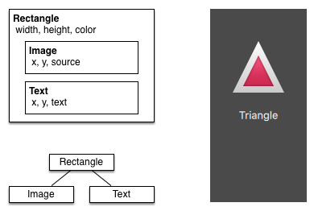
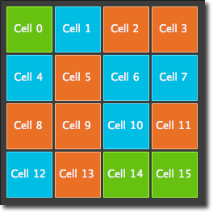

=============
Quick Starter
=============

.. sectionauthor:: `jryannel@LinkedIn <https://www.linkedin.com/in/jryannel>`_

.. github:: ch04

.. note::

    Last Build: |today|

    The source code for this chapter can be found in the `assets folder <../assets>`_.

This chapter provides an overview of QML, the declarative user interface language used in Qt 5. We will discuss the QML syntax, which is a tree of elements, followed by an overview of the most important basic elements. Later we will briefly look at how to create our own elements, called components and how to transform elements using property manipulations. Towards the end, we will look at how to arrange elements together in a layout and finally have a look at elements where the user can provide input.

QML Syntax
==========

.. issues:: ch04

.. index:: qmlscene, properties, scripting, binding, syntax

QML is a declarative language used to describe the user interface of your application. It breaks down the user interface into smaller elements, which can be combined into components. QML describes the look and the behavior of these user interface elements. This user interface description can be enriched with JavaScript code to provide simple but also more complex logic. In this perspective, it follows the HTML-JavaScript pattern but QML is designed from the ground up to describe user interfaces, not text-documents.

In its simplest way, QML is a hierarchy of elements. Child elements inherit the coordinate system from the parent. An ``x,y`` coordinate is always relative to the parent.

Let's start with a simple example of a QML file to explain the different syntax.

.. literalinclude:: src/concepts/RectangleExample.qml
    :start-after: M1>>
    :end-before: <<M1

* The ``import`` statement imports a module in a specific version.
* Comments can be made using ``//`` for single line comments or ``/* */`` for multi-line comments. Just like in C/C++ and JavaScript
* Every QML file needs to have exactly one root element, like HTML
* An element is declared by its type followed by ``{ }``
* Elements can have properties, they are in the form `` name: value``
* Arbitrary elements inside a QML document can be accessed by using their ``id`` (an unquoted identifier)
* Elements can be nested, meaning a parent element can have child elements. The parent element can be accessed using the ``parent`` keyword

The ``import`` statement you import a specific version of a module. For the QML modules that comes with Qt the version is linked to the Qt version you intend to use. The lower the version number, the earlier Qt version can be used. The minor version of the ``import`` statement matches the minor version of the Qt release, so Qt 5.11 corresponds to ``QtQuick`` 2.11, Qt 5.12 to ``QtQuick`` 2.12 and so on. Prior to Qt 5.11, the QML modules shipped with Qt had their own versioning sequences, meaning that ``QtQuick`` followed the Qt versions, while ``QtQuick.Controls`` started with version 2.0 at Qt 5.7 and was at version 2.4 by Qt 5.11.

.. tip::

    Often you want to access a particular element by id or a parent element using the ``parent`` keyword. So it's good practice to name your root element "root" using ``id: root``. Then you don't have to think about how the root element is named in your QML document.

.. hint::

    You can run the example using the Qt Quick runtime from the command line from your OS like this::

        $ $QTDIR/bin/qmlscene RectangleExample.qml

    Where you need to replace the *$QTDIR* to the path to your Qt installation. The *qmlscene* executable initializes the Qt Quick runtime and interprets the provided QML file.

    In Qt Creator, you can open the corresponding project file and run the document ``RectangleExample.qml``.

Properties
----------

.. issues:: ch04

Elements are declared by using their element name but are defined by using their properties or by creating custom properties. A property is a simple key-value pair, e.g. ``width : 100``, ``text: 'Greetings'``, ``color: '#FF0000'``. A property has a well-defined type and can have an initial value.

.. literalinclude:: src/concepts/PropertiesExample.qml
    :start-after: M1>>
    :end-before: <<M1

Let's go through the different features of properties:

(1) ``id`` is a very special property-like value, it is used to reference elements inside a QML file (called "document" in QML). The ``id`` is not a string type but rather an identifier and part of the QML syntax. An ``id`` needs to be unique inside a document and it can't be reset to a different value, nor may it be queried. (It behaves much like a reference in the C++ world.)

(2) A property can be set to a value, depending on its type. If no value is given for a property, an initial value will be chosen. You need to consult the documentation of the particular element for more information about the initial value of a property.

(3) A property can depend on one or many other properties. This is called *binding*. A bound property is updated when its dependent properties change. It works like a contract, in this case, the ``height`` should always be two times the ``width``.

(4) Adding own properties to an element is done using the ``property`` qualifier followed by the type, the name and the optional initial value (``property <type> <name> : <value>``). If no initial value is given a system initial value is chosen.

    .. note:: You can also declare one property to be the default property if no property name is given by prepending the property declaration with the ``default`` keyword. This is used for example when you add child elements, the child elements are added automatically to the default property ``children`` of type list if they are visible elements.

(5) Another important way of declaring properties is using the ``alias`` keyword (``property alias <name>: <reference>``). The ``alias`` keyword allows us to forward a property of an object or an object itself from within the type to an outer scope. We will use this technique later when defining components to export the inner properties or element ids to the root level. A property alias does not need a type, it uses the type of the referenced property or object.

(6) The ``text`` property depends on the custom property ``times`` of type int. The ``int`` based value is automatically converted to a ``string`` type. The expression itself is another example of binding and results in the text being updated every time the ``times`` property changes.

(7) Some properties are grouped properties. This feature is used when a property is more structured and related properties should be grouped together. Another way of writing grouped properties is ``font { family: "Ubuntu"; pixelSize: 24 }``.

(8) Some properties are attached to the element itself. This is done for global relevant elements which appear only once in the application (e.g. keyboard input). The writing is ``<Element>.<property>: <value>``.

(9) For every property, you can provide a signal handler. This handler is called after the property changes. For example, here we want to be notified whenever the height changes and use the built-in console to log a message to the system.

.. warning:: An element id should only be used to reference elements inside your document (e.g. the current file). QML provides a mechanism called dynamic-scoping where later loaded documents overwrite the element id's from earlier loaded documents. This makes it possible to reference element id's from earlier loaded documents if they are not yet overwritten. It's like creating global variables. Unfortunately, this frequently leads to really bad code in practice, where the program depends on the order of execution. Unfortunately, this can't be turned off. Please only use this with care or even better don't use this mechanism at all. It's better to export the element you want to provide to the outside world using properties on the root element of your document.

Scripting
---------

.. issues:: ch04

QML and JavaScript (also known as ECMAScript) are best friends. In the *JavaScript* chapter we will go into more detail on this symbiosis. Currently, we just want to make you aware of this relationship.

.. literalinclude:: src/concepts/ScriptingExample.qml
    :start-after: M1>>
    :end-before: <<M1

(1) The text changed handler ``onTextChanged`` prints the current text every-time the text changed due to a space-bar key pressed

(2) When the text element receives the space-bar key (because the user pressed the space-bar on the keyboard) we call a JavaScript function ``increment()``.

(3) Definition of a JavaScript function in the form of ``function <name>(<parameters>) { ... }``, which increments our counter ``spacePressed``. Every time ``spacePressed`` is incremented, bound properties will also be updated.

.. note::

    The difference between the QML ``:`` (binding) and the JavaScript ``=`` (assignment) is, that the binding is a contract and keeps true over the lifetime of the binding, whereas the JavaScript assignment (``=``) is a one time value assignment.
    The lifetime of a binding ends, when a new binding is set to the property or even when a JavaScript value is assigned is to the property. For example, a key handler setting the text property to an empty string would destroy our increment display::

        Keys.onEscapePressed: {
            label.text = ''
        }

    After pressing escape, pressing the space-bar will not update the display anymore as the previous binding of the ``text`` property (*text: "Space pressed: " + spacePresses + " times"*) was destroyed.

    When you have conflicting strategies to change a property as in this case (text updated by a change to a property increment via a binding and text cleared by a JavaScript assignment) then you can't use bindings! You need to use assignment on both property change paths as the binding will be destroyed by the assignment (broken contract!).

Basic Elements
==============

.. issues:: ch04

.. index:: Item, Rectangle, Text, MouseArea, Image, gradients

Elements can be grouped into visual and non-visual elements. A visual element (like the ``Rectangle``) has a geometry and normally presents an area on the screen. A non-visual element (like a ``Timer``) provides general functionality, normally used to manipulate the visual elements.

Currently, we will focus on the fundamental visual elements, such as ``Item``, ``Rectangle``, ``Text``, ``Image`` and ``MouseArea``. However, by using the Qt Quick Controls 2 module, it is possible to create user interfaces built from standard platform components such as buttons, labels and sliders.

Item Element
------------

.. issues:: ch04

``Item`` is the base element for all visual elements as such all other visual elements inherits from ``Item``. It doesn't paint anything by itself but defines all properties which are common across all visual elements:

.. list-table::
    :widths: 20,80
    :header-rows: 1

    *   - Group
        - Properties
    *   - Geometry
        - ``x`` and ``y`` to define the top-left position, ``width`` and ``height`` for the expansion of the element and also the ``z`` stacking order to lift elements up or down from their natural ordering
    *   - Layout handling
        - ``anchors`` (left, right, top, bottom, vertical and horizontal center) to position elements relative to other elements with their ``margins``
    *   - Key handling
        - attached ``Key`` and ``KeyNavigation`` properties to control key handling and the input ``focus`` property to enable key handling in the first place
    *   - Transformation
        - ``scale`` and ``rotate`` transformation and the generic ``transform`` property list for *x,y,z* transformation and their ``transformOrigin`` point
    *   - Visual
        - ``opacity`` to control transparency, ``visible`` to show/hide elements, ``clip`` to restrain paint operations to the element boundary and ``smooth`` to enhance the rendering quality
    *   - State definition
        - ``states`` list property with the supported list of states and the current ``state`` property as also the ``transitions`` list property to animate state changes.

To better understand the different properties we will try to introduce them throughout this chapter in the context of the element presented. Please remember these fundamental properties are available on every visual element and work the same across these elements.

.. note::

    The ``Item`` element is often used as a container for other elements, similar to the *div* element in HTML.

Rectangle Element
-----------------

.. issues:: ch04

The ``Rectangle`` extends ``Item`` and adds a fill color to it. Additionally it supports borders defined by ``border.color`` and ``border.width``. To create rounded rectangles you can use the ``radius`` property.

.. literalinclude:: src/concepts/RectangleExample2.qml
    :start-after: M1>>
    :end-before: <<M1

.. figure:: assets/rectangle2.png

.. note::

    Valid colors values are colors from the SVG color names (see  http://www.w3.org/TR/css3-color/#svg-color). You can provide colors in QML in different ways, but the most common way is an RGB string ('#FF4444') or as a color name (e.g. 'white').

Besides a fill color and a border the rectangle also supports custom gradients.

.. literalinclude:: src/concepts/RectangleExample3.qml
    :start-after: M1>>
    :end-before: <<M1

.. figure:: assets/rectangle3.png

A gradient is defined by a series of gradient stops. Each stop has a position and a color. The position marks the position on the y-axis (0 = top, 1 = bottom). The color of the ``GradientStop`` marks the color at that position.

.. note::

    A rectangle with no *width/height* set will not be visible. This happens often when you have several rectangles width (height) depending on each other and something went wrong in your composition logic. So watch out!

.. note::

    It is not possible to create an angled gradient. For this, it's better to use predefined images. One possibility would be to just rotate the rectangle with the gradient, but be aware the geometry of a rotated rectangle will not change and thus will lead to confusion as the geometry of the element is not the same as the visible area. From the authors perspective, it's really better to use designed gradient images in that case.

Text Element
------------

.. issues:: ch04

To display text, you can use the ``Text`` element. Its most notable property is the ``text`` property of type ``string``. The element calculates its initial width and height based on the given text and the font used. The font can be influenced using the font property group (e.g. ``font.family``, ``font.pixelSize``, ...). To change the color of the text just use the color property.

.. literalinclude:: src/concepts/TextExample.qml
    :start-after: M1>>
    :end-before: <<M1

|

.. figure:: assets/text.png

Text can be aligned to each side and the center using the ``horizontalAlignment`` and ``verticalAlignment`` properties. To further enhance the text rendering you can use the ``style`` and ``styleColor`` property, which allows you render the text in outline, raised and sunken mode. For longer text, you often want to define a *break* position like *A very ... long text*, this can be achieved using the ``elide`` property. The ``elide`` property allows you to set the elide position to the left, right or middle of your text. In case you don't want the '...' of the elide mode to appear but still want to see the full text you can also wrap the text using the ``wrapMode`` property (works only when the width is explicitly set)::

    Text {
        width: 40; height: 120
        text: 'A very long text'
        // '...' shall appear in the middle
        elide: Text.ElideMiddle
        // red sunken text styling
        style: Text.Sunken
        styleColor: '#FF4444'
        // align text to the top
        verticalAlignment: Text.AlignTop
        // only sensible when no elide mode
        // wrapMode: Text.WordWrap
    }

A ``Text`` element only displays the given text. It does not render any background decoration. Besides the rendered text the ``Text`` element is transparent. It's part of your overall design to provide a sensible background to the text element.

.. note::

    Be aware a ``Text`` initial width (height) is depending on the text string and on the font set. A ``Text`` element with no width set and no text will not be visible, as the initial width will be 0.

.. note::

    Often when you want to layout ``Text`` elements you need to differentiate between aligning the text inside the ``Text`` element boundary box or to align the element boundary box itself. In the former, you want to use the ``horizontalAlignment`` and ``verticalAlignment`` properties and in the latter case, you want to manipulate the element geometry or use anchors.

Image Element
-------------

.. issues:: ch04

An ``Image`` element is able to display images in various formats (e.g. PNG, JPG, GIF, BMP, WEBP). *For the full list of supported image formats, please consult the Qt documentation*. Besides the obvious ``source`` property to provide the image URL, it contains a ``fillMode`` which controls the resizing behavior.

.. literalinclude:: src/concepts/ImageExample.qml
    :start-after: M1>>
    :end-before: <<M1

.. figure:: assets/image.png

.. note::

    A URL can be a local path with forward slashes ( "./images/home.png" ) or a web-link (e.g. "http://example.org/home.png").

.. note::

    ``Image`` elements using ``PreserveAspectCrop`` should also enable the clipping to avoid image data being rendered outside the ``Image`` boundaries. By default clipping is disabled (`` clip: false``). You need to enable clipping (`` clip: true``) to constrain the painting to the elements bounding rectangle. This can be used on any visual element.

.. tip::

    Using C++ you are able to create your own image provider using :qt5:`QQuickImageProvider <qquickimageprovider>`. This allows you to create images on the fly and threaded image loading.

MouseArea Element
-----------------

.. issues:: ch04

To interact with these elements you often will use a ``MouseArea``. It's a rectangular invisible item in where you can capture mouse events. The mouse area is often used together with a visible item to execute commands when the user interacts with the visual part.

.. literalinclude:: src/concepts/MouseAreaExample.qml
    :start-after: M1>>
    :end-before: <<M1

.. list-table::
    :widths: 50 50

    *   - .. figure:: assets/mousearea1.png
        - .. figure:: assets/mousearea2.png

.. note::

    This is an important aspect of Qt Quick, the input handling is separated from the visual presentation. By this it allows you to show the user an interface element, but the interaction area can be larger.
    
.. note::

    For more complex interaction, `Qt Quick Input Handlers <https://doc-snapshots.qt.io/qt5-dev/qtquickhandlers-index.html>`_ where introduced with Qt 5.12. They are intended to be used instead of elements such as ``MouseArea`` and ``Flickable`` and offer greater control and flexibility. The idea is to handle one interaction aspect in each handler instance instead of centralizing the handling of all events from a given source in a single element, which was the case before.

Components
==========

.. issues:: ch04

.. index:: components

A component is a reusable element and QML provides different ways to create components. Currently, we will look only at the simplest form - a file-based component. A file-based component is created by placing a QML element in a file and give the file an element name (e.g. ``Button.qml``). You can use the component like every other element from the QtQuick module, in our case you would use this in your code as ``Button { ... }``.

For example, let's create a rectangle containing a text component and a mouse area. This resembles a simple button and doesn't need to be more complicated for our purposes.

.. literalinclude:: src/elements/InlinedComponentExample.qml
    :start-after: M1>>
    :end-before: <<M1

The UI will look similar to this. On the left the UI in the initial state, on the right after the button has been clicked.

.. list-table::
    :widths: 50 50

    *   - .. figure:: assets/button_waiting.png
        - .. figure:: assets/button_clicked.png

Our task is now to extract the button UI in a reusable component. For this, we shortly think about a possible API for our button. You can do this by imagining how someone else should use your button. Here's what I came up with:

.. code-block:: js

    // minimal API for a button
    Button {
        text: "Click Me"
        onClicked: { /* do something */ }
    }

I would like to set the text using a ``text`` property and to implement my own click handler. Also, I would expect the button to have a sensible initial size, which I can overwrite (e.g. with ``width: 240`` for example).

To achieve this we create a ``Button.qml`` file and copy our button UI inside. Additionally, we need to export the properties a user might want to change on the root level.

.. literalinclude:: src/elements/Button.qml
    :start-after: M1>>
    :end-before: <<M1

We have exported the text and clicked signal on the root level. Typically we name our root element root to make the referencing easier. We use the ``alias`` feature of QML, which is a way to export properties inside nested QML elements to the root level and make this available for the outside world. It is important to know, that only the root level properties can be accessed from outside this file by other components.

To use our new ``Button`` element we can simply declare it in our file. So the earlier example will become a little bit simplified.

.. literalinclude:: src/elements/ReusableComponentExample.qml
    :start-after: M1>>
    :end-before: <<M1

Now you can use as many buttons as you like in your UI by just using ``Button { ... }``. A real button could be more complex, e.g providing feedback when clicked or showing a nicer decoration.

.. note::

    If you want to, you could even go a step further and use an item as a root element. This prevents users to change the color of our designed button and provides us with more control about the exported API. The target should be to export a minimal API. Practically this means we would need to replace the root ``Rectangle`` with an ``Item`` and make the rectangle a nested element in the root item.

    |

    .. code-block:: js

        Item {
            id: root
            width: 116; height: 26

            property alias text: label.text
            signal clicked

            Rectangle {
                anchors.fill parent
                color: "lightsteelblue"
                border.color: "slategrey"
            }
            ...
        }

With this technique, it is easy to create a whole series of reusable components.

Simple Transformations
======================

.. issues:: ch04

.. index:: Transformation, Translation, Rotation, Scaling, ClickableImage Helper, Stacking order

A transformation manipulates the geometry of an object. QML Items can, in general, be translated, rotated and scaled. There is a simple form of these operations and a more advanced way.

Let's start with the simple transformations. Here is our scene as our starting point.

A simple translation is done via changing the ``x,y`` position. A rotation is done using the ``rotation`` property. The value is provided in degrees (0 .. 360). A scaling is done using the ``scale`` property and a value <1 means the element is scaled down and ``>1`` means the element is scaled up. The rotation and scaling do not change your geometry. The items ``x,y`` and ``width/height`` haven't changed. Just the painting instructions are transformed.

Before we show off the example I would like to introduce a little helper: The ``ClickableImage`` element. The ``ClickableImage`` is just an image with a mouse area. This brings up a useful rule of thumb - if you have copied a chunk of code three times, extract it into a component.

.. literalinclude:: src/transformation/ClickableImage.qml
    :start-after: M1>>
    :end-before: <<M1

.. figure:: assets/objects.png

We use our clickable image to present three objects (box, circle, triangle). Each object performs a simple transformation when clicked. Clicking the background will reset the scene.

.. literalinclude:: src/transformation/TransformationExample.qml
    :start-after: M1>>
    :end-before: <<M1

.. figure:: assets/objects_transformed.png

The circle increments the x-position on each click and the box will rotate on each click. The triangle will rotate and scale the image up on each click, to demonstrate a combined transformation. For the scaling and rotation operation we set ``antialiasing: true`` to enable anti-aliasing, which is switched off (same as the clipping property ``clip``) for performance reasons.  In your own work, when you see some rasterized edges in your graphics, then you should probably switch smoothly on.

.. note::

    To achieve better visual quality when scaling images it is recommended to scale images down instead of up. Scaling an image up with a larger scaling factor will result in scaling artifacts (blurred image). When scaling an image you should consider using `` antialiasing: true`` to enable the usage of a higher quality filter.

The background ``MouseArea`` covers the whole background and resets the object values.

.. note::

    Elements which appear earlier in the code have a lower stacking order (called z-order). If you click long enough on ``circle`` you will see it moves below ``box``. The z-order can also be manipulated by the ``z-property`` of an Item.

    .. figure:: assets/objects_overlap.png

    This is because ``box`` appears later in the code. The same applies also to mouse areas. A mouse area later in the code will overlap (and thus grab the mouse events) of a mouse area earlier in the code.

    Please remember: *The order of elements in the document matters*.

Positioning Elements
====================

.. issues:: ch04

.. index:: Row, Column, Grid, Repeater, Flow, Square Helper

There are a number of QML elements used to position items. These are called positioners and the following are provided in the QtQuick module ``Row``, ``Column``, ``Grid`` and ``Flow``. They can be seen showing the same contents in the illustration below.

.. todo: illustration showing row, grid, column and flow side by side showing four images

.. note::

    Before we go into details, let me introduce some helper elements. The red, blue, green, lighter and darker squares. Each of these components contains a 48x48 pixels colorized rectangle. As a reference here is the source code for the ``RedSquare``:

    .. literalinclude:: src/positioners/RedSquare.qml
        :start-after: M1>>
        :end-before: <<M1

    Please note the use of ``Qt.lighter(color)`` to produce a lighter border color based on the fill color. We will use these helpers in the next examples to make the source code more compact and hopefully readable. Please remember, each rectangle is initial 48x48 pixels.

The ``Column`` element arranges child items into a column by stacking them on top of each other. The ``spacing`` property can be used to distance each of the child elements from each other.

.. figure:: assets/column.png

.. literalinclude:: src/positioners/ColumnExample.qml
    :start-after: M1>>
    :end-before: <<M1

The ``Row`` element places its child items next to each other, either from the left to the right or from the right to the left, depending on the ``layoutDirection`` property. Again, ``spacing`` is used to separate child items.

.. figure:: assets/row.png

.. literalinclude:: src/positioners/RowExample.qml
    :start-after: M1>>
    :end-before: <<M1

The ``Grid`` element arranges its children in a grid, by setting the ``rows`` and ``columns`` properties, the number of rows or columns can be constrained. By not setting either of them, the other is calculated from the number of child items. For instance, setting rows to 3 and adding 6 child items will result in 2 columns. The properties ``flow`` and ``layoutDirection`` are used to control the order in which the items are added to the grid, while ``spacing`` controls the amount of space separating the child items.

.. figure:: assets/grid.png

.. literalinclude:: src/positioners/GridExample.qml
    :start-after: M1>>
    :end-before: <<M1

The final positioner is ``Flow``. It adds its child items in a flow. The direction of the flow is controlled using ``flow`` and ``layoutDirection``. It can run sideways or from the top to the bottom. It can also run from left to right or in the opposite direction. As the items are added in the flow, they are wrapped to form new rows or columns as needed. In order for a flow to work, it must have a width or a height. This can be set either directly, or though anchor layouts.

.. figure:: assets/flow.png

.. literalinclude:: src/positioners/FlowExample.qml
    :start-after: M1>>
    :end-before: <<M1

An element often used with positioners is the ``Repeater``. It works like a for-loop and iterates over a model. In the simplest case a model is just a value providing the number of loops.

.. literalinclude:: src/positioners/RepeaterExample.qml
    :start-after: M1>>
    :end-before: <<M1

In this repeater example, we use some new magic. We define our own color property, which we use as an array of colors. The repeater creates a series of rectangles (16, as defined by the model). For each loop, he creates the rectangle as defined by the child of the repeater. In the rectangle we chose the color by using JS math functions ``Math.floor(Math.random()*3)``. This gives us a random number in the range from 0..2, which we use to select the color from our color array. As noted earlier, JavaScript is a core part of Qt Quick, as such the standard libraries are available for us.

A repeater injects the ``index`` property into the repeater. It contains the current loop-index. (0,1,..15). We can use this to make our own decisions based on the index, or in our case to visualize the current index with the ``Text`` element.

.. note::

    More advanced handling of larger models and kinetic views with dynamic delegates is covered in an own model-view chapter. Repeaters are best used when having a small amount of static data to be presented.

Layout Items
============

.. issues:: ch04

.. index:: anchors

.. todo:: do we need to remove all uses of anchors earlier?

QML provides a flexible way to layout items using anchors. The concept of anchoring is part of the ``Item`` fundamental properties and available to all visual QML elements. Anchors act like a contract and are stronger than competing geometry changes. Anchors are expressions of relativeness, you always need a related element to anchor with.

.. figure:: assets/anchors.png

An element has 6 major anchor lines (top, bottom, left, right, horizontalCenter, verticalCenter). Additional there is the baseline anchor for text in Text elements. Each anchor line comes with an offset. In the case of the top, bottom left and right they are called margins. For horizontalCenter, verticalCenter and baseline they are called offsets.

.. figure:: assets/anchorgrid.png

#. An element fills a parent element

    .. literalinclude:: src/anchors/AnchorsExample.qml
        :start-after: M1>>
        :end-before: <<M1

#. An element is left aligned to the parent

    .. literalinclude:: src/anchors/AnchorsExample.qml
        :start-after: M2>>
        :end-before: <<M2

#. An element left side is aligned to the parent's right side

    .. literalinclude:: src/anchors/AnchorsExample.qml
        :start-after: M3>>
        :end-before: <<M3

#. Center-aligned elements. ``Blue1`` is horizontally centered on the parent. ``Blue2`` is also horizontal centered but on ``Blue1`` and it's top is aligned to the ``Blue1`` bottom line.

    .. literalinclude:: src/anchors/AnchorsExample.qml
        :start-after: M4>>
        :end-before: <<M4

#. An element is centered on a parent element

    .. literalinclude:: src/anchors/AnchorsExample.qml
        :start-after: M5>>
        :end-before: <<M5

#. An element is centered with a left-offset on a parent element using horizontal and vertical center lines

    .. literalinclude:: src/anchors/AnchorsExample.qml
        :start-after: M6>>
        :end-before: <<M6

.. note:: Our squares have been enhanced to enable dragging. Try the example and drag around some squares. You will see that (1) can't be dragged as it's anchored on all sides, sure you can drag the parent of (1) as it's not anchored at all. (2) can be vertically dragged as only the left side is anchored. Similar applies to (3). (4) can only be dragged vertically as both squares are horizontally centered. (5) is centered on the parent and as such can't be dragged, similar applies to (7). Dragging an element means changing their ``x,y`` position. As anchoring is stronger than geometry changes such as ``x,y``, dragging is restricted by the anchored lines. We will see this effect later when we discuss animations.

Input Elements
==============

.. issues:: ch04

.. index:: TextInput, TextEdit, FocusScope, focus, Keys, KeyNavigation

We have already used the ``MouseArea`` as a mouse input element. Next, we'll focus on keyboard input. We start off with the text editing elements: ``TextInput`` and ``TextEdit``.

TextInput
---------

.. issues:: ch04

The ``TextInput`` allows the user to enter a line of text. The element supports input constraints such as ``validator``, ``inputMask``, and ``echoMode``.

.. literalinclude:: src/input/TextInputExample.qml
    :start-after: M1>>
    :end-before: <<M1

.. figure:: assets/textinput.png

The user can click inside a ``TextInput`` to change the focus. To support switching the focus by keyboard, we can use the ``KeyNavigation`` attached property.

.. literalinclude:: src/input/TextInputExample2.qml
    :start-after: M1>>
    :end-before: <<M1

The ``KeyNavigation`` attached property supports a preset of navigation keys where an element id is bound to switch focus on the given key press.

A text input element comes with no visual presentation beside a blinking cursor and the entered text. For the user to be able to recognize the element as an input element it needs some visual decoration, for example, a simple rectangle. When placing the ``TextInput`` inside an element you need make sure you export the major properties you want others to be able to access.

We move this piece of code into our own component called ``TLineEditV1`` for reuse.

.. literalinclude:: src/input/TLineEditV1.qml
    :start-after: M1>>
    :end-before: <<M1

.. note::

    If you want to export the ``TextInput`` completely, you can export the element by using ``property alias input: input``. The first ``input`` is the property name, where the 2nd input is the element id.

We rewrite our ``KeyNavigation`` example with the new ``TLineEditV1`` component.

.. code-block:: js

    Rectangle {
        ...
        TLineEditV1 {
            id: input1
            ...
        }
        TLineEditV1 {
            id: input2
            ...
        }
    }

.. figure:: assets/textinput3.png

And try the tab key for navigation. You will experience the focus does not change to ``input2``. The simple use of ``focus: true`` is not sufficient. The problem arises, that the focus was transferred to the ``input2`` element the top-level item inside the ``TlineEditV1`` (our ``Rectangle``) received focus and did not forward the focus to the ``TextInput``. To prevent this QML offers the ``FocusScope``.

FocusScope
----------

.. issues:: ch04

A focus scope declares that the last child element with ``focus: true`` receives the focus if the focus scope receives the focus. So it's forward the focus to the last focus requesting child element. We will create a 2nd version of our TLineEdit component called TLineEditV2 using the focus scope as the root element.

.. literalinclude:: src/input/TLineEditV2.qml
    :start-after: M1>>
    :end-before: <<M1

Our example will now look like this:

.. code-block:: js

    Rectangle {
        ...
        TLineEditV2 {
            id: input1
            ...
        }
        TLineEditV2 {
            id: input2
            ...
        }
    }

Pressing the tab key now successfully switches the focus between the 2 components and the correct child element inside the component is focused.

TextEdit
--------

.. issues:: ch04

The ``TextEdit`` is very similar to ``TextInput`` and support a multi-line text edit field. It doesn't have the text constraint properties as this depends on querying the painted size of the text (``paintedHeight``, ``paintedWidth``). We also create our own component called ``TTextEdit`` to provide an editing background and use the focus scope for better focus forwarding.

.. literalinclude:: src/input/TTextEdit.qml
    :start-after: M1>>
    :end-before: <<M1

You can use it like the ``TLineEdit`` component

.. literalinclude:: src/input/TextEditExample.qml
    :start-after: M1>>
    :end-before: <<M1

.. figure:: assets/textedit.png

Keys Element
------------

.. issues:: ch04

The attached property ``Keys`` allows executing code based on certain key presses. For example, to move a square around and scale we can hook into the up, down, left and right keys to translate the element and the plus, minus key to scale the element.

.. literalinclude:: src/input/KeysExample.qml
    :start-after: M1>>
    :end-before: <<M1

.. figure:: assets/keys.png

Advanced Techniques
===================

.. issues:: ch04

Performance of QML
------------------

QML and Javascript are interpreted languages. This means that they do not have to be processed by a compiler before being executed. Instead, they are being run inside an execution engine. However, as interpretation is a costly operation various techniques are used to improvide performance. 

The QML engine uses just-in-time (JIT) compilation to improve performance. It also caches the intermediate output to avoid having to recompile. This works seamlessly for you as a developer. The only trace of this is that files ending with ``qmlc`` and ``jsc`` can be found next to the source files.

If you want to avoid the initial start-up penalty induced by the initial parsing you can also pre-compile your QML and Javascript. This requires you to put your code into a Qt resource file and is described in detail in the `Compiling QML Ahead of Time <http://doc.qt.io/qt-5/qtquick-deployment.html#compiling-qml-ahead-of-time>`_ chapter in the Qt documentation.
