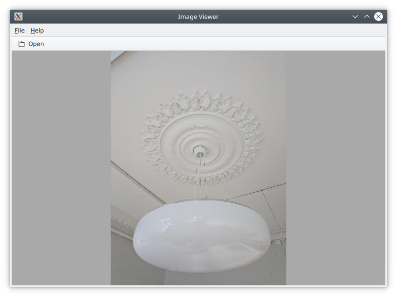
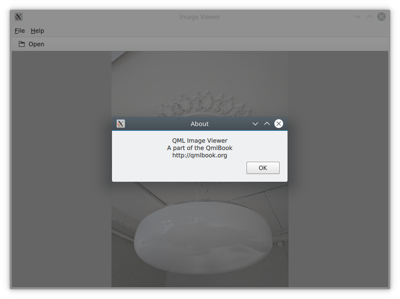
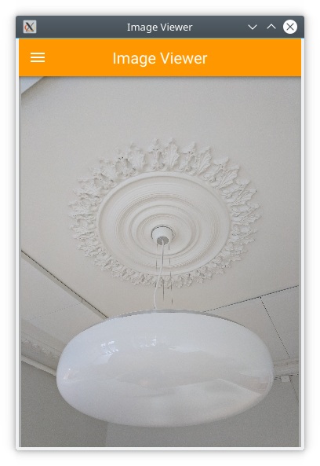
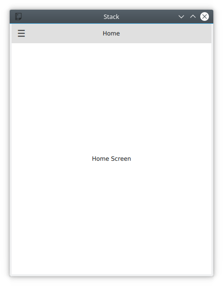
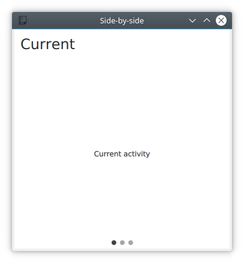
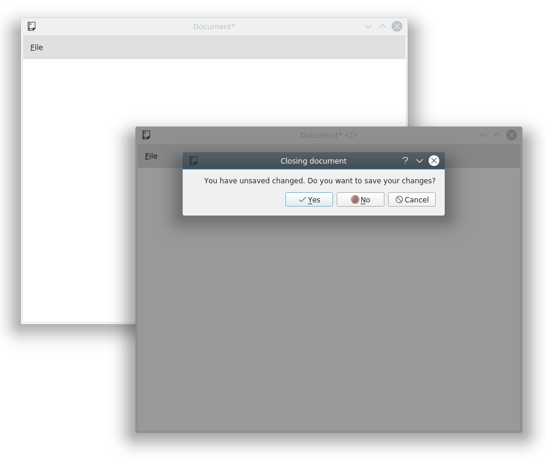
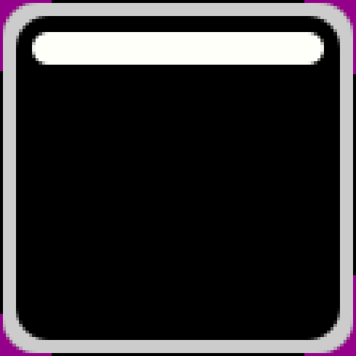

===================
Qt Quick Controls 2
===================

.. sectionauthor:: `e8johan <https://github.com/e8johan>`_

.. github:: ch06

.. note::

    Last Build: |today|

    The source code for this chapter can be found in the `assets folder <../../assets>`_.

This chapter introduces how to use Qt Quick Controls 2 to create a user interface built from standard components such as buttons, labels, sliders and so on. We will look at how various styles can be used to move user interfaces between platforms before diving into custom styling.
    
Introduction to Controls
========================

Using Qt Quick from scratch gives you primited graphical and interaction elements from which you can build your user interfaces. Using Qt Quick Controls 2 you start from a slightly more structured set of controls to build from. The controls range from simple text labels and buttons to more complex ones such as sliders and dials. These element are handy if you want to create a user interface based on classic interaction patterns as they provide a foundation to stand on.

The Qt Quick Controls 2 comes with a number of styles out of the box that are shown in the table below. The *Default* style is a basic flat style. The *Universal* style is based on the Microsoft Universal Design Guidelines, while *Material* is based on Google's Material Design Guidelines, and the *Fusion* style is a desktop oriented style. 

Some of the styles can be tweaked by tweaking the used palette. The *Imagine* is a style based on image assets, this allows a graphical designer to create a new style without writing any code at all, not even for palette colour codes.

========= =====================================
Style     Example
========= =====================================
Default   .. image:: assets/style-default.png
Universal .. image:: assets/style-universal.png
Material  .. image:: assets/style-material.png
Fusion    .. image:: assets/style-fusion.png
Imagine   .. image:: assets/style-imagine.png
========= =====================================

The Qt Quick Controls 2 is available from the ``QtQuick.Controls`` import module. In this module you will find the basic controls such as buttons, labels, checkboxes, sliders and so on. In addition to these controls, the following modules are also of interest:

.. list-table::
    :widths: 20 80
    :header-rows: 1

    *   - Module
        - Description
    *   - ``QtQuick.Controls``
        - The basic controls.
    *   - ``QtQuick.Templates``
        - Provides the non-visual part of the controls.
    *   - ``QtQuick.Dialogs``
        - Provides standard dialogs for showing messages, picking files, picking colours, and picking fonts, as well as the base for custom dialogs.
    *   - ``QtQuick.Controls.Universal``
        - Universal style theming support.
    *   - ``QtQuick.Controls.Material``
        - Material style theming support.
    *   - ``Qt.labs.calendar``
        - Controls for supporting date picking and other calendar related interactions.
    *   - ``Qt.labs.platform``
        - Support for platform native dialogs for common tasks such as picking files, colours, etc, as well as system tray icons and standard paths.

Notice that the ``Qt.labs`` modules are experimental, meaning that their APIs can have breaking changes between Qt versions.

.. note::

    The ``QtQuick.Dialogs`` module is a Qt Quick Controls 1 module, but it is also the only way to do dialogs without depending on the ``QtWidgets`` module. See below for more details.

An Image Viewer
===============

Let's look at a larger example of how Qt Quick Controls 2 is used. For this, we will create a simple image viewer.

First, we create it for desktop using the Fusion style, then we will refactor it for a mobile experience before having a look at the final code base.

The Desktop Version
-------------------

The desktop version is based around a classic application window with a menu bar, a tool bar and a document area. The application can be seen in action below.

    The image viewer main window.

We use the Qt Creator project template for an empty Qt Quick application as a starting point. However, we replace the default ``Window`` element from the template with a ``ApplicationWindow`` from the ``QtQuick.Controls`` module. The code below shows ``main.qml`` where the window itself is created and setup with a default size and title.

.. literalinclude:: src/imageviewer-desktop/main.qml
    :lines: 1-5, 9-11, 78-
    
The ``ApplicationWindow`` consists of four main areas as shown below. The menu bar, tool bar and status bar are usually populated by instances of ``MenuBar``, ``ToolBar`` or ``TabBar`` controls, while the contents area is where the children of the window goes. Notice that the image viewer application does not feature a status bar, that is why it is missing from the code show here, as well as from the figure above.

.. figure:: assets/applicationwindow-areas.png

    The main areas of the ``ApplicationWindow``
    
As we are targetting desktop, we enforce the use of the *Fusion* style. This can be done via environment variables, command line arguments, or programmatically in the C++ code. We do it the latter way by adding the following line to the ``main.cpp``::

    QQuickStyle::setStyle("Fusion");
    
We then start building the user interface in ``main.qml`` by adding an ``Image`` element as the contents. This element will hold the images when the user opens them, so for now it is just a place holder. The ``background`` property is used to provide an element to the window to place behind the contents. This will be shown when there is no image loaded, and as borders around the image if the aspect ratio down not let it fill the contents area of the window.

.. literalinclude:: src/imageviewer-desktop/main.qml
    :lines: 5-8, 44-53, 78-
    
We then continue by adding the ``ToolBar``. This is done using the ``toolBar`` property of the window. Inside the tool bar we add a ``Flow`` element which will let the contents fill the width of the control before overflowing to a new row. Inside the flow we place a ``ToolButton``.

The ``ToolButton`` has a couple of interesting properties. The ``text`` is straight forward. However, the ``icon.name`` is taken from the `freedesktop.org Icon Naming Specification <https://specifications.freedesktop.org/icon-naming-spec/icon-naming-spec-latest.html>`_. In that document, a list of standard icons are listed by name. By refering to such a name, Qt will pick out the correct icon from the current desktop theme.

In the ``onClicked`` signal handler of the ``ToolButton`` is the final piece of code. It calls the ``open`` method on the ``fileOpenDialog`` element.

.. literalinclude:: src/imageviewer-desktop/main.qml
    :lines: 5-8, 33-42, 78-

The ``fileOpenDialog`` element is a ``FileDialog`` control from the ``QtQuick.Dialogs`` module. The file dialog can be used to open or save files, as well as picking directories.

.. note::

    The ``QtQuick.Dialogs`` module is a Qt Quick Controls 1 module, but it is also the only way to do dialogs without depending on the ``QtWidgets`` module. See how to implement native dialogs using ``Qt.labs.platform`` further down.

In the code we start by assigning a ``title``. Then we set the starting folder using the ``shortcut`` property. The ``shortcut`` property holds links to common folders such as the user's home, documents, and such. After that we set a name filter that controls what files the user can see and pick using the dialog.

Finally, we reach the ``onAccepted`` signal handler where the ``Image`` element that holds the window contents is set to show the the selected file. There is an ``onRejected`` signal as well, but we do not need to handle it in the image viewer application.
    
.. literalinclude:: src/imageviewer-desktop/main.qml
    :lines: 5-8, 55-65, 78-

We then continue with the ``MenuBar``. To create a menu, one puts ``Menu`` elements inside the menu bar, and then populate each ``Menu`` with ``MenuItem`` elements.

In the code below, we create two menus, *File* and *Help*. Under *File*, we place *Open* using the same icon and action as the tool button in the tool bar. Under *Help* you find *About* which triggers a call to the ``open`` method of the ``aboutDialog`` element. 

Notice that the ampersands ("&") in the ``title`` property of the ``Menu`` and the ``text`` property of the ``MenuItem`` turns the following character into a keyboard shortcut, e.g. you reach the file menu by pressing *Alt+F*, followed by *Alt+O* to trigger the open item.
    
.. literalinclude:: src/imageviewer-desktop/main.qml
    :lines: 5-8, 14-31, 78-

The ``aboutDialog`` element is based on the ``Dialog`` control from the ``QtQuick.Controls`` module, which is the base for custom dialogs. The dialog we are about to create is shown in the figure below.

    The about dialog.

The code for the ``aboutDialog`` can be split into three parts. First, we setup the dialog window with a title. Then we provide some contents for the dialog -- in this case, a ``Label`` control. Finally, we opt to use a standard *Ok* button to close the dialog.
    
.. literalinclude:: src/imageviewer-desktop/main.qml
    :lines: 5-8, 67-
    
The end result of all this is an, albeit simple, desktop application for viewing images.

Moving to Mobile
----------------

There are a number of differences in how a user interface is expected to look an behave on a mobile device compared to a desktop application. The biggest difference for our application is how the actions are accessed. Instead of a menu bar and a tool bar, we will use a drawer from which the user can pick the actions. The drawer can swiped in from the side, but we also offer a hamburger button in the header. The resulting application with the drawer open can be seen below.

.. figure:: assets/viewer-mobile-drawer.png

    The image viewer with a drawer menu.
    
First of all, we need to change the style that is set in ``main.cpp`` from *Fusion* to *Material*::

    QQuickStyle::setStyle("Material");

Then we start adapting the user interface. We start by replacing the menu with a drawer. In the code below, the ``Drawer`` component is added as a child to the ``ApplicationWindow``. Inside the drawer, we put a ``ListView`` containing ``ItemDelegate`` instances. It also contains a ``ScrollIndicator`` used to show what part of a long list that is shown. As our list only consists of two items, this is not visible in this example.

The drawer ``ListView`` is populated from a ``ListModel`` where each ``ListItem`` corresponds to a menu item. Each time an item is clicked, in the ``onClicked`` method, the ``triggered`` method of the corresponding ``ListItem`` is called. This way, we can use a single delegate to trigger different actions.
    
.. literalinclude:: src/imageviewer-mobile/main.qml
    :lines: 6-11, 17-51, 105-

The next change is the ``header`` in the ``ApplicationWindow``. Instead of a desktop style toolbar, we add a button to open the drawer and the title of our application. 
    

    The image viewer with the mobile header.
    
The ``ToolBar`` contains a two child child elements: a ``ToolButton`` and a ``Label``.
    
The ``ToolButton`` control opens the drawer. The corresponding close call can be found in the ``ListView`` delegate. When an item has been selected the drawer is closed. The icon used for the ``ToolButton`` comes from the `Material Design Icons page <https://material.io/tools/icons/?style=baseline>`_.
    
.. literalinclude:: src/imageviewer-mobile/main.qml
    :lines: 6-9, 53, 56-69, 105-

Finally we make the background of the toolbar pretty --- or at least orange. To do this, we alter the ``Material.background`` attached property. This comes from the ``QtQuick.Controls.Material 2.1`` module and only affects the Material style.
    
.. literalinclude:: src/imageviewer-mobile/main.qml
    :lines: 4-9, 53-54, 105-
    
With these few changes we have converted our desktop image viewer to a mobile friendly version.

A Shared Codebase
-----------------

In the past two sections we have looked at an image viewer developed for desktop use and then adapted it to mobile.

Looking at the code base, much of the code is still shared. The parts that are shared are mostly associated with the document of the application, i.e. the image. The changes has affected individual interaction patterns of desktop and mobile respectively. Naturally, we would want to unify these code bases. QML supports this through the use of *file selectors*.

A file selector lets us replace individual files based on which selectors are active. The Qt documentation maintains a list of selectors in the documentation for the ``QFileSelector`` class (`link <https://doc.qt.io/qt-5/qfileselector.html>`_). In our case we will make the desktop version the default and replace selected files when the *android* selector is encountered. During the development you can set the environment variable ``QT_FILE_SELECTORS`` to ``android`` to simulate this.

.. note::

    The file selector works by replacing files with an alternative when a *selector* is present.
    
    By creating a directory named ``+selector``, where ``selector`` represents the name of a selector, in parallel to the files that you want to replace, you can then place files with the same name as the file you want to replace inside the directory. When the selector is present, the file in the directory will be picked instead of the original file.
    
    The selectors are based on the platform, e.g. android, ios, osx, linux, qnx, and so on. They can also include the name of the Linux distribution used (if identified), e.g. debian, ubuntu, fedora. Finally, they also include the locale, e.g. en_US, sv_SE, etc.
    
    It is also possible to add your own, custom, selectors.

The first step to do this change is to isolate the shared code. We do this by creating the ``ImageViewerWindow`` element which will be used instead of the ``ApplicationWindow`` for both our variants. This will consist of the dialogs, the ``Image`` element and the background. In order to make the open methods of the dialogs available to the platform specific code, we need to expose them through the functions ``openFileDialog`` and ``openAboutDialog``.

.. literalinclude:: src/imageviewer-all/ImageViewerWindow.qml
    :lines: 1-5, 9-30, 35-41, 50, 54
    
Next, we create a new ``main.qml`` for our default style *Fusion*, i.e. the desktop version of the user interface.

Here, we base the user interface around the ``ImageViewerWindow`` instead of the ``ApplicationWindow``. Then we add the platform specific parts to it, e.g. the ``MenuBar`` and ``ToolBar``. The only changes to these is that the calls to open the respective dialogs are made to the new functions instead of directly to the dialog controls.
    
.. literalinclude:: src/imageviewer-all/main.qml
    :lines: 1-4, 8-41, 45

Next, we have to create a mobile specific ``main.qml``. This will be based around the *Material* theme. Here, we keep the ``Drawer`` and the mobile specific toolbar. Again, the only change is how the dialogs are opened.

.. literalinclude:: src/imageviewer-all/+android/main.qml
    :lines: 1-5, 9-18, 22-25, 40-52, 54-60, 77, 81
    
The two ``main.qml`` files are placed in the file system as shown below. This lets the file selector that the QML engine automatically creates pick the right file. By default, the *Fusion* ``main.qml`` is loaded, unless the ``android`` selector is present. Then the *Material* ``main.qml`` is loaded instead.

.. digraph:: selector_files

    "Project Root" -> "main.qml\n(Fusion)"
    "Project Root" -> "+android"
    "+android" -> "main.qml\n(Material)"
    
Until now the style has been set in in ``main.cpp``. We could continue doing this and use ``#ifdef`` expressions to set different styles for different platform. Instead we will use the file selector mechanism again and set the style using a configuration file. Below, you can see the file for the *Material* style, but the *Fusion* file is equally simple.

.. literalinclude:: src/imageviewer-all/+android/qtquickcontrols2.conf
    :language: ini

These changes has given us a joined codebase where all the document code is shared and only the differences in user interaction patterns differ. There are different ways to do this, e.g. keeping the document in a specific component that is included in the platform specific interfaces, or as in this example, by creating a common base that is extended by each platform. The best approach is best determined when you know how your specific code base looks and can decide how to separate the common from the unique.

Native Dialogs
--------------

When using the image viewer you will notice that it uses a non-standard file selector dialog. This makes it look out of place.

The ``Qt.labs.platform`` module can help us solve this. It provides QML bindings to native dialogs such as the file selector, font selector and colour selector. It also provides APIs to create system tray icons, as well as system global menus that sits on top of the screen (e.g. as in OS X). The cost of this is a dependency on the ``QtWidgets`` module, as the widget based dialog is used as a fallback where the native support is missing.

In order to integrate a native file dialog into the image viewer, we need to import the ``Qt.labs.platform`` module. As this module has name clashes with the module it replaces, ``QtQuick.Dialogs``, it is important to remove the old import statement.

In the actual file dialog element, we have to change how the ``folder`` property is set, and ensure that the ``onAccepted`` handler uses the ``file`` property instead of the ``fileUrl`` property. Apart from these details, the usage is identical to the ``FileDialog`` from ``QtQuick.Dialogs``.

.. literalinclude:: src/imageviewer-native/main.qml
    :lines: 1-8, 55-65, 78-

In addition to the QML changes, we also need to alter the project file of the image viewer to include the ``widgets`` module.

.. literalinclude:: src/imageviewer-native/imageviewer-native.pro
    :lines: 1

And we need to update ``main.qml`` to instantiate a ``QApplication`` object instead of a ``QGuiApplication`` object. This is because the ``QGuiApplication`` class contains the minimal environment needed for a graphical application, while ``QApplication`` extends ``QGuiApplication`` with features needed to support ``QtWidgets``.
    
.. literalinclude:: src/imageviewer-native/main.cpp
    :language: cpp
    :lines: 1, 4-8, 11-14, 22
    
With these changes, the image viewer will now use native dialogs on most platforms. The platforms supported are iOS, Linux (with a GTK+ platform theme), macOS, Windows and WinRT. For Android, it will use a default Qt dialog provided by the ``QtWidgets`` module.
    
Common Patterns
===============

There a number of common user interface patterns that can be implemented using Qt Quick Controls 2. In this section, we try to demonstrate how some of the more common ones can be built.

Nested Screens
--------------

For this example we will create a tree of pages that can be reached from the previous level of screens. The structure is pictured below.

.. digraph:: nested_screens

    "Home" -> "Profile"
    "Profile" -> "Edit Profile"
    "Home" -> "About"

The key component in this type of user interface is the ``StackView``. It allows us to place pages on a stack which then can be poped when the user wants to go back. In the example here, we will show how this can be implemented.

The initial home screen of the application is shown in the figure below.

    The home screen page.

The application start in ``main.qml`` where we have an ``ApplicationWindow`` containing a ``ToolBar``, a ``Drawer``, a ``StackView`` and a home page element, ``Home``. We will look into each of the components below.

.. literalinclude:: src/interface-stack/main.qml
    :lines: 1-4, 10-16, 36-41, 66-72, 84

The home page, ``Home.qml`` consists of a ``Page``, which is an control element that support headers and footers. In this example we simply center a ``Label`` with the text *Home Screen* on the page. This works because the contents of a ``StackView`` automatically fills the stack view, so the page has the right size for this to work.

.. literalinclude:: src/interface-stack/Home.qml

Returning back to the ``main.qml``, we now look at the drawer part. This is where the navigation to the pages begin. The active parts of the user interface is the ``ÌtemDelegate`` items. In the ``onClicked`` handler, the next page is pushed onto the ``stackView``.

As shown in the code below, it possible to push either a ``Component`` or a reference to a specific QML file. Either way results in that a new instance is created and is pushed onto the stack.

.. literalinclude:: src/interface-stack/main.qml
    :lines: 4, 10-12, 38, 42-66, 73-

The other half of the puzzle is the toolbar. The idea is that a back button is shown when the ``stackView`` contains more than one page, otherwise a menu button is shown. The logic for this can be seen on the ``text`` property where the ``"\u..."`` strings represents the unicode symbols that we need.

In the ``onClicked`` handler, we can see that when there is more than one page on the stack, the stack is poped, i.e. the top page is removed. If the stack contains only one item, i.e. the home screen, the drawer is opened.

Below the ``ToolBar``, you find a ``Label``. This element shows the title of each page in the center of the header.
    
.. literalinclude:: src/interface-stack/main.qml
    :lines: 4, 10-12, 13, 17-36, 81-

Now we've seen how to reach the *About* and *Profile* pages, but we also want to make it possible to reach the *Edit Profile* page from the *Profile* page. This is done via the ``Button`` on the *Profile* page. When the button is clicked, the ``EditProfile.qml`` file is pushed onto the ``StackView``.

.. figure:: assets/interface-stack-profile.png

    The profile page with the *Edit* button.

.. literalinclude:: src/interface-stack/Profile.qml

Side by Side Screens
--------------------

For this example we create a user interface consisting of three pages that the user can shift through. The pages are shown in the diagram below. This could be the interface of a health tracking app, tracking the current state, the user's statistics and the overall statistics.

.. digraph:: side_by_side_screens

    "Current" -> "Your Statistics"
    "Your Statistics" -> "Community Statistics"
    
The illustration below shows how the *Current* page looks in the application. The main part of the screen is managed by a ``SwipeView``, which is what enables the side by side screens interaction pattern. The title and text shown in the figure come from the page inside the ``SwipeView``, while the ``PageIndicator`` (the three dots at the bottom) come from ``main.qml`` and sit under the ``SwipeView``. The page indicator shows the user which page that is currently active, helping when navigating.

    The *Current* page in the side-by-side app.

Diving into ``main.qml``, it consists of an ``ApplicationWindow`` with the ``SwipeView``.
    
.. literalinclude:: src/interface-side-by-side/main.qml
    :lines: 1-4, 8-14, 26-29, 38-

Inside the ``SwipeView`` each of the child pages are instantiated in the order they are to appear. They are ``Current``, ``UserStats`` and ``TotalStats``.
    
.. literalinclude:: src/interface-side-by-side/main.qml
    :lines: 4-7, 14-25, 29, 38-
    
Finally the ``count`` and ``currentIndex`` properties of the ``SwipeView`` are bound to the ``PageIndicator`` element. This completes the structure around the pages.

.. literalinclude:: src/interface-side-by-side/main.qml
    :lines: 4-7, 14-15, 26-37, 41
    
Each page consists of a ``Page`` with a ``header`` consisting of a ``Label`` and some contents. For the *Current* and *User Stats* pages the contents is a simple ``Label``, but for the *Community Stats* page, a back button is included.

.. literalinclude:: src/interface-side-by-side/TotalStats.qml
    :lines: 1-12, 26

.. figure:: assets/interface-side-by-side-community.png

    The *Back* button in the side-by-side app.
    
The back button explicitly calls the ``setCurrentIndex`` of the ``SwipeView`` to set the index to zero, returning the user directly to the *Current* page. During each transition between pages the ``SwipeView`` provides a transition, so even when explicitly changing the index the user is given a sense of direction.

.. note::

    When navigating in a ``SwipeView`` programatically it is important not to set the ``currentIndex`` by assignment in Javascript. This is because doing so will break any QML bindings it overrides. Instead use the methods ``setCurrentIndex``, ``incrementCurrentIndex``, and ``decrementCurrentIndex``. This preserves the QML bindings.

.. literalinclude:: src/interface-side-by-side/TotalStats.qml
    :lines: 4, 10-    

Document Windows
----------------

This example shows how to implement a desktop oriented, document centric user interface. The idea is to have one window per document. When opening a new document, a new window is opened. To the user, each window is a self contained world with a single document.

    Two document windows and the close warning dialog.

The code starts from an ``ApplicationWindow`` with a *File* menu with the standard operations: *New*, *Open*, *Save* and *Save As*. We put this in the file ``DocumentWindow.qml``. 

We import the ``Qt.labs.platform`` for native dialogs and have made the subsequent changes to the project file and ``main.cpp`` as described in the section on native dialogs above.
        
.. literalinclude:: src/interface-document-window/DocumentWindow.qml
    :lines: 1-9, 19, 23-47, 139-

To bootstrap the program, we create the first ``DocumentWindow`` instance from the ``main.qml``, which is the entrypoint of the application.

.. literalinclude:: src/interface-document-window/main.qml

In the example at the beginning of this chapter, each ``MenuItem`` results in a call to a corresponding function when triggered. Let's start with the *New* item, which ends up in the ``newDocument`` function. 

The function, in turn, relies on the ``_createNewDocument`` function, which dynamically creates a new element instance from the ``DocumentWindow.qml`` file, i.e. a new ``DocumentWindow`` instance. The reason for breaking out this part of the new function is that we use it when opening documents as well.

Notice that we do not provide a parent element when creating the new instance using ``createObject``. This way, we create new top level elements. If we would have provided the current document as parent to the next, the destruction of the parent window would lead to the destruction of the child windows.

.. literalinclude:: src/interface-document-window/DocumentWindow.qml
    :lines: 5, 7-9, 49-60, 139-

Looking at the *Open* item results in a call to ``openDocument`` function. The function simply opens the ``openDialog`` which let's the user pick a file to open. As we don't have a document format, file extension or anything like that, the dialog has most properties set to their default value. In a real world application, this would be better configured.

In the ``onAccepted`` handler a new document window is instantiated using the ``_createNewDocument`` method, but then a file name is set before the window is shown. In this case, no real loading takes place.

.. note::

    We imported the ``Qt.labs.platform`` module as ``NativeDialogs``. This is because it provides a ``MenuItem`` that clashes with the ``MenuItem`` provided by the ``QtQuick.Controls`` module.

.. literalinclude:: src/interface-document-window/DocumentWindow.qml
    :lines: 5, 7-9, 62-66, 89-98, 139-

The file name belongs to a pair of properties describing the document: ``_fileName`` and ``_isDirty``. The ``_fileName`` holds the file name of the document name and ``_isDirty`` is set when the document has unsaved changes. This is used by the save and save as logic, which is shown below.

When trying to save a document without a name, the ``saveAsDocument`` is invoked. This results in a round-trip over the ``saveAsDialog``, which sets a file name and then tries to save again in the ``onAccepted`` handler.

Notice that the ``saveAsDocument`` and ``saveDocument`` functions correspond to the *Save As* and *Save* menu items.

After having saved the document, in the ``saveDocument`` function, the ``_tryingToClose`` property is checked. This flag is set if the save is the result of the user wanting to save a document when the window is being closed. As a consequence, the window is closed after the save operation has been performed. Again, no actual saving takes place in this example.

.. literalinclude:: src/interface-document-window/DocumentWindow.qml
    :lines: 5, 7-9, 15-17, 7-9, 67-88, 100-111, 139-

This leads us to the closing of windows. When a window is being closed, the ``onClosing`` handler is invoked. Here, the code can choose not to accept the request to close. If the document has unsaved changes, we open the ``closeWarningDialog`` and reject the request to close.

The ``closeWarningDialog`` asks the user if the changes should be changed, but the user also has the option to cancel the close operation. The cancelling, handeled in ``onRejected``, is the easiest case, as we rejected the closing when the dialog was opened.

When the user does not want to save the changes, i.e. in ``onNoClicked``, the ``_isDirty`` flag is set to ``false`` and the window is closed again. This time around, the ``onClosing`` will accept the closing as the ``_isDirty`` is false.

Finally, when the user wants to save the changes, we set the ``_tryingToClose`` flag to true before calling save. This leads us to the save - save as logic.

.. literalinclude:: src/interface-document-window/DocumentWindow.qml
    :lines: 5, 7-9, 113-138, 142

The entire flow for the close and save - save as logic is shown below. The system is entered at the *close* state, while *closed* and *not closed* states are outcomes.

This looks complicated compared to implementing this using ``QtWidgets`` and C++. This is because the dialogs are not blocking to QML. This means that we cannot wait for the outcome of a dialog in a ``switch`` statement. Instead we need to remember the state and continue the operation in the respective ``onYesClicked``, ``onNoClicked``, ``onAccepted``, and ``onRejected`` handlers.

.. digraph:: close_logic

    entry -> close
    close -> onClose [label="Request to close"]
    onClose -> closeWarningDialog [label="_isDirty == true"]
    onClose -> closed [label="_isDirty == false\nWindow is closed"]
    closeWarningDialog -> "Not closed" [label="onRejected\nWindow is not closed"]
    closeWarningDialog -> saveDocument [label="onYesClicked\nSet _tryingToClose to true"]
    closeWarningDialog -> close [label="onNoClicked\nSet _isDirty to false"]
    saveDocument -> closed [label="_fileName is set\n&&\n_tryingToClose == true"]
    saveDocument -> saveAsDialog [label="_fileName is empty"]
    saveAsDialog -> "Not closed" [label="onRejected\nWindow is not closed"]
    saveAsDialog -> saveDocument [label="onAccepted\n_fileName is set"]
    close [shape=oval]
    onClose [shape=oval]
    closeWarningDialog [shape=oval]
    saveDocument [shape=oval]
    saveAsDialog [shape=oval]
    "Not closed" [shape=rect]
    closed [shape=rect]
    entry [shape=point]

The final piece of the puzzle is the window title. It is composed form the ``_fileName`` and ``_isDirty``.
    
.. literalinclude:: src/interface-document-window/DocumentWindow.qml
    :lines: 5, 7-10, 139-

This example is far from complete. For instance, the document is never loaded or saved. Another missing piece is handling the case of closing all the windows in one go, i.e. exiting the application. For this function, a singleton maintaining a list of all current ``DocumentWindow`` instances is needed. However, this would only be another way to trigger the closing of a window, so the logic flow shown here is still valid.

The Imagine Style
=================

One of the goals with Qt Quick Controls 2 is to separate the logic of a control from its appearance. For most of the styles, the implementation of the appearance consists of a mix of QML code and graphical assets. However, using the *Imagine* style, it is possible to customize the appearance of a Qt Quick Controls 2 based application using only graphical assets.

The imagine style is based on `9-patch images <https://developer.android.com/guide/topics/graphics/drawables#nine-patch>`_. This allows the images to carry information on how they are stretched and what parts are to be considered as a part of the element and what is outside, e.g. a shadow. For each control, the style supports several elements, and for each element a large number of states are available. By providing assets for certain combinations of these elements and states, you can control the appearance of each control in detail.

The details of 9-patch images, and how each control can be styled is covered in great detail in the `Imagine style documentation <https://doc.qt.io/qt-5/qtquickcontrols2-imagine.html>`_. Here, we will create a custom style to an imaginary device interface to demonstrate how the style is used.

The application consists of a custom style of the ``ApplicationWindow`` and ``Button`` controls. For the buttons, the normal case, as well as *pressed* and *checked* are handled. The demonstration application is shown below.

.. figure:: assets/style-imagine-example.png

    The custom imagine button style.

The code for this uses a ``Column`` for the clickable buttons, and a ``Grid`` for the checkable ones. The clickable buttons also stretch with the window width.
    
.. literalinclude:: src/imagine-style/main.qml
    :lines: 4-7, 13, 21-34, 42-

As we are using the *Imagine* style, all controls that we want to use needs to be styled using a graphical asset. The easiest is the background for the ``ApplicationWindow``. This is a single pixel texture defining the background colour. By naming the file ``applicationwindow-background.png`` and then pointing the style to it using the ``qtquickcontrols2.conf`` file, the file is picked up.

In the ``qtquickcontrols2.conf`` file shown below, you can see how we set the ``Style`` to ``Imagine``, and then setup a ``Path`` for the style where it can look for the assets. Finally we set some palette properties as well. The available palette properties can be found on the `palette QML Basic Type <https://doc.qt.io/qt-5/qml-palette.html#qtquickcontrols2-palette>`_ page.
    
.. literalinclude:: src/imagine-style/qtquickcontrols2.conf
    :language: ini

The assets for the ``Button`` control are ``button-background.9.png``, ``button-background-pressed.9.png`` and ``button-background-checked.9.png``. These follow the *control*-*element*-*state* pattern. The stateless file, ``button-background.9.png`` is used for all states without a specific asset. According to the `Imagine style element reference table <https://doc.qt.io/qt-5/qtquickcontrols2-imagine.html#element-reference>`_, a button can have the following states:

* disabled
* pressed
* checked
* checkable
* focused
* highlighted
* flat
* mirrored
* hovered

Which ones that are needed depends on your user interface. For instance, the hovered style is never used for touch based interfaces.

.. figure:: assets/button-background-checked-enlarged.9.png

    The ``button-background-checked.9.png`` asset enlarged.

Looking at an enlarged version of ``button-background-checked.9.png`` above you can see the 9-patch guide lines along the sides. The purple background has been added for visibility reasons. This area is actually transparent in the asset used in the example. 

The pixels along the edges of the image can be either white/transparent, black, or red. These have different meanings that we will go through one by one.

* **Black** lines along the **left** and **top** sides of the asset mark the stretchable parts of the image. This means that the rounded corners and the white marker in the example are not affected when the button is stretched.
* **Black** lines along the **right** and **bottom** sides of the asset mark the area used for the control's contents. That means what part of the button is used for text in the example.
* **Red** lines along the **right** and **bottom** sides of the asset mark *inset* areas. These areas are a part of the image, but not considered a part of the control. For the checked image above, this is used for a soft halo extending outside the button.

A demonstration of the usage of an *inset* areas is how the ``button-background.9.png`` (below) and ``button-background-checked.9.png`` (above) result in an image that seems to light up, but not move, in the example.

    The ``button-background.9.png`` asset enlarged.

Summary
=======

In this chapter we have looked at the Qt Quick Controls 2. They offer set of elements that provide more high level concepts than the basic QML elements. For most scenarios, you will save memory and gain performance by using the Qt Quick Controls 2, as they are based around an optimized C++ logic instead of Javascript and QML.

In the chapter we've demonstrated how different styles can be used, and how a common code base can be developed using file selectors. This way, a single code base can address multiple platforms with user interactions and visual styles.

Finally, we have looked at the Imagine style that allows you to completely customize the look of a QML application through the use of graphical assets. This way an application can be reskinned without any code change what so ever.
