=====
Felgo
=====

.. sectionauthor:: `e8johan <https://bitbucket.org/e8johan>`_

.. github:: ch08

.. note::

    Last Build: |today|

    The source code for this chapter can be found in the `assets folder <../assets>`_.

.. figure:: images/felgo-logo.png
    :scale: 50%

Felgo is a cross-platform application development solution, based on the Qt framework and greatly extending it. Felgo applications run natively on many platforms, such as Android, iOS, Desktop (all three major OSs), Web (WebAssembly) and Embedded systems.

Felgo offers unique Qt/QML tooling, cloud services, and the Felgo SDK that adds more than 200 APIs extending Qt with capabilities such as:

* Advanced controls and native navigation
* Theming and style
* Density independence
* Responsive layout
* File handling (local/remote)
* Data management and model/view
* Multimedia
* REST networking
* Native dialogs and features

The screenshot below showcases how a single code base can be themed to look native on both Android and iOS.

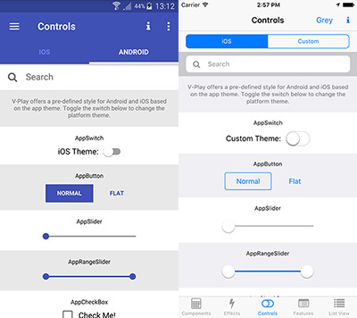

Felgo is a Qt Technology Partner, and the SDK, which we will use in this chapter, can greatly help you save time and money when developing Qt applications. As the Felgo SDK extends Qt, it is possible to mix Felgo APIs with existing Qt and QML code. This means that you can add Felgo to your existing applications. In addition to the Felgo SDK, Felgo also provides consulting and training.

Why choose Felgo?
=================

Felgo takes the cross platform story one step further. It lets you get more done from QML and reduces the need to write complex C++ code. For instance, the `Felgo Qt World Summit Conference <https://github.com/FelgoSDK/Qt-World-Summit-Conference-App>`_ App, used at the annual Qt World Summit conference, has saved 90% code compared to the pure `Qt/QML implementation <https://github.com/ekke/c2gQtCon_x>`_.

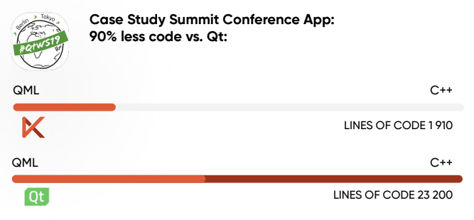

Code savings are not limited to the Qt world, but Felgo is a lot less verbose also compared to native development and competing cross-platform solutions.

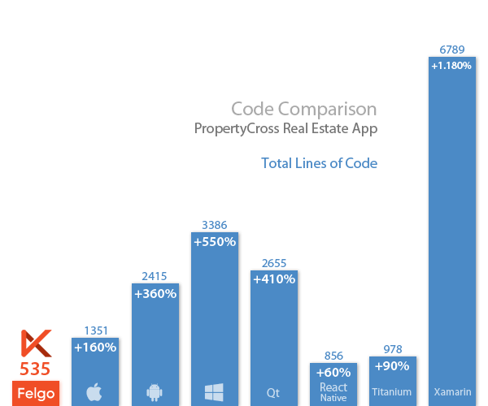

Installing Felgo
================

In order to use Felgo you need to perform the following steps:

1. Sign-up to felgo.com. There are different purchasing options including a free tier which grants access to most features. In this text we will only use the free tier features.
2. Depending on your OS of choice, install the requirements: `<https://felgo.com/doc/felgo-installation/#install-requirements>`_
3. Download Felgo: `<https://felgo.com/download/>`_
4. Run the installer and proceed to install Felgo.

This installs the Felgo SDK, development tools and several demo applications. Felgo also comes with a specific version of Qt and an own QtCreator that includes useful Felgo plugins. It is possible to install the Felgo SDK in addition to other Qt installations on your system. If you have Qt installed already and only want to add Felgo to your installation take a look here: `<https://felgo.com/doc/felgo-installation/#add-felgo-to-existing-qt-installation>`_.

Installing the Companion Apps
-----------------------------

Felgo comes with a companion app that makes it easier to develop mobile apps, the the Felgo Live Client for `Android <https://play.google.com/store/apps/details?id=net.vplay.apps.QMLLive&hl=en>`_ and `iOS <https://apps.apple.com/us/app/qml-live-scripting-by-felgo/id1157319191>`_.

You can connect the client apps to the Felgo Live Server tool that comes with the SDK. This allows you to directly test how your app works on mobile without having to build and deploy an app. With QML Hot Reload, you can see QML and JavaScript code changes applied instantly on all your devices.

Hello World with Felgo
======================

Now that we have everything in place we can test the setup with our very first Felgo application: the mandatory *Hello World*. To do this, fire up the Felgo SDK Qt Creator and create a new project.

You will be faced by the ordinary project and file creation dialog, but with the *Felgo Apps* and *Felgo Games* categories for both projects and files. In this case, choose the *Single-Page Application* from the Felgo Apps project category.

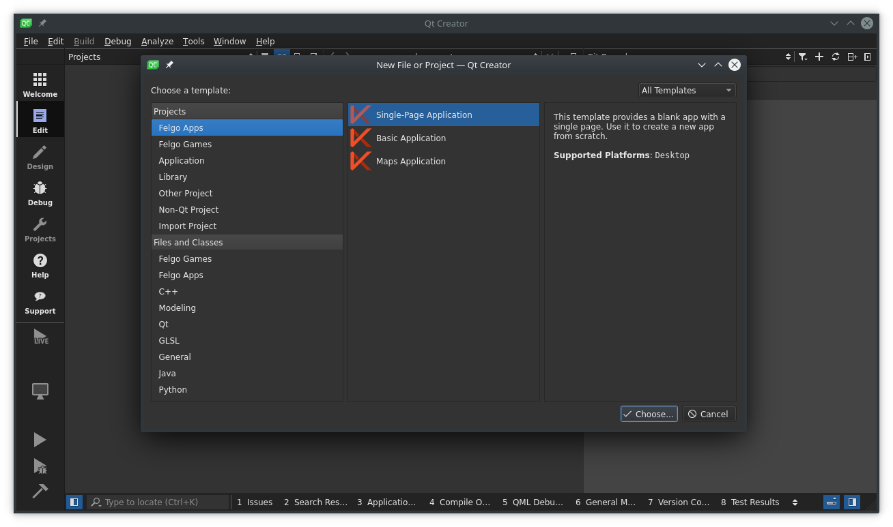

This will take you through the new project wizard, with some additional Felgo steps. Ensure that you pick the *Felgo Desktop* kit, especially if you have multiple versions of Qt installed. Also do not pick any additional plugins for now.

.. topic:: Felgo Plugins

    Felgo comes with a large set of plugins focused at mobile app developers. These include integrations of various frameworks for ads, in-app purchasing as well as analytics. If you activate any of the plugins, the SDK will provide you with a link further outlining how to integrate the service selected.
    
    |Plugin Selection| |Plugin Integration|
    
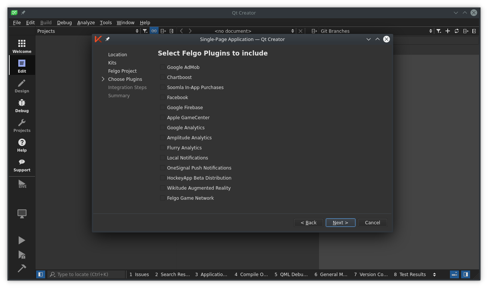
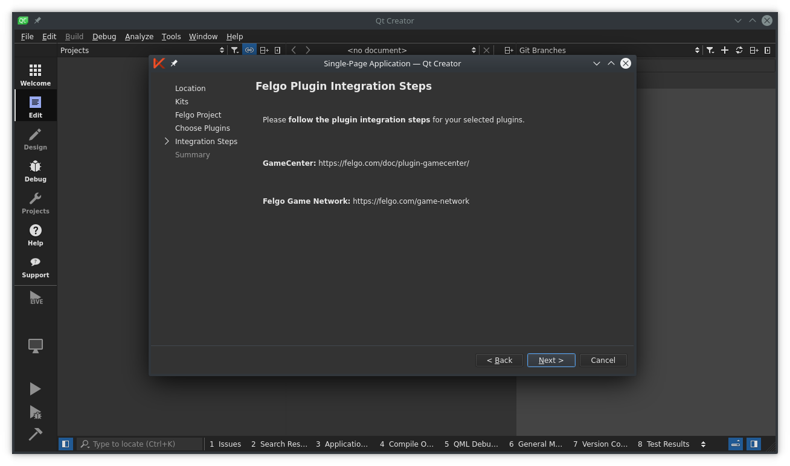

Once the project has been created, replace the contents of the ``Main.qml`` with the following Hello World code:

.. literalinclude:: src/helloworld/helloworld.qml

You will notice that the live reloader will show a preview of your project looking like the figure below. The Live server and client will start when you load a project into Qt Creator, so if you're quick, you will notice when you changed the source code and saved, the live view was updated. If the Live Server is not running, you can start it via the *Live Run* button. It is placed on top of the *Build and Run* button in the left sidebar. The button starts the Felgo Live Server in addition to the Desktop version of the app.

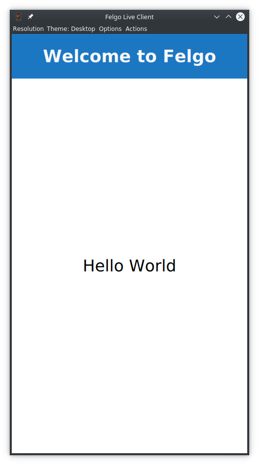
    
The code above should look familiar if you’ve worked through the earlier chapters introducing QML. There is a new import of ``Felgo 3.0`` which includes every component of the FelgoSDK.

The root element is the `App <https://felgo.com/doc/felgo-app/>`_ element with a nested `NavigationStack <https://felgo.com/doc/felgo-navigationstack/>`_. This component takes care of managing all the different `Page <https://felgo.com/doc/felgo-page/>`_ instances your application is going to present.

Within the Page you can find an `AppText <https://felgo.com/doc/felgo-apptext/>`_ element, which inherits from QtQuick.Text, but also manages proper font scaling. It offers a fontSize property that ensures the same physical size on all devices, avoiding the need to manually adapt the font.pixelSize setting of QtQuick.Text to the pixel density of your device.

In the Live Client view, you can you can change simulated resolutions or the application theme from the menu bar. You can test different screen formats and see how the app looks on an Android, iOS or Desktop device.

A Messaging App
===============

Now that we have familiarized ourselves with the Felgo environment and run the Hello World code, let's transform the Hello World application into a messaging app. It will provide an overview page of all conversations, as well as one page per conversation showing the individual messages.

Each step of the Messaging App chapter is available in the `Felgo Cloud IDE <https://ide.felgo.com/-/ide/project/qmlbook/qmlbook-felgo-messaging/blob/messaging-stage-1/-/>`_ on a separate git branch & commit. Use it to view code changes of every step, make own changes, or live preview everything right in your web browser.

A Skeleton
----------

We start with defining the skeleton of our application. It initially shows a page with the most recent conversations. Put the following code into the ``Main.qml`` of a new project (or replace the contents of the Hello World project's ``Main.qml``)

.. literalinclude:: src/messaging-stage-1/qml/Main.qml

We can already see two new components: ``Navigation``, and ``NavigationItem``. The `Navigation <https://felgo.com/doc/felgo-navigation/>`_ presents you with a single component for platform-specific navigation patterns. On Android or Desktop it will be displayed as a side menu, while on iOS it will use a bottom tab bar by default.

Now test it on Desktop: in the Live Client, make sure to select the Desktop theme and increase the window size by dragging at the window edges. Over a certain threshold the side-menu automatically gets visible. Felgo implements responsive design by default, meaning that the layout of the application adapts to the screen size and orientation.

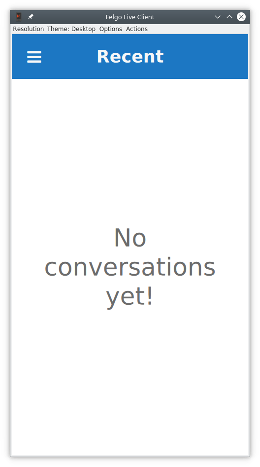

The other new component: `NavigationItem <https://felgo.com/doc/felgo-navigationitem/>`_ represents a root entry in the main navigation of your application. You can have multiple ``NavigationItem`` elements in your ``Navigation`` element. In the example code we define an icon and a title for the *Recent* page. Felgo comes with comprehensive icon font out of the box.

``NavigationStack`` is a component which allows stacking pages on top of each other. At the moment we only have one ``Page`` that feels a bit empty. Let’s include some mock data by creating a new file.

To display lists of items you can rely on the `AppListView <https://felgo.com/doc/felgo-applistview/>`_, or you can take a shortcut and use the `ListPage <https://felgo.com/doc/felgo-listpage/>`_.
This last component is a ``Page`` with a single ``AppListView`` as a child, with some properties of ``AppListView`` aliased for convenience such as ``model`` and ``delegate``.

.. literalinclude:: src/messaging-stage-2/qml/Main.qml
    :start-after: M1>>
    :end-before: <<M1

The model property is a standard QML `ListModel <https://doc.qt.io/qt-5/qml-qtqml-models-listmodel.html>`_. In this case we are just passing a javascript array. You can use any Qt/QML ``ListModel``, or the `JsonListModel <https://felgo.com/doc/felgo-jsonlistmodel/>`_ from Felgo, optimized to handle JSON data in a performant way.

Now let’s attach a delegate to show the model contents. The result is shown in the figure below, followed by the source code.

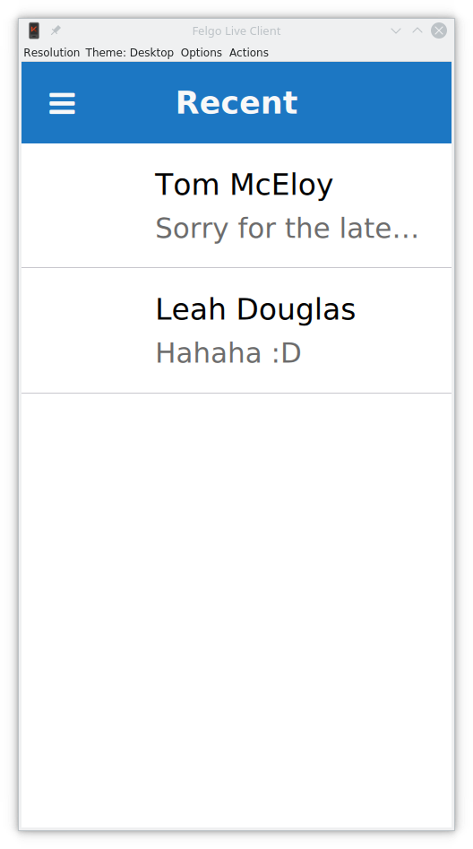

.. literalinclude:: src/messaging-stage-2/qml/Main.qml
    :start-after: M2>>
    :end-before: <<M2

`SimpleRow <https://felgo.com/doc/felgo-simplerow/>`_ is a flexible Felgo component which represents a single entry in a list. It has many useful properties such as image, primary text and subtext. It also tries to be smart and picks out the corresponding model keys automatically. In the example, the ``text``, ``detailText``, and ``image`` are set this way. Check out the `element documentation <https://felgo.com/doc/felgo-simplerow/>`_ for a complete list of what model properties are picked up automatically by ``SimpleRow``.

``SimpleRow`` is composed of different QML items that are exposed through properties. You can tweak each item if the default setup is not satisfying. In the example, we are overriding the ``radius`` property of the ``image`` item to create a rounded image.

Another interesing detail in the example above is that ``imageMaxSize`` is defined as ``dp(48)``. Felgo uses density independent sizes, meaning that elements have the same size regardless of the device screen. To benefit from this you should always use ``dp()`` for setting the size of visual items such as buttons, and ``sp()`` for texts which can also scale along to the preferred base size of a user. For details about how to create apps for multiple screen sizes and densities using Felgo, see: `Supporting Multiple Screen Sizes & Screen Densities with Felgo Apps <https://felgo.com/doc/apps-supporting-multiple-screens-and-screen-densities/>`_. 

You can preview and edit the resulting state of this step in the `Felgo Cloud IDE <https://ide.felgo.com/-/ide/project/qmlbook/qmlbook-felgo-messaging/edit/messaging-stage-2/-/>`_.

Showing Conversations
---------------------

Now it is time to get interactive. When our user selects a conversation, we want to open a new page for that conversation. Let’s start by adding a new ``Component`` to the bottom of ``Main.qml`` of our app. 

.. literalinclude:: src/messaging-stage-3/qml/Main.qml
    :start-after: M1>>
    :end-before: <<M1

As you can see from the code above, each conversation is represented by a ``ListPage`` instance. When the user clicks on a conversation we can now push a new instance of the ``conversationComponent`` page onto our ``navigationStack``. The ``title`` for each new page is the text of the selected item. This is done from the ``onSelected`` signal in our ``SimpleRow`` delegate that we showed earlier. We use the `popAllExceptFirstAndPush <https://felgo.com/doc/felgo-navigationstack/#popAllExceptFirstAndPush-method>`_ method to ensure that we only have one conversation at a time open.

.. literalinclude:: src/messaging-stage-3/qml/Main.qml
    :start-after: M2>>
    :end-before: <<M2

At this stage, you can navigate back and forth between the conversation list and details and see the title changing accordingly. We can fill up the conversation page by adding some mock messages as the model.

.. literalinclude:: src/messaging-stage-3/qml/Main.qml
    :start-after: M3>>
    :end-before: <<M3

Similar to the list of conversations, this model for the messages acts as source for a ``ListPage``, but for this page, we want a custom user interface to show the messages. We can do this by creating a custom ``delegate`` as shown below.

.. literalinclude:: src/messaging-stage-3/qml/Main.qml
    :start-after: M4>>
    :end-before: <<M4

This delegate allows us to provide a custom look for our message list, as shown below. 

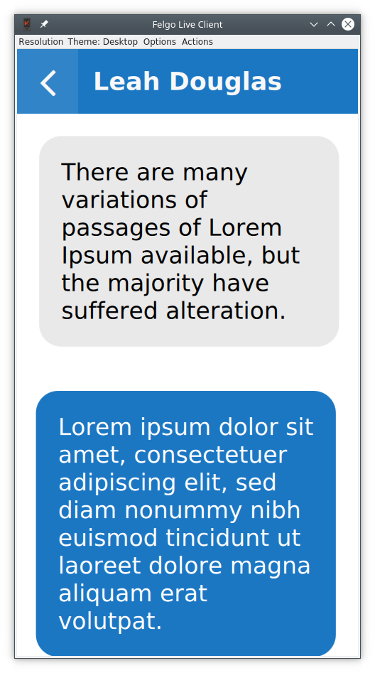

The text is shown using the `AppText <https://felgo.com/doc/felgo-apptext/>`_ element, that ensures that the size of the text is device independent. The ``AppText`` relies on the application's `Theme <https://felgo.com/doc/felgo-theme/>`_. Each Felgo application has a theme, and inside the ``Theme`` object, the global styling options for the application are found. In the code above we use ``Theme.tintColor`` for the primary color and ``Theme.contentPadding`` for the system dependent padding size. By default, the ``Theme`` ensures a native look and feel across platforms.

You can preview and edit the resulting state of this step in the `Felgo Cloud IDE <https://ide.felgo.com/-/ide/project/qmlbook/qmlbook-felgo-messaging/edit/messaging-stage-3/-/>`_.

Sending Messages
----------------

The last step is to let the user send messages. For this, let's add a `AppTextField <https://felgo.com/doc/felgo-apptextfield/>`_ to the bottom of our conversation page.

.. literalinclude:: src/messaging-stage-4/qml/Main.qml
    :start-after: M1>>
    :end-before: <<M1

The ``AppTextField`` let's the user enter text, and provides the ``onAccepted`` signal when the text is ready. Each time the user provides a new text, we update the model and clear the text field.

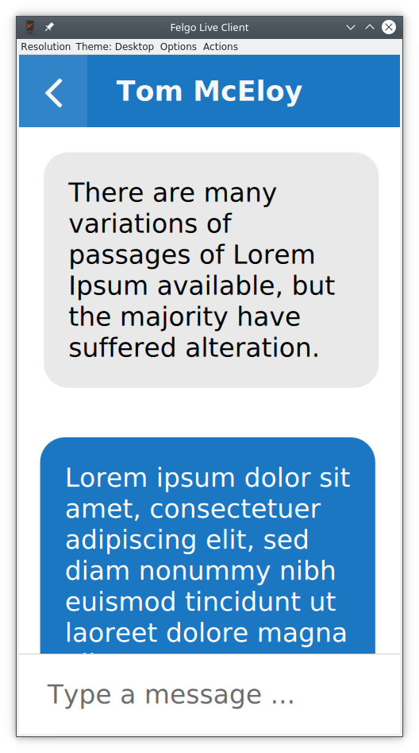

You can preview and edit the resulting state of this step in the `Felgo Cloud IDE <https://ide.felgo.com/-/ide/project/qmlbook/qmlbook-felgo-messaging/edit/messaging-stage-4/-/>`_.

Storing Data
------------

At the moment, the application only uses mock data and does not connect to any backend. This means that all messages the user adds will disappear every time the application is closed. We can fix this by using a data storage API.

QtQuick allows you to use an SQL database, which is a fast option even for large data, but it is rather inconvenient to use for our simple data structure. Instead, we will save our data as JSON data. Something that fits well into QML, as it is based on JavaScript.

With the `Storage <https://felgo.com/doc/felgo-storage/>`_ item, Felgo provides a JSON-optimized component for this. You can access the database as a simple key-value store and there is no need for complex SQL queries. In its simplest form the API looks a bit like: ``myStorage.setValue (key, value)`` and ``value = myStorage.getValue(key)``.

Felgo automatically calls JSON.stringify() when writing composed values, automatically serializing the data. You can also take direct control of the underlying database using SQL queries if needed.

We use the ``Storage`` class via the ``app.settings`` property, which is the central application settings store. In the example below, you can see how we populate the model with mock data if the model is empty, or use the stored data otherwise.

.. literalinclude:: src/messaging-stage-5/qml/Main.qml
    :start-after: M1>>
    :end-before: <<M1
    
In addition to this snippet, the ``conversationPage.storeNewMessages()`` has to be called from the ``onAccepted`` signal in the ``AppTextField`` so that each new message is stored as it is added.

The screenshot below shows a stored message that has been saved between two executions of the app (you'll have to trust me on that).

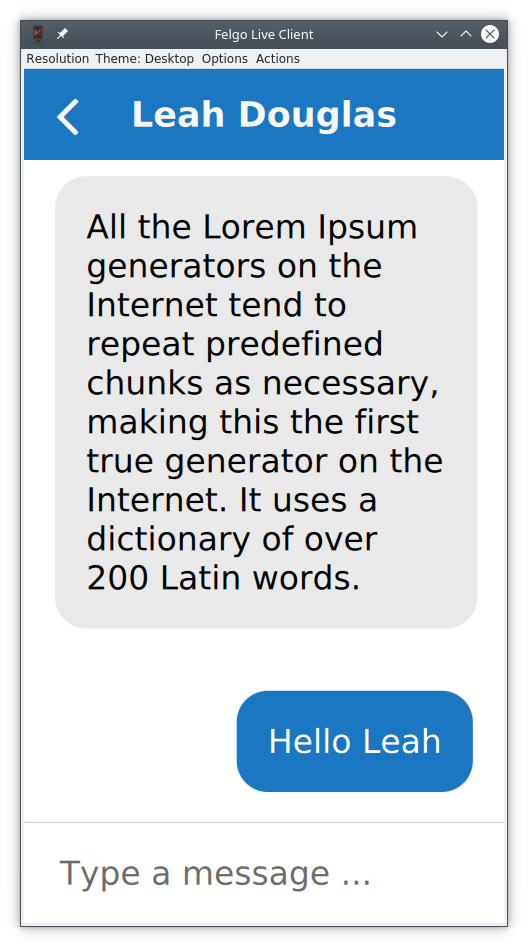

If you want to take the messaging application to the next level, you can also use Felgo to directly integrate your QML to Google Firebase or the Felgo Cloud backend, to provide a proper, cloud based storage option. But that is a completely different story.

You can preview and edit the resulting state of this step in the `Felgo Cloud IDE <https://ide.felgo.com/-/ide/project/qmlbook/qmlbook-felgo-messaging/edit/messaging-stage-5/-/>`_.

Refactoring
-----------

Up until now, we've created the entire messaging app in a single QML file. This works for smaller apps, but we are already way beyond a hundred lines of code in our example. For the interested reader, there is a refactored version of the app available in the chapter example source code tarball where the app has been split into ``RecentsPage.qml``, ``ConversationPage.qml``, and ``Main.qml``. This way, the complexity in each file can be kept down and the various parts of the app can be kept separate from each other.

You can preview and edit the resulting state of this step in the `Felgo Cloud IDE <https://ide.felgo.com/-/ide/project/qmlbook/qmlbook-felgo-messaging/edit/messaging-stage-6-refactor/-/>`_.

Advanced Topics
===============

Theming
-------

Felgo comes with theming capabilities, making it easy to customize the look of your application. The `Theme <https://felgo.com/doc/felgo-theme/>`_ object contains a set of properties that control the appearance of the user interface. It can easily be controlled in the `App::onInitTheme <https://felgo.com/doc/felgo-app/#initTheme-signal>`_ signal.

.. literalinclude:: src/snippets/theming-intro.qml

In the example above we change the tint color. This affects many parts of your UI such as the ``ActionBar`` color on Android and the highlight color on iOS.

You can also customize the background color, as well as many other details such as the navigation bar color, or the main font. If you feel like it, you can completely change the platform style, as shown below, the Android theme is swapped for the iOS theme and the other way around.

.. literalinclude:: src/snippets/theming-colours.qml

You can also lock the ``Theme.platform`` to a fixed style, and thus offer the same look and experience on all platforms. It all depends on what kind of user experience your are trying to create.

Styling Items
+++++++++++++

If you want to dig deeper you can customize the look and feel of specific components. Each component has an entry in the theme object. In the example below we customize buttons so they have a red background and a with a border that creates a fake 3D effect.

.. literalinclude:: src/snippets/theming-button-style.qml

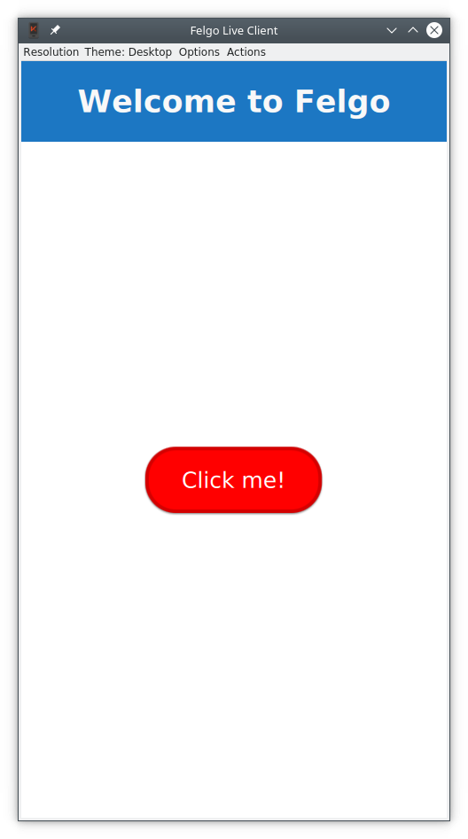

While the Desktop and Android versions are going to have a raised style, the default iOS variant will be flat. That is why we also customize the ``flatTextColor`` to change the appearance. You can switch between platforms in the Felgo Live View to see how your styling appears on all platforms.

Model Sorting and Filtering
---------------------------

A common use-case in Apps is to sort the contents of a model. Here, Felgo provides a QML version of the `SoftFilterProxyModel <https://felgo.com/doc/felgo-sortfilterproxymodel/>`_. Using this element you cannot only sort and filter models from QML, you can provide both sorters and filters directly from QML.

.. literalinclude:: src/snippets/sort-filter-proxy-model.qml

In the example above, a `StringSorter <https://felgo.com/doc/felgo-stringsorter/>`_ is used, but Felgo comes with more sorters, as well as a range of filters.

Native App Features
-------------------

There are many use cases which require accessing native features on every platform. Using Qt with C++ to bridge between QML, Java (Android) and Objective-C (iOS) can be quite complex. Manually writing this code requires a lot of time and effort, different implementations for each platform. Felgo provides many integrations which you can use out of the box to access native platform features.

The platform native features are exposed through the `NativeUtils <https://felgo.com/doc/felgo-nativeutils/>`_ element, made available under the name ``nativeUtils``.

Native Dialogs
++++++++++++++

Qt allows displaying QML dialogs, but sometimes you need native dialogs that are better integrated with the platform. Felgo provides a number of methods to create them:

* `displayAlertDialog <https://felgo.com/doc/felgo-nativeutils/#displayAlertDialog-method>`_
* `displayAlertSheet <https://felgo.com/doc/felgo-nativeutils/#displayAlertSheet-method>`_
* `displayDatePicker <https://felgo.com/doc/felgo-nativeutils/#displayDatePicker-method>`_
* `displayMessageBox <https://felgo.com/doc/felgo-nativeutils/#displayMessageBox-method>`_
* `displayTextInput <https://felgo.com/doc/felgo-nativeutils/#displayTextInput-method>`_

Once one of the methods above are invoked, you can connect to the result in a slot for nativeUtils. Let’s see an example in action:

.. literalinclude:: src/snippets/native-dialog.qml

You can also retrieve pictures from your camera or your gallery using ``nativeUtils`` methods.

* `displayImagePicker <https://felgo.com/doc/felgo-nativeutils/#displayImagePicker-method>`_
* `displayCameraPicker <https://felgo.com/doc/felgo-nativeutils/#displayCameraPicker-method>`_

Usage is very similar to working with native dialogs: call the method and wait for a signal on completion.

.. literalinclude:: src/snippets/camera-image-picker.qml

The original images will be copied into your application data directory and you’ll get the path. This avoids all the complications introduced by the scoped storage policies on mobile devices.

Notch Support
+++++++++++++

Modern phones sometimes come with the camera placed in a notch inside the screen. Felgo introduces the concept of a ``safeArea``. Anything inside this item is guaranteed not to be overlapped with various notch and gesture areas on both on Android and iOS. The safe area is enabled by default, but sometimes, you might feel the need to disable it, as shown below.

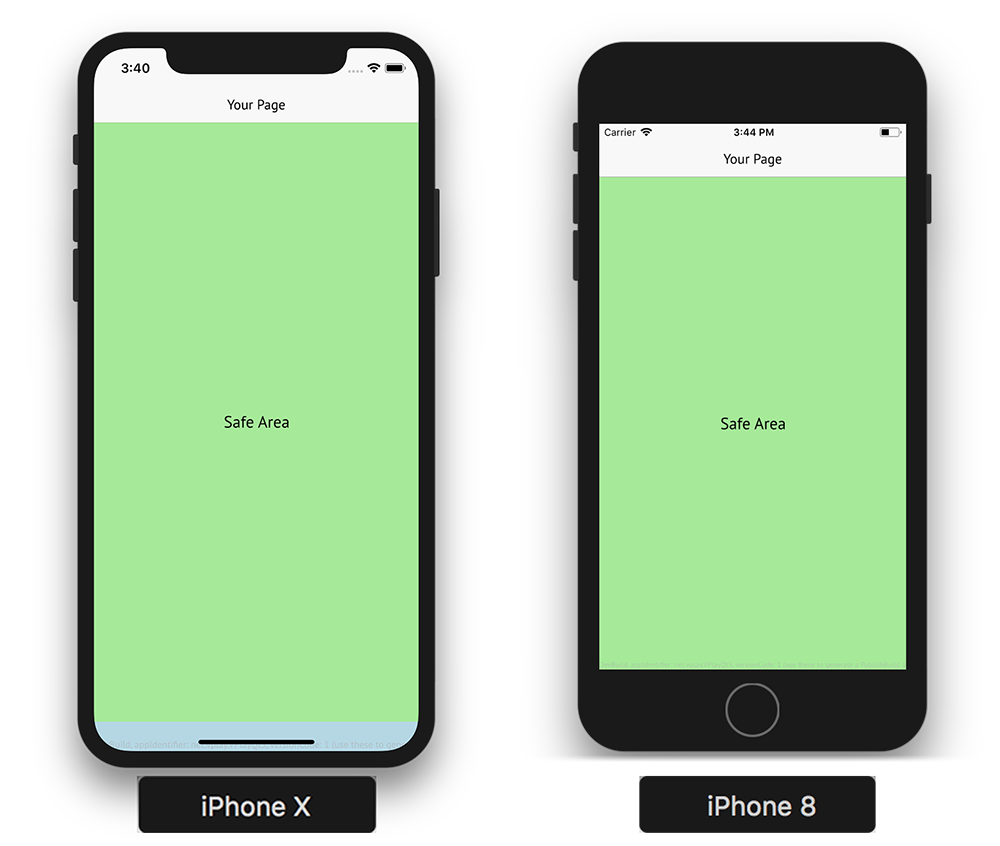

.. literalinclude:: src/snippets/safe-area.qml

This allows full-screen designs, but you need to make sure that important parts of your UI are not affected by notches and gesture areas. To do so, you can rely on ``nativeUtils.safeAreaInsets``, which contains the inset sizes in pixel values:

* ``nativeUtils.safeAreaInsets.left``
* ``nativeUtils.safeAreaInsets.top``
* ``nativeUtils.safeAreaInsets.right``
* ``nativeUtils.safeAreaInsets.bottom``

Native APIs
+++++++++++

Some APIs are less visual than dialogs and notches. For instance, the ``nativeUtils.contacts`` provides access to the contact information from the device's address book. It is represented by a JavaScript object, and you can display all your contacts in a QML view as shown below.

.. literalinclude:: src/snippets/contacts.qml

You can also share links and texts using ``nativeUtils.share`` or interact with files using ``fileUtils``. In addition, there are many Felgo Plugins that simplify working with 3rd party Frameworks and libraries that target mobile platforms.

Networking
----------

Felgo comes with a number of utily functions that come in handy. In this section we will show some of them that come in handy when building a modern, connected, application.

HttpRequest
+++++++++++

With vanilla Qt/QML it is possible to perform network requests using the JavaScript ``XMLHttpRequest`` call. Felgo provides the `HttpRequest <https://felgo.com/doc/felgo-httprequest/>`_ that provides an easier to use interface.

In the example below, a request with a time-out is made, with one function called on success and another one on failure.

.. literalinclude:: src/snippets/http-request.qml

Compared to ``XMLHttpRequest``, the ``HttpRequest`` approach is more straight forward. All the `HTTP CRUD <https://en.wikipedia.org/wiki/Create,_read,_update_and_delete>`_ operations are supported (get, post, put, patch, del). There also advanced features like request caching that can be enabled globally in ``config``, as shown below.

.. literalinclude:: src/snippets/http-request-caching-global.qml

Or for a specific request, as shown here.

.. literalinclude:: src/snippets/http-request-caching-local.qml

Working with JSON data
++++++++++++++++++++++

Very often applications display data coming from remote endpoints. The data is exposed via JSON REST APIs. You can use it as the model for your lists, but a QML ListModel is the preferred and performant way. It allows to track changes and apply view updates on an entry-level, instead of just refreshing the whole list.

Felgo comes with the `JsonListModel <https://felgo.com/doc/felgo-jsonlistmodel/>`_ that provides a model with good performance and Qt integration, while working with JSON data.

In the example below, we populate the ``jsonModel`` with hardcoded JSON data , but we could just as easily have provided it with data from a remote server.

.. literalinclude:: src/snippets/json-list-model.qml

Download Resources, Files and PDFs
++++++++++++++++++++++++++++++++++

A lot of platform and file system specifics play into how you can interact with files on certain systems. The `FileUtils <https://felgo.com/doc/felgo-fileutils/>`_ element, provided through the global ``fileUtils`` item that is available as a context property from all QML components encapsulates methods that allow you to read, write and list files.

In the example below, we show how to download a PDF file and then open it with the native PDF viewer application using `FileUtils::openFile() <https://felgo.com/doc/felgo-fileutils/#openFile-method>`_. It also uses the ``DownloadableResource`` type to download the PDF from a web location and store it on the device.

.. literalinclude:: src/snippets/view-pdf.qml

Summary
=======
The Felgo SDK brings a lot of benefits to Qt/QML development. It allows you to create cross-platform apps that look native on: Android, iOS, Desktop, Web (WebAssembly) and Embedded systems. Supporting all kinds of devices,  regardless of their different screen sizes and densities.

Use the navigation components to build your main menu and implement hierarchies of pages. Compose your page content with Felgo controls, lists and models. Introduce logic for data handling, storage, networking or to access native APIs like the device camera, contacts or dialogs. For all these areas, you can save a lot of time with a big variety of carefully constructed QML components.

Felgo provides you with all important tools for cross-platform app development with QML. Instead of worrying about pitfalls and issues that aren’t specific to your project, you can focus on the actual work for your application. The customization options of Felgo leverage the flexibility of QML and are perfect for custom UI and branded apps. You can control the look with app-wide theme settings and freely customize or mix-in your own QML if needed.

This is just scratching the surface of what Felgo offers. You can see the `full documentation <https://felgo.com/doc/>`_, which also includes a large selection of `Felgo Plugins <https://felgo.com/plugins>`_. If you want to learn more about the Felgo SDK and application development with QML, explore free `webinars <https://felgo.com/resources/white-papers-and-webinars>`_ or join one of the scheduled `trainings <https://felgo.com/training-offers>`_.

If you enjoyed our messaging app, you can find more sample applications `here <https://felgo.com/apps/>`_. Feel free to take a look at their full source-code or use them as starting point to build awesome new applications.

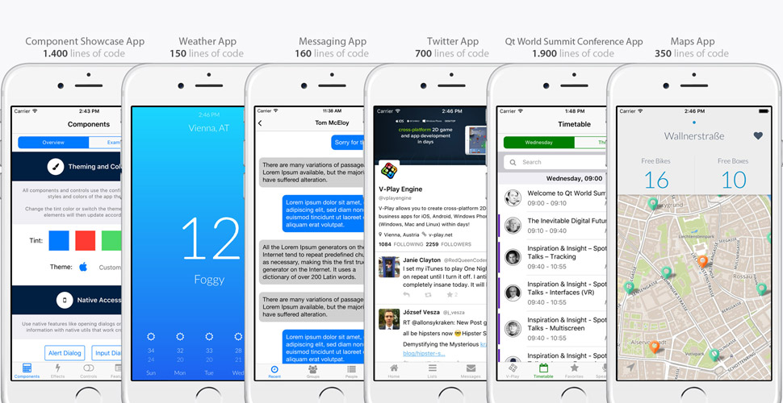

