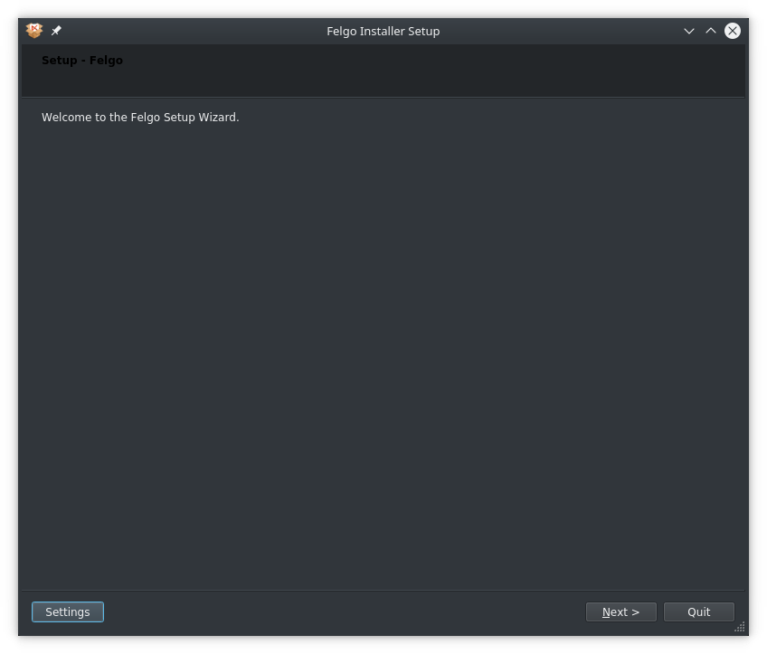
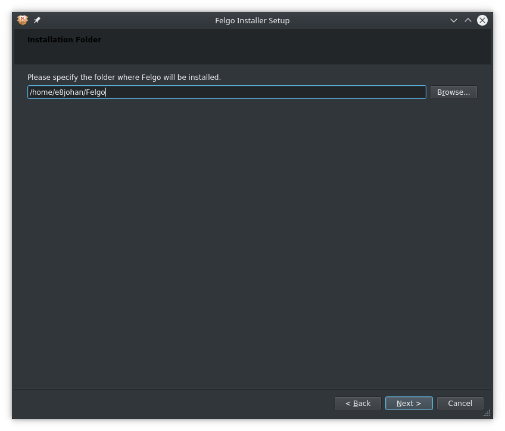
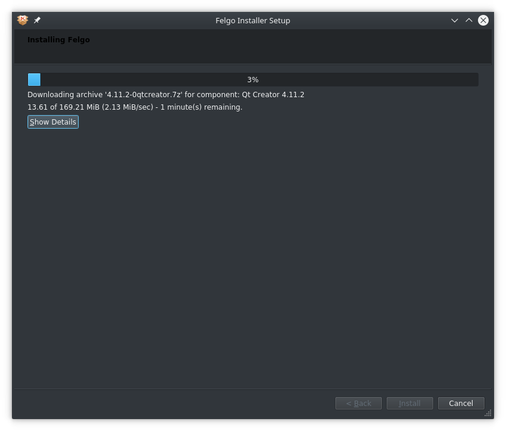
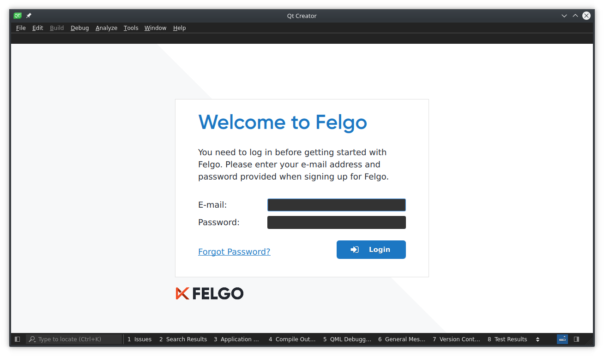

=====
Felgo
=====

.. sectionauthor:: `e8johan <https://bitbucket.org/e8johan>`_

.. github:: ch08

.. note::

    Last Build: |today|

    The source code for this chapter can be found in the `assets folder <../assets>`_.

.. note::
    Placeholder for the Felgo chapter covering:

    * General introduction
    * Messaging App Example
    * Advanced Topics
    * Styling and Customization
    * Access to Native Features
    * Application Logic and Utility

  
.. note::

  Tarball, untar, provides installer. Run it
  
  libssl1.0.0.so
  
  LD_LIBRARY_PATH=./libs ./FelgoInstaller-linux_x64-online.run
  
  screenshots 1 + 2 - license agreement + 3

.. literalinclude:: src/helloworld/helloworld.qml

.. literalinclude:: src/messaging-snippets/skeleton.qml
.. literalinclude:: src/messaging-snippets/model.qml
.. literalinclude:: src/messaging-snippets/delegate.qml

.. literalinclude:: src/messaging-snippets/conversation.qml
.. literalinclude:: src/messaging-snippets/delegate-create-conversation-page.qml
.. literalinclude:: src/messaging-snippets/conversation-page.qml

.. literalinclude:: src/messaging-snippets/mock-messages.qml
.. literalinclude:: src/messaging-snippets/message-delegate.qml
.. literalinclude:: src/messaging-snippets/message-text-field.qml

.. literalinclude:: src/messaging-snippets/settings.qml

.. literalinclude:: src/messaging-snippets/theming-intro.qml
.. literalinclude:: src/messaging-snippets/theming-colours.qml
.. literalinclude:: src/messaging-snippets/theming-button-style.qml

.. literalinclude:: src/messaging-snippets/safe-area.qml

.. literalinclude:: src/messaging-snippets/native-dialog.qml
.. literalinclude:: src/messaging-snippets/camera-image-picker.qml
.. literalinclude:: src/messaging-snippets/contacts.qml

.. literalinclude:: src/messaging-snippets/http-request.qml
.. literalinclude:: src/messaging-snippets/http-request-caching-global.qml
.. literalinclude:: src/messaging-snippets/http-request-caching-local.qml

.. literalinclude:: src/messaging-snippets/json-list-model.qml
.. literalinclude:: src/messaging-snippets/sort-filter-proxy-model.qml
