===================================
Felgo Plugins and QML Hot Reloading
===================================

.. sectionauthor:: `e8johan <https://bitbucket.org/e8johan>`_

.. github:: ch19

.. note::

    Last Build: |today|

    The source code for this chapter can be found in the `assets folder <../assets>`_.

We've already discussed how Felgo enhances Qt and simplifies the creation of applications. In this chapter, we will look a bit deeper at the tooling and the mobile plugins that Felgo provides.

Tooling
=======

Felgo comes with two main tools that simplify your life as a Qt developer. The Felgo Live that lets you apply your code changes in real-time, and Cloud Builds, that lets you automate the building and deployment of your apps for all platforms.

Felgo Live
----------

The Hot Reload and Felgo Live Clients lets you modify your code and see the changes live. All QML, JavaScript, and assets are updated on every connected device as soon as you save your files.

.. figure:: images/hot-reload.*

Hot Reload is smart enough to only modify what you changed, preserving the state of your application. For instance, if you are updating a page containing a toggled switch, it will still be toggled after a reload.

This shortens the roundtrip times dramatically when developing, as you no longer have to go through the complete save, compile, deploy, restart cycle.

The Felgo Live tool is a standalone tool that comes with the Felgo SDK and can be used with any Qt/QML project. You do not have to develop your app with the Felgo SDK to enable QML Hot Reload for your project.

In the Felgo SDK, you launch Felgo Live from the Live Play button in the Qt Creator sidebar, as shown below.

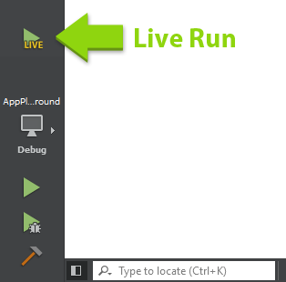

Once started, the Felgo Live Server is running together with your application. Every time you save your source files, the changes are immediately shown in the running application. You can also see logs from all connected devices. It is also possible to start the live server from command line, passing your root QML file as an argument.

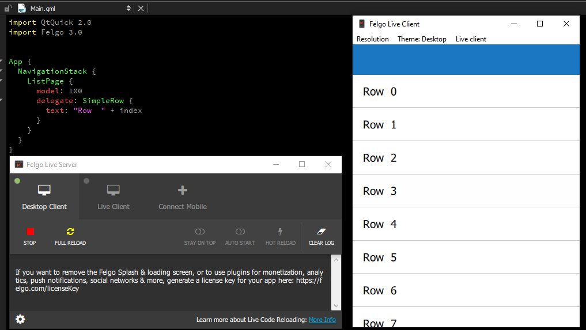

Felgo Hot Reload can be used on every target platform - be it desktop or mobile. It even works for WebAssembly and Embedded systems. Felgo has more information on the topic at the `product page <https://felgo.com/doc/qml-hot-reload-felgo-live/>`_.

Felgo Live Client
+++++++++++++++++

When used locally on your computer, the Felgo Live Server talks to an instance of the Felgo Live Client. It is possible to connect more clients to each server. For instance, the Felgo Dev App integrates a Live client for Android and iOS devices. You can download it from `Google Play <https://play.google.com/store/apps/details?id=net.vplay.apps.QMLLive>`_ and `Apple AppStore <https://apps.apple.com/us/app/qml-live-scripting-by-felgo/id1157319191>`_ respectively. This application also provides a showcase of Felgo components and sample applications to give you an overview of what’s offered.

After you install the application, make sure your device is on the same network as your PC and click on “Connect Desktop”. Your mobile device will show you the live view of your app right away. When you start changing your code you will see both the Desktop and Mobile versions updated instantaneously.

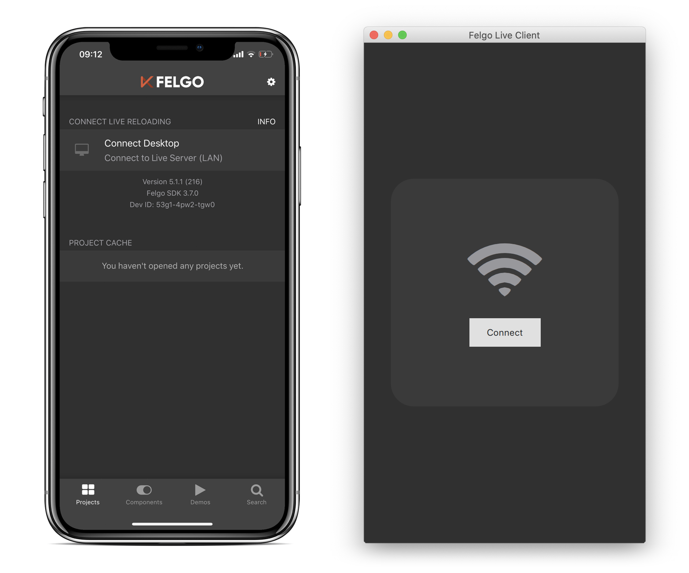

When connecting multiple devices through live clients, you can test many different configurations of screen sizes, DPIs and styles at the same time. You can even deploy your application on an iOS device without having access to an Apple computer.

How does it Actually Work?
++++++++++++++++++++++++++

Most QML applications are layered. They have a QML and Javascript layer running in the QML engine, sitting on top of the Qt/C++ layer. The Felgo SDK adds the Felgo Live Module component and the Felgo Live Server, interacting with the module.

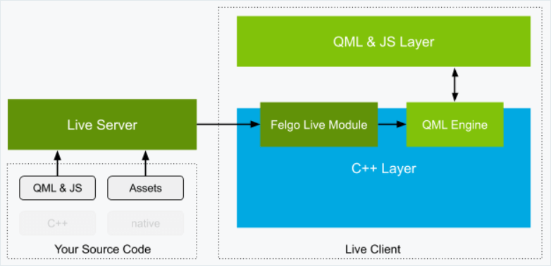

The Live Server monitors your QML, JS and assets files. When they change, it sends the updated tree to the Felgo Live Module. The module takes care of comparing the current tree of QML components with the new one and updates the subtrees which have changed, preserving the state of every other property.

Custom Clients
++++++++++++++

The Felgo Live Server operates by transmitting changed QML, JS and asset files to the Live Client. However, C++ code always requires compilation which is why the Live Client cannot support custom C++ out of the box. All your native C++ classes need to be built into the application. 

The way to solve this with the Felgo SDK is to integrate the Felgo Live Module into your own project. This essentially turns your own app into a custom Live Client that supports QML Hot Reload. The code needed for this is trivial.

First, you need to add the ``felgo-live`` module to your Qt ``CONFIG`` in your project::

    CONFIG += felgo-live

The include ``FelgoLiveClient`` in your ``main.cpp``:

.. code-block:: c++

    #include <FelgoLiveClient>

And finally, instead of loading your QML root file, use the live client to configure the ``QQmlEngine`` instance by replacing:

.. code-block:: c++

    felgo.setMainQmlFileName(QStringLiteral("qml/Main.qml"));
    engine.load(QUrl(felgo.mainQmlFileName()));

With:

.. code-block:: c++

    FelgoLiveClient liveClient(&engine);

The line above creates a ``FelgoLiveClient`` instance, which handles loading the QML, but also updating of the QML inside the running engine when the code changes.

Now build and run the application for any Qt platform and you have a custom Felgo Live Client that you can connect to your Felgo Live Server. The application includes all your C++ code while allowing you to use Hot Reload for the QML code.

When you are ready for release just revert the ``main.cpp`` file back the way and remove the Live Client Module. You can do this using a define that you use when calling ``qmake``. That way you can use an ``ifdef`` to avoid having two different versions of ``main.cpp``, but instead configure the build environment in Qt Creator to include or exclude the live client functionality.

Cloud Builds
------------

A large task, once your application has been developed, is building it for a variety of target platforms. You might want to build different versions such as, beta releases, production releases and even customer specific versions. You might also want to push builds to various app stores for publishing.

This is a major undertaking. You need to set up and maintain a build environment for each platform. Application packages need to be signed for deployment to the app stores. As an application grows, you will end up building a lot of major or minor builds for testing or new releases. This is where DevOps or CI/CD comes into the picture.

Felgo Cloud Builds is a CI/CD solution for automatic building and deploying of Qt apps. You set up your project and build configuration once and then use this to build apps. You can target iOS, Android, Desktop, or Embedded. Each new version only takes a few minutes to build.

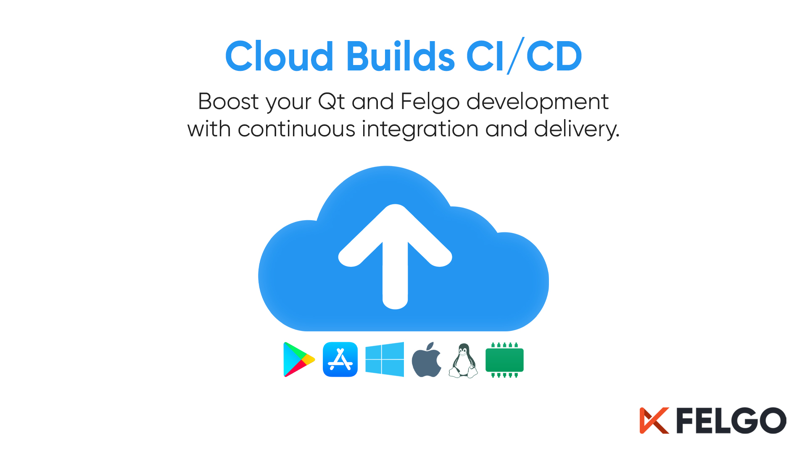

The Felgo Cloud Build is a centralized and stable build environment for every Qt target platform. This means that you, as a developer, do not need the toolchains for every platform on your machine. For example, you can create iOS apps from Windows, even though you cannot install the required tools for compiling iOS apps on your machine. This also removes potential problems that may arise from building the app with different systems and tooling environments. Every release is built with the same system configuration, Qt version and dependencies.

In addition to building apps, you might also want to deploy your apps to Google Play or Apple AppStore. You can use the beta testing mechanisms in the stores to test new versions and then move them to production. This traditionally requires uploading the ``apk`` bundles or ``ipa`` packages on the respective store websites.

Felgo Cloud Builds automates this as well. It takes your source code from your repository, builds your project for all platforms in parallel, and then uploads the packages to the stores for testing or publishing, depending on your settings.

To use Felgo Cloud Builds, visit the `Cloud Builds page <https://felgo.com/cloud-builds>`_ to set up your project.

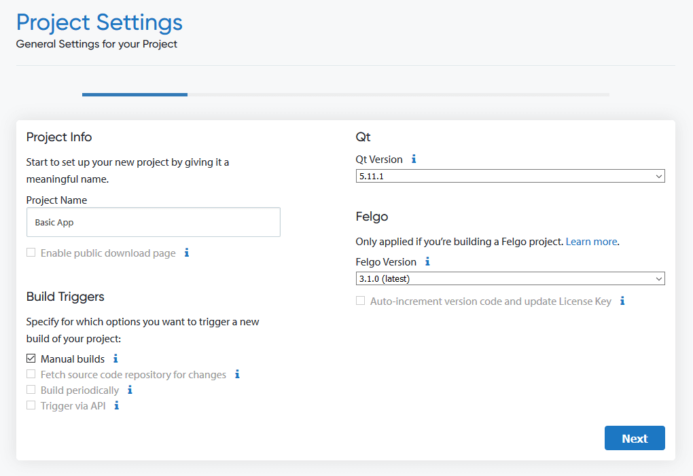

The web site has step by step guides to create and configure your project. Starting from a Git repository, signing options, and optionally the integration with the stores. If you do not have a Google Play or App Store account yet, or have not setup your application in the app store, it is recommended to first set everything up and have a look at how to configure the store listing before integrating it into the Cloud Build infrastructure. Your store configuration and testing channels should be ready and working before you configure Cloud Builds for automatic deployment.

Once everything is set up, you can trigger a build whenever you wish, resulting in a set of application packages. If you enable store deployment for the build, the packages will automatically appear in the respective channels, ready for your testers and users, before you can push the build to production.

.. admonition:: Building on-premise

    Felgo Cloud Builds is hosted by Felgo, but is also available on-premise. It can be used for any Qt/QML application and custom toolchains or specific Qt versions are possible as well. If you need a specific setup, for example, to target a certain embedded platform, get in touch with Felgo.

    
Felgo Plugins
=============

Once you've created a new app, you can look at more advanced topics. Felgo provides extensions to Qt that help you with monetization, push notifications, and analytics, i.e. the study of how the user moves through the app.

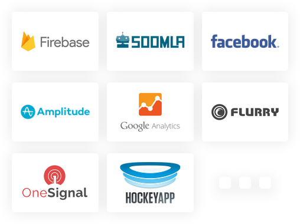

These functions usually required platform specific APIs. There are also third party services that provide such services through custom native frameworks. Supporting native SDKs for Android and iOS using Qt/QML is not an easy task. You need to provide a portable abstraction for the APIs, binding to Java/Kotlin for Android or Objective-C/Swift for iOS.

To help with this, Felgo extends Qt with plugins integrating these services directly to QML.

Configuration
-------------

The Felgo plugins extend Qt with bindings to external services. This means that you will have register with the third party services. You will also need a Felgo license key. All monetization plugins are available for free, while other plugins require that you purchase an `Indie or Enterprise license <https://felgo.com/pricing>`_.

.. note::

    All the examples in this chapter require you to have a custom license key. They are not runnable out of the box.
    
To get started with the Felgo plugins, start Qt Creator from the Felgo SDK and create a new project. The project wizard presents you with a step that lets you select which plugins to use. Choose the ones that you want to use. This will add the relevant code to your project along with the needed build configurations.

To retrieve a valid Felgo license key for your application, go to `https://felgo.com/developers/license <https://felgo.com/developers/license>`_ and select the plugins that you intend to use.

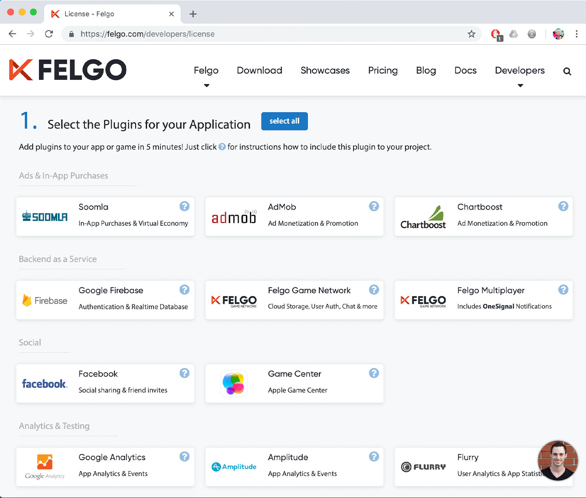

At the bottom of the page, click the *Generate License Key* button. This lets you provide an app identifier and a version code.

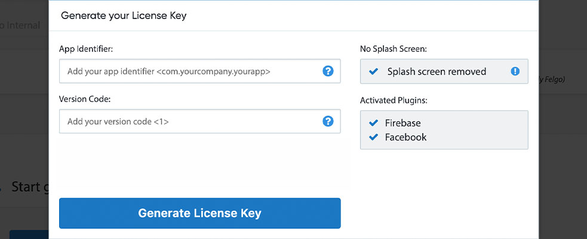

This will present you with your generated license key. This key is unique to your license and your app, so make sure to keep it secret.

You can then paste the license key into your application.

.. literalinclude:: src/snippets/license-key-app.qml

You can also provide the license key through your project file. This integrates well with the Felgo Cloud Builds platform.

.. literalinclude:: src/snippets/license-key-pro.pro
    :language: bash
    
Once this is in place you can start using the plugins. If you use the paid versions of Felgo, the Felgo splash screen is also removed by specifying the license key.

Monetization, Ads and In-App Purchases
======================================

A common business model in the mobile space is in-app purchases or advertising. Felgo offers APIs to enable both these use-cases powered using multiple alternative backends such as Google AdMob, Soomla, and Chartboost.

Ad Monetization
---------------

In this example we will look at using AdMob. AdMob is an in-app mobile advertising platform run by Google.

To get started, you need to register an AdMob account on the `AdMob Sign-up Page <https://admob.google.com/home/get-started/>`_. Then add an `AddMobBanner <https://felgo.com/doc/felgo-admobbanner/>`_ to your app as shown below.

.. literalinclude:: src/snippets/ad-banner.qml

Notice that you specify your ad unit id from AdMob through the ``adUnitId`` property.

This code results in a banner such as the one shown below.

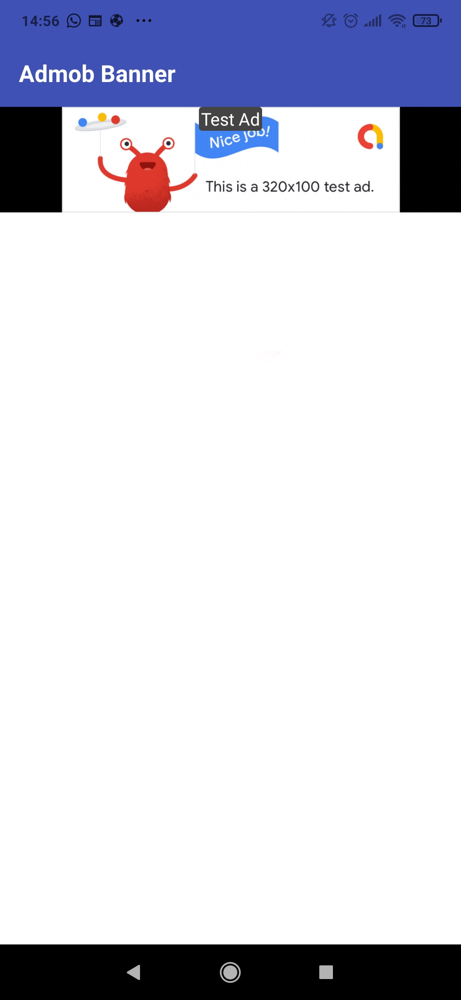

In addition to banners, you can use interstitial ads. These are full-screen interactive advertisements. From QML, it is just as simple to integrate such an ad using the `AdMobInterstitial <https://felgo.com/doc/felgo-admobinterstitial/>`_ element.

.. literalinclude:: src/snippets/ad-full-screen.qml

Use the ``loadInterstitial`` function to start loading the ad in the background. As soon as you want to show the ad, call the ``showInterstitialIfLoaded``. In the example above we call this on the ``interstitialReceived`` signal. It has a sister signal called ``interstitialFailedToReceive`` that is called if the interstitial cannot be loaded, for instance, due to network errors.

In-App Purchases
----------------

Felgo lets you integrate in-app purchases directly into QML. The Soomla plugin lets you use a cross platform API to integrate the Soomla purchasing services into your application.

The API is built around a `Store <https://felgo.com/doc/felgo-store/>`_ with Good items. These can be things such as `LifetimeGood <https://felgo.com/doc/felgo-lifetimegood/>`_, which is a purchase that lasts forever, or a `SingleUseGood <https://felgo.com/doc/felgo-singleusegood/>`_ which is a one time purchase that is used once and then has to be purchased again.

To `StorePurchase <https://felgo.com/doc/felgo-storepurchase/>`_ defines how the item can be purchased. By calling the ``store.buyItem(noadsGood.itemId)`` the purchase is made. The ``noadsGood.purchased`` property can then be used to check if the purchase has been made or not.

.. literalinclude:: src/snippets/in-app-purchases.qml

This example shows the most basic use case. The Soomla APIs let you do much more. For instance, the `SyncedStore <https://felgo.com/doc/felgo-syncedstore/>`_ lets you sync purchases across user devices. You can also provide virtual, an in-app currency, sell packs of items, and much more. Check out the `Soomal documentation <https://felgo.com/doc/plugin-soomla/>`_ for more information.

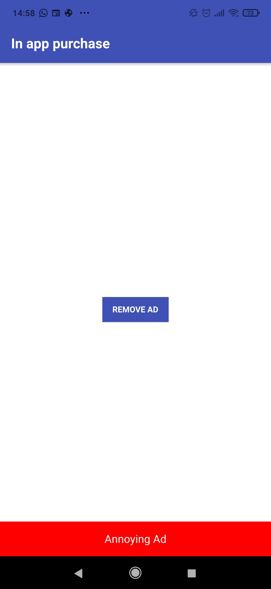

Notifications
=============

It is common that mobile apps use notifications to indicate to the user that an important event has happened or that an announcement is available. Notifications can either be local, for instance a timer is finished, or remote, such as a friend request. With Felgo, you can integrate both types of notification on iOS and Android.

Local Notifications
-------------------

The `NotificationManager <https://felgo.com/doc/felgo-notificationmanager/>`_ is used to schedule local notifications. Notifications can be scheduled either relative to the current time, i.e. in 1 hour, or at a given time, e.g. 3pm on December 24.

In the example below, a `Notification <https://felgo.com/doc/felgo-notification/>`_ is defined declaratively in QML. This is called a *static* notification. Then the ``NotificationManager::scheduleNotification`` is used to trigger the notification. The ``Notification::timeInterval`` is used to set a relative time, in this case, 5 seconds. For setting an absolute time, use the ``timestamp`` property instead.

.. literalinclude:: src/snippets/local-notifications.qml

The ``notificationFired`` signal is triggered when a notification is fired. This signal behaves differently if the app is active, or if it is running in the background. When the app is active, the signal is emitted immediately without a banner or sound being played. When the app is in the background, a notification sound is played and the message is shown in a notification banner. The signal is then emitted once the user taps the message to activate the app and bring it into the foreground.

In some scenarios, a statically declared notification is not enough. For that use-case, it is also possible to provide a JavaScript object to the ``scheduleNotification`` method. This creates the notification dynamically, as shown below.

.. literalinclude:: src/snippets/local-notifications-js-qml

Remote Push Notifications
-------------------------

Remote push notifications require a backend server of some sort. Felgo integrates Google Cloud Messaging and OneSignal to provide push notifications to both Android and iOS. Using these services, you can trigger notifications manually or automatically for every user, or targetted at groups of users.

In the examples below, you will use OneSignal to send push notifications to your app. Before you can start with OneSignal, you need to register for an account. This is described in detail on the `OneSignal plugin page <https://felgo.com/doc/plugin-onesignal/#onesignal-account>`_.

You then create a `OneSignal <https://felgo.com/doc/felgo-onesignal/>`_ element and configure the ``appId``. Each time a notification is received, the ``onNotificationReceived`` signal is emitted. This signal behaves just as the ``notificationFired`` signal discussed above, with respect to the app being active or in the background.

.. literalinclude:: src/snippets/remote-notifications.qml

You can use the excellent `curl <https://curl.haxx.se/>`_ tool to send a notification to all instances of your app.

.. literalinclude:: src/snippets/remote-notifications-curl.sh
    :language: bash
    
If you want to send the notification to a selected set of users, you need to register a tag on the client side, i.e. in your QML code::

    onesignal.setTag("my_key", "my_value")
    
This tag can then be referenced when sending the notification.

.. literalinclude:: src/snippets/remote-notifications-tag-curl.sh 
    :language: bash

The tags are used to reach groups of users. To reference a specific user, use the `OneSignal::userId <https://felgo.com/doc/felgo-onesignal/#userId-prop>`_ property instead.

Analytics and Crash Reporting
=============================

Analytics is used to understand how your users work with your app. This will let you understand if all features are used, or if there is a usability problem with the user interface. Felgo provides plugins for Amplitude, Google Analytics and Flurry. In the example below, we demonstrate how to integrate Amplitude.

In order to use Amplitude you need to sign up for an account. You do that at the `Amplitude website <https://amplitude.com/signup>`_ . 

The code is built around the `Amplitude <https://felgo.com/doc/felgo-amplitude/>`_ element, which provides the ``logEvent`` method, as shown below.

.. literalinclude:: src/snippets/amplitude.qml

Each event should represent an action of the user, for instance, "picture deleted", "user logged in", and so on. In addition to the events, Amplitude can log revenues using the ``logRevenue`` method. This allows you to analyze what user flows leads to revenue streams, e.g. in-app purchases.

To enable further analytics, you can provide a JavaScript object with key-value pairs that you can pass to Amplitude to help analyze the results better. In the example above, we provide an age, a weight, a name and what achievements the user has reached. This way, we can correlate this information with the logs using the Amplitude tools.

The properties can also be things such as free space on the device, or time since the last photo shared, or other relevant data that will make understanding the results easier.

Firebase: Authentication, Databases, and Storage
================================================

The Google Firebase plugin provides three core feature sets: authentication, a database, and generic storage. In this section, we will look at the authentication and database features.

Before you can get started with Firebase you have to register your applications and download the ``google-services.json`` file from the `Firebase console <https://console.firebase.google.com/u/0/?pli=1>`_. Notice that using Firebase also requires a Google account. 

Using the information from the Firebase console, you can set up your `FirebaseConfig <https://felgo.com/doc/felgo-firebaseconfig/>`_ item as shown below.

.. literalinclude:: src/snippets/database.qml

All the required information is found in the ``google-services.json`` file.

Authentication
--------------

In order to use Firebase for authentication, you need to enable the *Email/Password* sign-in method in your Google project. You then use the `FirebaseAuth <https://felgo.com/doc/felgo-firebaseauth/>`_ item to interact with the backend.

The example below demonstrates how to sign up a new user using the ``registerUser`` method. Once the user is registered, the ``userRegistered`` is emitted, indicating either a success or failure in the registration process.

.. literalinclude:: src/snippets/firebase-authentication.qml

When a user has been registered, the ``loginUser`` is used to log in the user. This results in the ``loggedIn`` signal being emitted. ``FirebaseAuth`` also provides methods to ``loginUserWithGoogle``, ``loginUserWithToken``, and ``loginUserAnonymously``.

The tokens used when logging in are created by custom authentication servers as described in `the Firebase documentation <https://firebase.google.com/docs/auth/admin/create-custom-tokens>`_.

When logging in a user anonymously, a local, anonymous, account is created on the current device. If the ``registerUser`` is called from an anonymously logged in session, the anonymous account is associated with the new user, making it possible to migrate the user data across devices.

Firebase Database
-----------------

The firebase realtime database can be viewed as a gigantic json file that contains all data for all users. This database is tightly coupled to the Firebase authentication functionality to ensure that all data is protected and secure.

The `FirebaseDatabase <https://felgo.com/doc/felgo-firebasedatabase/>`_ QML component provides the interface to the database. The API provides functions such as ``setUserValue`` for storing data. Notice that the function tells you if the value was successfully stored or not - something that is important as the database is located in the Firebase cloud.

.. literalinclude:: src/snippets/firebase-setuservalue.qml

To retrieve a stored value, the ``getUserValue`` method is used. It is possible to provide *queryParameters* to sort and filter. This is described in detail in the `firebase query documentation <https://firebase.google.com/docs/database/admin/retrieve-data#section-queries>`_.

.. literalinclude:: src/snippets/firebase-getuservalue.qml

The ``setUserValue`` and ``getUserValue`` works on data for the currently logged in user. The ``setValue`` and ``getValue`` methods perform a similar task, but across all users. Use these with care.

Realtime Database
+++++++++++++++++

The firebase database offers an interesting function in the shape of real-time updates of data changes. 

By registering a key in the ``realtimeUserValueKeys`` property, the `realtimeUserValueChanged <https://felgo.com/doc/felgo-firebasedatabase/#realtimeUserValueChanged-signal>`_ will signal real-time value changes *across devices*. This function has a user independent sibling in the shape of ``realtimeValueChanged``, that acts on global values.

Cloud Storage, Augmented Reality, and More
==========================================

The Felgo plugins provide more integration than we've covered here. As an alternative to Firebase, you can use Felgo Cloud. There is also an augmented reality plugin powered by Wikitude, the Felgo Gamification APIs for leaderboards and achievements and Felgo Multiplayer powered by Photon for real-time communication between users.

Felgo & WebAssembly
===================

In addition to these pure extensions of Qt, Felgo also offers an improved WebAssembly experience, fixing known shortcomings of the current Qt integration, as well as extending the Qt APIs for the WebAssembly environment.

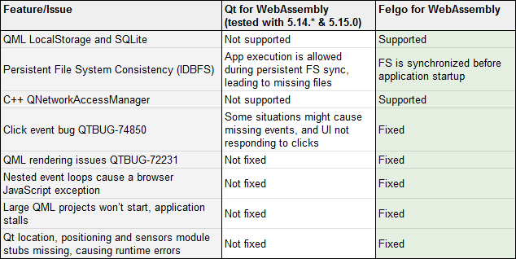

Summary
=======

In this chapter, we have looked at some of the ways that Felgo extends Qt. This spans the entire range: tooling, build services, and integration of features. The strength of the Felgo extensions is that they enable access to advanced features directly from QML. This saves the effort needed to first integrate a feature into Qt/C++, and then exposing it to QML.

Many of the integrated functions shown in this chapter require accounts at external services, as well as Felgo account. This means that you will have to modify the example snippets included with your keys, instead of running them straight out of the box. This is why we separated these contents into a distinct chapter.

The functions demonstrated - advertisements, in-app purchases, push notifications, analytics, user accounts, and real-time databases are all integrated by many applications in one shape or form. By providing pre-made QML integrations, Felgo can save a considerable amount of development time. This is on top of the remote building capabilities of Cloud Builds, automating the building and deployment into app stores, and the Hot Reload feature, making it possible to try out changes live across a range of devices. All of this together can lead to great time savings.

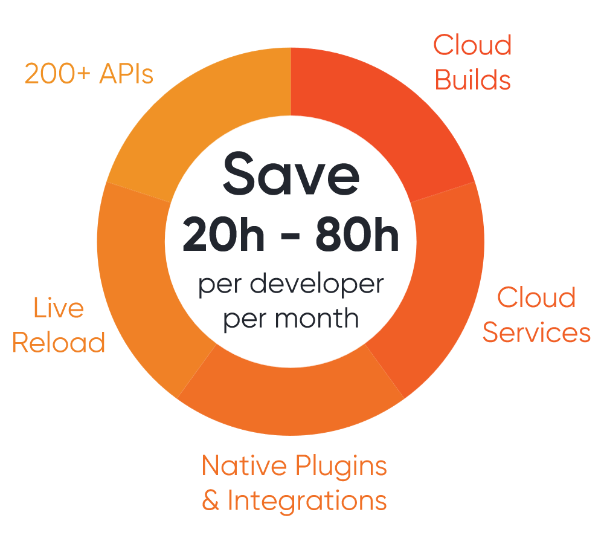

