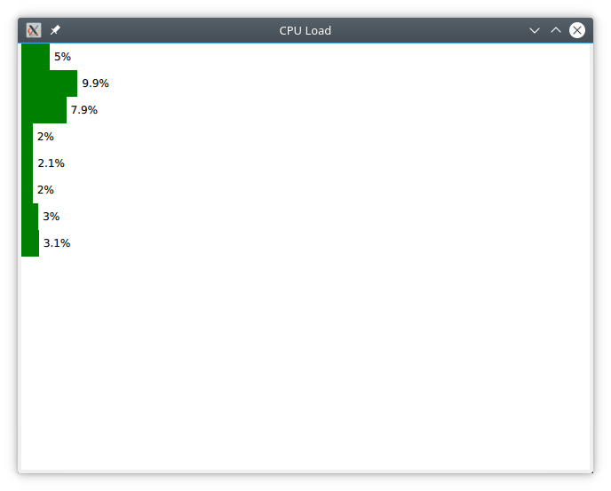

=============
Qt for Python
=============

.. sectionauthor:: `e8johan <https://github.com/e8johan>`_

.. github:: ch20

.. note::

    Last Build: |today|

    The source code for this chapter can be found in the `assets folder <../../assets>`_.

This chapter describes the PySide2 module from the Qt for Python project. You will learn how to install it and how to leverage QML together with Python.

Introduction
============

The Qt for Python project provides the tooling to bind C++ and Qt to Python, and a complete Python API to Qt. This means that everything that you can do with Qt and C++, you can also do with Qt and Python. This ranges from headless services to widget based user interfaces. In this chapter, we will focus on how to integrate QML and Python.

Currently, Qt for Python is available for all desktop platforms, but not for mobile. Depending on which platform you use, the setup of Python is slightly different, but as soon as you have a `Python <https://www.python.org/>`_ and `PyPA <https://www.pypa.io/en/latest/>`_ environment setup, you can install Qt for Python using ``pip``. This is discussed in more detail further down.

As the Qt for Python project provides an entirely new language binding for Qt, it also comes with a new set of documentation. The following resources are good to know about when exploring this module.

- Reference documentation: `<https://doc.qt.io/qtforpython/>`_
- Qt for Python wiki: `<https://wiki.qt.io/Qt_for_Python>`_
- Caveats: `<https://wiki.qt.io/Qt_for_Python/Considerations>`_

The Qt for Python bindings are generated using the Shiboken tool. At times, it might be of interest to read about it as well to understand what is going on. The prefered point for finding information about Shiboken is the `reference documentation <https://doc.qt.io/qtforpython/shiboken2/index.html>`_. If you want to mix your own C++ code with Python and QML, Shiboken is the tool that you need.

.. note::

    Through-out this chapter we will use Python 3.6.

Installing
==========

Qt for Python is available through PyPA using ``pip`` under the name ``pyside2``. In the example below we setup a ``venv`` environment in which we will install the latest version of Qt for Python:

.. code-block:: bash

    $ mkdir qt-for-python
    $ cd qt-for-python
    $ python3 -m venv .
    $ . bin/activate
    (qt-for-python) $ python --version
    Python 3.6.6

When the environment is setup, we continue to install ``pyside2`` using ``pip``:
    
.. code-block:: bash

    (qt-for-python) $ pip install pyside2
    Collecting pyside2
    Downloading [ ... ] (166.4MB)

    [ ... ]
    
    Installing collected packages: pyside2
    Successfully installed pyside2-5.11.2

After the installation, we can test it by running a *Hello World* example from the interactive Python prompt:
    
.. code-block:: bash

    (qt-for-python) $ python
    Python 3.6.6 (default, Jun 27 2018, 14:44:17) 
    [GCC 8.1.0] on linux
    Type "help", "copyright", "credits" or "license" for more information.
    >>> from PySide2 import QtWidgets
    >>> import sys
    >>> app = QtWidgets.QApplication(sys.argv)
    >>> widget = QtWidgets.QLabel("Hello World!")
    >>> widget.show()
    >>> app.exec_()
    0
    >>> 

The example results in a window such as the one shown below. To end the program, close the window.

    A Qt Widgets based *Hello World* example using Qt for Python.

Building an Application
=======================

In this chapter we will look at how you can combine Python and QML. The most natural way to combine the two worlds is to do as with C++ and QML, i.e. implement the logic in Python and the presentation in QML.

To do this, we need to understand how to combine QML and Python into a single program, and then how to implement interfaces between the two worlds. In the sub-sections below, we will look at how this is done. We will start simple and progress to an example exposing the capabilities of a Python module to QML through a Qt item model.

Running QML from Python
-----------------------

The very first step is to create a Python program that can host the *Hello World* QML program shown below.

.. literalinclude:: src/basic/main.qml

To do this, we need a Qt mainloop provided by ``QGuiApplication`` from the ``QtGui`` module. We also need a ``QQmlApplicationEngine`` from the ``QtQml`` module. In order to pass the reference to the source file to the QML application engine, we also need the ``QUrl`` class from the ``QtCore`` module.

In the code below we emulate the functionality of the boilerplate C++ code generated by Qt Creator for QML projects. It instanciates the application object, and creates a QML application engine. It then loads the QML and then ensures that the QML was loaded by checking if a root object was created. Finally, it exits and returns the value returned by the ``exec_`` method of the application object.

.. note::

    The ``exec_`` method ends with an underscore to avoid a name clash with Python. It corresponds to the C++ method named ``exec``.

.. literalinclude:: src/basic/basic.py
    :language: python

Executing the example results in a window with the title *Hello Python World*.

.. figure:: assets/qml-hello-world.png

    A QML window created from Python.
    
.. note::

    The example assumes that it is executed from the directory containing the ``main.qml`` source file. You can termine the location of the Python file being executed using the ``__file__`` variable. This can be used to locate the QML files relative to the Python file as shown in this `blog post <http://blog.qt.io/blog/2018/05/14/qml-qt-python/>`_.

Exposing Python Objects to QML
------------------------------

The easiest way to share information between Python and QML is to expose a Python object to QML. This is done by registering a *context property* through the ``QQmlApplicationEngine``. Before we can do that, we need to define a class so that we have an object to expose.

Qt classes comes with a number of features that we want to be able to use. These are: signals, slots and properties. In this first example, we will restrict ourselves to a pair of a basic signal and slot. The rest will be covered in the examples further on.

Signals and Slots
+++++++++++++++++

We start with the class ``NumberGenerator``. It has a constructor, a method called ``giveNumber`` and a signal called ``nextNumber``. The idea is that when you call ``giveNumber``, the signal ``nextNumber`` is emitted with a new random number. You can see the code for the class below, but first we will look at the details.

First of all we make sure to call ``QObject.__init__`` from our constructor. This is very important, as the example will not work without it.

Then we declare a signal by creating an instance of the ``Signal`` class from the ``PySide2.QtCore`` module. In this case, the signal carries an integer value, hence the ``int``.

Finally, we *decorate* the ``giveNumber`` method with the ``@Slot()`` decorator, thus turning it into a slot. There is not concept of *invokables* in Qt for Python, so all callable methods must be slots.

In the ``giveNumber`` method we emit the ``nextNumber`` signal using the ``emit`` method. This is a bit different than the syntax for doing so from QML or C++ as the signal is represented by an object instead of being a callable function.

.. literalinclude:: src/object/object.py
    :language: python
    :lines: 2-3, 8-18

Next up is to combine the class we just created with the boilerplate code for combining QML and Python from earlier. This gives us the following entry-point code.

The interesting lines are the one where we first instatiate a ``NumberGenerator``. This object is then exposed to QML using the ``setContextProperty`` method of the ``rootContext`` of the QML engine. This exposes the object to QML as a global variable under the name ``numberGenerator``.

.. literalinclude:: src/object/object.py
    :language: python
    :lines: 21-
    
Continuing to the QML code, we can see that we've created a Qt Quick Controls 2 user interface consisting of a ``Button`` and a ``Label``. In the button's ``onClicked`` handler, the ``numberGenerator.giveNumber()`` function is called. This is the slot of the object instantiated on the Python side.

To receive a signal from an object that has been instantiated outside of QML we need to use a ``Connections`` element. This allows us to attach a signal hanlder to an existing target.

.. note::

    At the moment of writing, the name of a signal argument cannot be propagated from Python to QML. To work around this, the Python signal, ``numberGenerator.nextNumber``, is connected to a QML defined signal, ``reNextNumber``, that has the name ``number`` for the signal argument. This allows us to capture the value of the signal argument in the signal handler in the ``Connections`` element.
    
    This is a workaround for issue `PYSIDE-634 <https://bugreports.qt.io/browse/PYSIDE-634>`_.

.. literalinclude:: src/object/main.qml

Properties
++++++++++
    
Instead of relying soley on signals and slots, the common way to expose state to QML is through properties. A property is a combination of a setter, getter and notification signal. The setter is optional, as we can also have read-only properties.

To try this out we will update the ``NumberGenerator`` from the last example to a property based version. It will have two properties: ``number``, a read-only property holding the last random number, and ``maxNumber``, a read-write property holding the maximum value that can be returned. It will also have a slot, ``updateNumber`` that updates the random number.

Before we dive into the details of properties, we create a basic Python class for this. It consists of the relevant getters and setters, but not Qt signalling. As a matter of fact, the only Qt part here is the inheritance from ``QObject``. Even the names of the methods are Python style, i.e. using underscores instead of camelCase.

Take notice of the underscores ("``__``") at the beginning of the ``__set_number`` method. This implies that it is a private method. So even when the ``number`` property is read-only, we provide a setter. We just don't make it public. This allows us to take actions when changing the value (e.g. emitting the notification signal).

.. literalinclude:: src/property/property.py
    :language: python
    :lines: 10-15, 30-35, 37-43, 50-52, 54-56

In order to define properties, we need to import the concepts of ``Signal``, ``Slot``, and ``Property`` from ``PySide2.QtCore``. In the full example, there are more imports, but these are the ones relevant to the properties.
    
.. literalinclude:: src/property/property.py
    :language: python
    :lines: 8
    
Now we are ready to define the first property, ``number``. We start off by declaring the signal ``numberChanged``, which we then invoke in the ``__set_number`` method so that the signal is emitted when the value is changed.

After that, all that is left is to instantiate the ``Property`` object. The ``Property`` contructor takes three arguments in this case: the type (``int``), the getter (``get_number``) and the notification signal which is passed as a named argument (``notify=numberChanged``). Notice that the getter has a Python name, i.e. using underscore rather than camelCase, as it is used to read the value from Python. For QML, the property name, ``number``, is used.

.. literalinclude:: src/property/property.py
    :language: python
    :lines: 10, 74-75, 45-58

This leads us to the next property, ``maxNumber``. This is a read-write property, so we need to provide a setter, as well as everything that we did for the ``number`` property. 

First up we declare the ``maxNumberChanged`` signal. This time, using the ``@Signal`` decorator instead of instantiating a ``Signal`` object. We also provide a setter slot, ``setMaxNumber`` with a Qt name (camelCase) that simply calls the Python method ``set_max_number`` alongside a getter with a Python name. Again, the setter emits the change signal when the value is updated.

Finally we put the pieces together into a read-write property by instantiating a ``Property`` object taking the type, getter, setter and notification signal as arguments.
    
.. literalinclude:: src/property/property.py
    :language: python
    :lines: 10, 74-75, 19-44

Now we have properties for the current random number, ``number``, and the maximum random number, ``maxNumber``. All that is left is a slot to produce a new random number. It is called ``updateNumber`` and simply sets a new random number.
    
.. literalinclude:: src/property/property.py
    :language: python
    :lines: 10, 74-76, 16-18

Finally, the number generator is exposed to QML through a root context property.
    
.. literalinclude:: src/property/property.py
    :language: python
    :lines: 61-73
    
In QML, we can bind to the ``number`` as well as the ``maxNumber`` properties of the ``numberGenerator`` object. In the ``onClicked`` handler of the ``Button`` we call the ``updateNumber`` method to generate a new random number and in the ``onValueChanged`` handler of the ``Slider`` we set the ``maxNumber`` property using the ``setMaxNumber`` method. This is because altering the property directly through Javascript would destroy the bindings to the property. By using the setter method explicitly, this is avoided.
    
.. literalinclude:: src/property/main.qml

Exposing a Python class to QML
------------------------------

Up until now, we've instantiated an object Python and used the ``setContextProperty`` method of the ``rootContext`` to make it available to QML. Being able to instantiate the object from QML allows better control over object life-cycles from QML. To enable this, we need to expose the *class*, instead of the *object*, to QML.

The class that is being exposed to QML is not affected by where it is intantiated. No change is needed to the class definition. However, instead of calling ``setContextProperty``, the ``qmlRegisterType`` function is used. This function comes from the ``PySide2.QtQml`` module and takes five arguments:

- A reference to the class, ``NumberGenerator`` in the example below.
- A module name, ``'Generators'``.
- A module version consisting of a major and minor number, ``1`` and ``0`` meaning ``1.0``.
- The QML name of the class, ``'NumberGenerator'``

.. literalinclude:: src/class/class.py
    :language: python

In QML, we need to import the module, e.g. ``Generators 1.0`` and then instantiate the class as ``NumberGenerator { ... }``. The instance now works like any other QML element.

.. literalinclude:: src/class/main.qml

A Model from Python
-------------------

One of the more interesting types of objects or classes to expose from Python to QML are item models. These are used with various views or the ``Repeater`` element to dynamically build a user interface from the model contents.

In this section we will take an existing python utility for monitoring CPU load (and more), ``psutil``, and expose it to QML via a custom made item model called ``CpuLoadModel``. You can see the program in action below:

    Showing the CPU load of eight cores through a custom item model using *psutil*.

.. note::

    The psutil library can be found at https://pypi.org/project/psutil/ . 
    
    *"psutil (process and system utilities) is a cross-platform library for retrieving information on running processes and system utilization (CPU, memory, disks, network, sensors) in Python."*
    
    You can install psutil using ``pip install psutil``.

We will use the ``psutil.cpu_percent`` function (`documentation <https://psutil.readthedocs.io/en/latest/#psutil.cpu_percent>`_) to sample the CPU load per core every second. To drive the sampling we use a ``QTimer``. All of this is exposed through the ``CpuLoadModel`` which is a ``QAbstractListModel``.

Item models are interesting. They allow you to represent a two dimensional data set, or even nested data sets, if using the ``QAbstractItemModel``. The ``QAbstractListModel`` that we use allow us to represent a list of items, so a one dimensional set of data. It is possible to implement a nested set of lists, creating a tree, but we only create one level.

To implement a ``QAbstractListModel`` it is necessary to implement the methods ``rowCount`` and ``data``. The ``rowCount`` returns the number of CPU cores which we get using the ``psutil.cpu_count`` method. The ``data`` method returns data for different *roles*. We only support the ``Qt.DisplayRole``, which corresponds to what you get when you refer to ``display`` inside the deletage item from QML.

Looking at the code for the model, you can see that the actual data is stored in the ``__cpu_load`` list. If a valid request is made to ``data``, i.e. the row, column and role is correct, we return the right element from the ``__cpu_load`` list. Otherwise we return ``None`` which corresponds to an uninitialized ``QVariant`` on the Qt side.

Every time the update timer (``__update_timer``) times out, the ``__update`` method is triggered. Here, the ``__cpu_load`` list is updated, but we also emit the ``dataChanged`` signal, indicating that all data was changed. We do not do a ``modelReset`` as that also implies that the number of items might have changed.

Finally, the ``CpuLoadModel`` is exposed to QML are a registered type in the ``PsUtils`` module.

.. literalinclude:: src/model/model.py
    :language: python
    
On the QML side we use a ``ListView`` to show the CPU load. The model is bound to the ``model`` property. For each item in the model a ``delegate`` item will be instantiated. In this case that means a ``Rectangle`` with a green bar (another ``Rectangle``) and a ``Text`` element displaying the current load.

.. literalinclude:: src/model/main.qml

Limitations
===========

At the moment, there are some things that are not easily available. One of them is that you cannot easily create QML plugins using Python. Instead you need to import the Python QML "modules" into your Python program and then use qmlRegisterType to make it possible to import them from QML.

Summary
=======

In this chapter we have looked at the PySide2 module from the Qt for Python project. After a brief look at installation, we focused on how Qt concepts are used from Python. This included slots, signals and properties. We also looked at a basic list model and how to expose both Python objects and classes from Python to QML.
