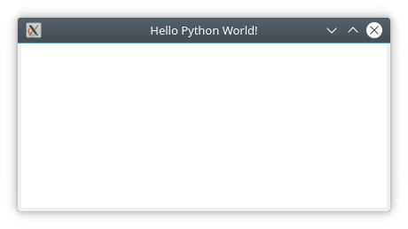

=============
Qt for Python
=============

.. sectionauthor:: `e8johan <https://github.com/e8johan>`_

.. github:: ch106

.. note::

    Last Build: |today|

    The source code for this chapter can be found in the `assets folder <../../assets>`_.

This chapter ... TBD    

Introduction
============

The Qt for Python project provides the tooling to bind C++ and Qt to Python, and a complete Python API to Qt. This means that everything that you can do with Qt and C++, you can also do with Qt and Python. This ranges from headless services to widget based user interfaces. In this chapter, we will focus on how to integrate QML and Python.

Currently, Qt for Python is available for all desktop platforms, but not for mobile. Depending on which platform you use, the setup of Python is slightly different, but as soon as you have a `Python <https://www.python.org/>`_ and `PyPA <https://www.pypa.io/en/latest/>`_ environment setup, you can install Qt for Python using ``pip``. This is discussed in more detail further down.

As the Qt for Python project provides an entirely new language binding for Qt, it also comes with a new set of documentation. The following resources are good to know about when exploring this module.

- Reference documentation: `<https://doc.qt.io/qtforpython/>`_
- Qt for Python wiki: `<https://wiki.qt.io/Qt_for_Python>`_
- Caveats: `<https://wiki.qt.io/Qt_for_Python/Considerations>`_

.. note::

    Through-out this chapter we will use Python 3.6.

Installing
==========

Qt for Python is available through PyPA using ``pip`` under the name ``pyside2``. In the example below we setup a ``venv`` environment in which we will install the latest version of Qt for Python:

.. code-block:: bash

    $ mkdir qt-for-python
    $ cd qt-for-python
    $ python3 -m venv .
    $ . bin/activate
    (qt-for-python) $ python --version
    Python 3.6.6

When the environment is setup, we continue to install ``pyside2`` using ``pip``:
    
.. code-block:: bash

    (qt-for-python) $ pip install pyside2
    Collecting pyside2
    Downloading [ ... ] (166.4MB)

    [ ... ]
    
    Installing collected packages: pyside2
    Successfully installed pyside2-5.11.2

After the installation, we can test it by running a *Hello World* example from the interactive Python prompt:
    
.. code-block:: bash

    (qt-for-python) $ python
    Python 3.6.6 (default, Jun 27 2018, 14:44:17) 
    [GCC 8.1.0] on linux
    Type "help", "copyright", "credits" or "license" for more information.
    >>> from PySide2 import QtWidgets
    >>> import sys
    >>> app = QtWidgets.QApplication(sys.argv)
    >>> widget = QtWidgets.QLabel("Hello World!")
    >>> widget.show()
    >>> app.exec_()
    0
    >>> 

The example results in a window such as the one shown below. To end the program, close the window.

.. figure:: assets/pyside2-hello-world.png

    A Qt Widgets based *Hello World* example using Qt for Python.

Building an Application
=======================

In this chapter we will look at how you can combine Python and QML. The most natural way to combine the two worlds is to do as with C++ and QML, i.e. implement the logic in Python and the presentation in QML.

To do this, we need to understand how to combine QML and Python into a single program, and then how to implement interfaces between the two worlds. In the sub-sections below, we will look at how this is done. We will start simple and progress to an example exposing the capabilities of a Python module to QML through a Qt item model.

Running QML from Python
-----------------------

The very first step is to create a Python program that can host the *Hello World* QML program shown below.

.. literalinclude:: src/basic/main.qml

To do this, we need a Qt mainloop provided by ``QGuiApplication`` from the ``QtGui`` module. We also need a ``QQmlApplicationEngine`` from the ``QtQml`` module. In order to pass the reference to the source file to the QML application engine, we also need the ``QUrl`` class from the ``QtCore`` module.

In the code below we emulate the functionality of the boilerplate C++ code generated by Qt Creator for QML projects. It instanciates the application object, and creates a QML application engine. It then loads the QML and then ensures that the QML was loaded by checking if a root object was created. Finally, it exits and returns the value returned by the ``exec_`` method of the application object.

.. note::

    The ``exec_`` method ends with an underscore to avoid a name clash with Python. It corresponds to the C++ method named ``exec``.

.. literalinclude:: src/basic/basic.py
    :language: python

Executing the example results in a window with the title *Hello Python World*.

    A QML window created from Python.
    
.. note::

    The example assumes that it is executed from the directory containing the ``main.qml`` source file. You can termine the location of the Python file being executed using the ``__file__`` variable. This can be used to locate the QML files relative to the Python file as shown in this `blog post <http://blog.qt.io/blog/2018/05/14/qml-qt-python/>`_.

Exposing a Python object to QML
-------------------------------

- invokable methods
- slots
- signals
    - signal argument names trick

.. literalinclude:: src/object/object.py
    :language: python

.. literalinclude:: src/object/main.qml

- properties
    - signal argument name solved by property name
    - readonly property
    - readwrite property
    - camel case slot, calling python method (to not break QML bindings)
    - two ways to define a signal
    - ordering

.. literalinclude:: src/property/property.py
    :language: python
    
.. literalinclude:: src/object/main.qml

Exposing a Python class to QML
------------------------------

- Instantiation from python

.. literalinclude:: src/class/class.py
    :language: python

.. literalinclude:: src/class/main.qml

Modelling in Python
-------------------

- abstract item list model
    - using psutil - https://pypi.org/project/psutil/
    - no QVariant, use None

.. literalinclude:: src/class/class.py
    :language: python

.. literalinclude:: src/class/main.qml

Summary
=======
