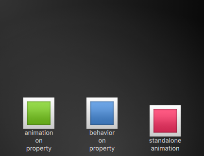
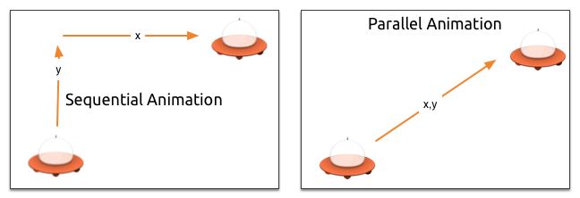
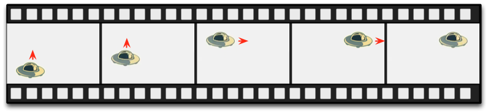
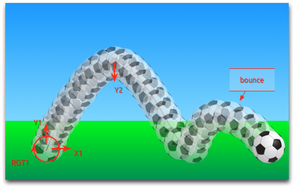

==============
Fluid Elements
==============

.. sectionauthor:: `jryannel <https://github.com/jryannel>`_

.. index:: Animations, Easing Curves, Grouped Animations, States, Transitions, SequentialAnimation, ParallelAnimation, ColorAnimation, NumberAnimation, Transition, ClickableImage, Bouncing Ball

.. issues:: ch05

.. note::

    Last Build: |today|

    The source code for this chapter can be found in the `assets folder <../../assets>`_.

Till now, we have mostly looked at simple graphical elements and how to arrange and manipulate them. This chapter is about how to control these changes in a way that a value of a property not just changes instantly, it's more how the value changes over time: an animation. This technology is one of the key foundations for modern slick user interfaces and can be extended with a system to describe your user interface using states and transitions. Each state defines a set of property changes and can be combined with animations on state changes, called transitions.

Animations
==========

.. issues:: ch05

Animations are applied to property changes. An animation defines the interpolation curve when for property value changes to create smooth transitions from one value to another. An animation is defined by a series of target properties to be animated, an easing curve for the interpolation curve and in the most cases a duration, which defines the time for the property change. All animations in Qt Quick are controlled by the same timer, and are therefore synchronized. This improves the performance and visual quality of animations.

.. note::

    Animations control how property changes, i.e. value interpolation. This is a fundamental concept. QML is based on elements, properties and scripting. Every element provides dozens of properties, each property is waiting to get animated by you. During the book you will see this is a spectacular playing field. You will caught yourself at looking at some animations and just admire their beauty and for sure also your creative genius. Please remember then: *Animations control property changes and every element has dozens of properties at your disposal*.

    **Unlock the power!**

.. figure:: assets/animation_sequence.png

.. literalinclude:: src/animation/AnimationExample.qml
    :start-after: M1>>
    :end-before: <<M1

The example above shows a simple animation applied on the ``x`` and ``rotation`` property. Each animation has a duration of 4000 milliseconds (msecs) and loops forever. The animation on x moves the x coordinate from the object gradually over to 240px. The animation on rotation runs from the current angle to 360 degree. Both animations run in parallel and are started as soon as the UI is loaded.

Now you can play around with the animation by changing the ``to`` and ``duration`` property or you could add another animation for example on the ``opacity`` or even the ``scale``. Combining these it could look like the object is disappearing in the deep space. Try it out!

Animation Elements
------------------

.. issues:: ch05

There are several types of animation elements, each optimized for a specific use case. Here is a list of the most prominent animations:

* ``PropertyAnimation`` - Animates changes in property values
* ``NumberAnimation`` - Animates changes in qreal-type values
* ``ColorAnimation`` - Animates changes in color values
* ``RotationAnimation`` - Animates changes in rotation values

Besides these basic and widely used animation elements, Qt Quick provides also more specialized animations for specific use cases:

* ``PauseAnimation`` - Provides a pause for an animation
* ``SequentialAnimation`` - Allows animations to be run sequentially
* ``ParallelAnimation`` - Allows animations to be run in parallel
* ``AnchorAnimation`` - Animates changes in anchor values
* ``ParentAnimation`` - Animates changes in parent values
* ``SmoothedAnimation`` - Allows a property to smoothly track a value
* ``SpringAnimation`` - Allows a property to track a value in a spring-like motion
* ``PathAnimation`` - Animates an item along a path
* ``Vector3dAnimation`` - Animates changes in QVector3d values

We will learn later how to create a sequence of animations. While working on more complex animations there comes up the need to change a property or to run a script during an an ongoing animation. For this Qt Quick offers the action elements, which can be used everywhere where the other animation elements can be used:

* ``PropertyAction`` - Specifies immediate property changes during animation
* ``ScriptAction`` - Defines scripts to be run during an animation

The major animation types will be discussed during this chapter using small focused examples.

Applying Animations
-------------------

.. issues:: ch05

Animation can be applied in several ways:

* *Animation on property* - runs automatically after element is fully loaded
* *Behavior on property* - runs automatically when the property value changes
* *Standalone Animation* - runs when animation is explicitly started using ``start()`` or ``running`` is set to true (e.g. by a property binding)

*Later we see also how animations can be used inside state transitions.*

.. topic:: Extended ClickableImage Version 2

    To demonstrate the usage of animations we reuse our ``ClickableImage`` component from an earlier chapter and extended it with a text element.

    .. literalinclude:: src/animation/ClickableImageV2.qml
        :start-after: M1>>
        :end-before: <<M1

    To organize the element below the image we used a ``Column`` positioner and calculated the width and height based on the column's ``childrenRect`` property. We exposed two properties: ``text`` and the image ``source`` as also the ``clicked`` signal. We also wanted that the text is as wide as the image and it should wrap. We achieve the latter by using the ``Text`` elements ``wrapMode`` property.

    .. note::

        Due to the inversion of the geometry-dependency (parent geometry depends on child geometry) we can't set a width/height on the ``ClickableImageV2``, as this will break our width/height binding. This is a limitation on our internal design and as a designer of components you should be aware of this. Normally you should prefer the child's geometry to depend on the parent's geometry.

.. rubric:: The objects ascending.

The three objects are all at the same y-position (``y=200``). They need to travel all to ``y=40``. Each of them using a different method with different side-effects and features.

.. literalinclude:: src/animation/AnimationTypesExample.qml
    :start-after: M1>>
    :end-before: <<M1

.. rubric:: 1st object

The 1st object travels using the ``Animation on <property>`` strategy. The animation starts immediately. When an object is clicked their y-position is reset to the start position, this applies to all objects. On the 1st object the reset does not have any effect as long as the animation is running. It's even disturbing as the y-position is set for a fraction of a second to a new value before the animation starts. *Such competing property changes should be avoided*.

.. literalinclude:: src/animation/AnimationTypesExample.qml
    :start-after: M2>>
    :end-before: <<M2

.. rubric:: 2nd object

The 2nd object travels using a ``behavior on`` animation. This behavior tells the property, every time the property value changes, it changes through this animation. The behavior can be disabled by ``enabled : false`` on the ``Behavior`` element. The object will start traveling when you click it (y-position is then set to 40). Another click has no influence as the position is already set. You could try to use a random value (e.g. ``40+(Math.random()*(205-40)``) for the y-position. You will see that the object will always animate to the new position and adapt its speed to match the 4 seconds to the destination defined by the animations duration.

.. literalinclude:: src/animation/AnimationTypesExample.qml
    :start-after: M3>>
    :end-before: <<M3

.. rubric:: 3rd object

The 3rd object uses a ``standalone animation``. The animation is defined as its own element and could be everywhere in the document. The click will start the animation using the animations function ``start()``. Each animation has a start(), stop(), resume(), restart() function. The animation itself contains much more information then the other animation types earlier. We need to define the target and properties to declare the target element to be animated and which properties we want to animate. We need to define a ``to`` value and in this case we define also a ``from`` value to allow a re-start of the animation.

.. figure:: assets/animationtypes.png

A click on the background will reset all objects to their initial position. The 1st object can't be restarted except by re-starting the program which triggers the re-loading of the element.

.. note::

    Another way to start/stop an animation is to bind a property to the ``running`` property of an animation. This is especially useful when the user-input is in control of properties::

        NumberAnimation {
            ...
            // animation runs when mouse is pressed
            running: area.pressed
        }
        MouseArea {
            id: area
        }

Easing Curves
-------------

.. issues:: ch05

The value change of a property can be controlled by an animation. Easing attributes allows influencing the interpolation curve of a property change. All animations we have defined by now use a linear interpolation because the initial easing type of an animation is ``Easing.Linear``. It's best visualized with a small plot, where the y-axis is the property to be animated and the x-axis is the time (*duration*). A linear interpolation would draw a straight line from the ``from`` value at the start of the animation to the ``to`` value at the end of the animation. So the easing type defines the curve of change. Easing types are carefully chosen to support a natural fit for a moving object, for example when a page slides out. Initially the page should slide out slowly and then gaining the speed to finally slide out on high speed, similar to turning the page of a book.

.. note::

    Animations should not be overused. As other aspects of UI design also animations should be designed carefully and support the UI flow and not dominate it. The eye is very sensitive to moving objects and animations can easily distract the user.

In the next example we will try some easing curves. Each easing curve is displayed by a click-able image and, when clicked, will set a new easing type on the ``square`` animation and then trigger a ``restart()`` to run the animation with the new curve.

.. figure:: assets/automatic/easingcurves.png
    :scale: 50%

The code for this example was made a little bit more complicated.We first create a grid of ``EasingTypes`` and a ``Box`` which is controlled by the easing types. A easing type just displays the curve which the box shall use for its animation. When the user clicks on an easing curve the box moves in a direction according to the easing curve. The animation itself is a standalone-animation with the target set to the box and configured for x-property animation with a duration of 2 secs.

.. note:: The internals of the EasingType renders the curve in real time and the interested reader can look it up in the ``EasingCurves`` example.

.. literalinclude:: src/EasingCurves/EasingCurves.qml
    :start-after: M1>>
    :end-before: <<M1

A you play with it, please observe the change of speed during an animation. Some animations feel more natural for the object and some feel irritating.

Besides the ``duration`` and ``easing.type`` you are able to fine tune animations. For example the general ``PropertyAnimation`` where most animation inherit from additionally supports an ``easing.amplitude``, ``easing.overshoot`` and ``easing.period`` property which allows you to fine-tune the behavior of particular easing curves. Not all easing curves support these parameters. Please consult the :qt5r:`easing table <qml-qtquick-propertyanimation.html#easing-prop>` from the ``PropertyAnimation`` documentation to check if an easing parameter has influence on an easing curve.

.. note::

    Choosing the right animation for the element in the user interface context is crucial for the outcome. Remember the animation shall support the UI flow; not irritate the user.

Grouped Animations
------------------

.. issues:: ch05

Often animations will be more complex then just animating one property. You might want to run several animations at the same time or one after another or even execute a script between two animations. For this, the grouped animation offer you a possibility. As the named suggests it's possible to group animations. Grouping can be done in two ways: parallel or sequential. You can use the ``SequentialAnimation`` or the ``ParallelAnimation`` element, which act as animation containers for other animation elements. These grouped animations are animations themselves and can be used exactly as such.

All direct child animations of a parallel animation will run in parallel, when started. This allows you to animate different properties at the same time.

.. literalinclude:: src/animation/ParallelAnimationExample.qml
    :start-after: M1>>
    :end-before: <<M1

.. figure:: assets/parallelanimation_sequence.png

A sequential animation will first run the first child animation and then continue from there.

.. literalinclude:: src/animation/SequentialAnimationExample.qml
    :start-after: M1>>
    :end-before: <<M1

Grouped animation can also be nested, for example a sequential animation can have two parallel animations as child animations, and so on. We can visualize this with a soccer ball example. The idea is to throw a ball from left to right an animate its behavior.

.. figure:: assets/soccer_init.png

To understand the animation we need to dissect it into the integral transformations of the object. We need to remember animation do animate property changes. Here are the different transformations:

* An x-translation from left-to-right (``X1``)
* An y-translation from down to up (``Y1``) followed by a translation from up to down (``Y2``) with some bouncing
* A rotation over 360 over the whole animation duration (``ROT1``)

The whole duration of the animation should take three seconds.

We start with an empty item as root element of the width of 480 and height of 300.

.. code-block:: js

    import QtQuick 2.5

    Item {
        id: root
        width: 480
        height: 300
        property int duration: 3000

        ...
    }

We have defined our total animation duration as reference to better synchronize the animation parts.

The next step would be to add the background, which in our case are 2 rectangles with a green and blue gradients.

.. literalinclude:: src/animation/BouncingBallExample.qml
    :start-after: M1>>
    :end-before: <<M1

.. figure:: assets/soccer_stage1.png

The upper blue rectangle takes 200 pixel of the height and the lower one is anchored to the top on the sky and to the bottom on the root element.

Let's bring the soccer ball onto the green. The ball is an image, stored under "assets/soccer_ball.png". For the beginning we would like to position it in the lower left corner, near the edge.

.. literalinclude:: src/animation/BouncingBallExample.qml
    :start-after: M2>>
    :end-before: <<M2

.. figure:: assets/soccer_stage2.png

The image has a mouse area attached to it. If the ball is clicked the position of the ball will reset and the animation restarted.

Let's start with an sequential animation for the two y translations first.

.. code-block:: js

    SequentialAnimation {
        id: anim
        NumberAnimation {
            target: ball
            properties: "y"
            to: 20
            duration: root.duration * 0.4
        }
        NumberAnimation {
            target: ball
            properties: "y"
            to: 240
            duration: root.duration * 0.6
        }
    }

.. figure:: assets/soccer_stage3.png

This specifies that 40% of the total animation duration is the up animation and 60% the down animation. One animation after another as a sequence. The transformations are animated on a linear path but there is no curve currently. Curves will be added later using the easing curves, at the moment we're concentrating on getting the transformations animated.

Next, we need to add the x-translation. The x-translation shall run in parallel with the y-translation so we need to encapsulate the sequence of y-translations into a parallel animation together with the x-translation.

.. code-block:: js

    ParallelAnimation {
        id: anim
        SequentialAnimation {
            // ... our Y1, Y2 animation
        }
        NumberAnimation { // X1 animation
            target: ball
            properties: "x"
            to: 400
            duration: root.duration
        }
    }

.. figure:: assets/soccer_stage4.png

At the end we would like the ball to be rotating. For this we need to add another animation to the parallel animation. We choose the ``RotationAnimation`` as it's specialized for rotation.

.. code-block:: js

    ParallelAnimation {
        id: anim
        SequentialAnimation {
            // ... our Y1, Y2 animation
        }
        NumberAnimation { // X1 animation
            // X1 animation
        }
        RotationAnimation {
            target: ball
            properties: "rotation"
            to: 720
            duration: root.duration
        }
    }

That's the whole animation sequence. The one thing left is to provide the correct easing curves for the movements of the ball. For the *Y1* animation I use a ``Easing.OutCirc`` curve as this should look more like a circular movement. *Y2* is enhanced using an ``Easing.OutBounce`` as the ball should bounce and the bouncing should happen at the end (try an ``Easing.InBounce`` and you see the bouncing will start right away).
The *X1* and *ROT1* animation are left as is with a linear curve.

Here is the final animation code for your reference:

.. literalinclude:: src/animation/BouncingBallExample.qml
    :start-after: M3>>
    :end-before: <<M3

States and Transitions
======================

.. issues:: ch05

Often parts of a user interface can be described in states. A state defines a set of property changes and can be triggered by a certain condition. Additional these state switches can have a transition attached which defines how these changes should be animated or any additional actions shall be applied. Actions can also be applied when a state is entered.

States
------

.. issues:: ch05

You define states in QML with the ``State`` element, which needs to be bound to the ``states`` array of any item element. A state is identified through a state name and consist, in its simplest form, of a series of property changes on elements. The default state is defined by the initial properties of the element and is named ``""`` (the empty string).

.. code-block:: js

    Item {
        id: root
        states: [
            State {
                name: "go"
                PropertyChanges { ... }
            },
            State {
                name: "stop"
                PropertyChanges { ... }
            }
        ]
    }

A state is changed by assigning a new state name to the ``state`` property of the element with the states defined.

.. note::

    Another way to switch states is using the ``when`` property of the ``State`` element. The ``when`` property can be set to an expression that evaluates to true when the state should be applied.

.. code-block:: js

    Item {
        id: root
        states: [
            ...
        ]

        Button {
            id: goButton
            ...
            onClicked: root.state = "go"
        }
    }

.. figure:: assets/trafficlight_sketch.png

For example, a traffic light might have two signaling lights. The upper one signaling stop with a red color and the lower one signaling go with a green color. In this example both lights should not shine at the same time. Let's have a look at the state chart diagram.

.. figure:: assets/trafficlight_states.png

When the system is switched on it goes automatically into the stop mode as default state. The stop state changes the ``light1`` to red and ``light2`` to black (off). An external event can now trigger a state switch to the ``"go"`` state. In the go state we change the color properties from ``light1`` to black (off) and ``light2`` to green to indicate the passers may walk now.

To realize this scenario we start sketching our user interface for the 2 lights. For simplicity we use 2 rectangles with the radius set to the half of the width (and the width is the same as the height, which means it's a square).

.. literalinclude:: src/animation/StatesExample.qml
    :start-after: M1>>
    :end-before: <<M1

As defined in the state chart we want to have two states one the ``"go"`` state and the other the ``"stop"`` state, where each of them changes the traffic lights respective to red or green. We set the ``state`` property to ``stop`` to ensure the initial state of our traffic light is the ``stop`` state.

.. note::

    We could have achieved the same effect with only a ``"go"`` state and no explicit ``"stop"`` state by setting the color of ``light1`` to red and the color of ``light2`` to black. The initial state ``""`` defined by the initial property values would then act as the ``"stop"`` state.

.. literalinclude:: src/animation/StatesExample.qml
    :start-after: M2>>
    :end-before: <<M2

Using ``PropertyChanges { target: light2; color: "black" }`` is not really required in this examples as the initial color of ``light2`` is already black. In a state it's only necessary to describe how the properties shall change from their default state (and not from the previous state).

A state change is triggered using a mouse area which covers the whole traffic light and toggles between the go and stop state when clicked.

.. literalinclude:: src/animation/StatesExample.qml
    :start-after: M3>>
    :end-before: <<M3

.. figure:: assets/trafficlight_ui.png

We are now able to successfully change the state of the traffic lamp. To make the UI more appealing and look natural we should add some transitions with animation effects. A transition can be triggered by a state change.

.. note::

    It's possible to create a similar logic using scripting instead of QML states. Developers can easily fall into the trap of writing more a JavaScript program than a QML program.

Transitions
-----------

.. issues:: ch05

A series of transitions can be added to every item. A transition is executed by a state change. You can define on which state change a particular transition can be applied using the ``from:`` and ``to:`` properties. These two properties act like a filter, when the filter is true the transition will be applied. You can also use the wild-cast "*" which means "any state". For example ``from:"*"; to:"*"`` means from any state to any other state and is the default value for ``from`` and ``to``, which means the transition is applied to every state switch.

For this example we would like to animate the color changes when switching state from "go" to "stop". For the other reversed state change ("stop" to "go") we want to keep an immediate color change and don't apply a transition. We restrict the transition with the ``from`` and ``to`` properties to filter only the state change from "go" to "stop". Inside the transition we add two color animations for each light, which shall animate the property changes defined in the state description.

.. literalinclude:: src/animation/StatesExample.qml
    :start-after: M4>>
    :end-before: <<M4

You can change the state though clicking the UI. The state is applied immediately and will also change the state while a transition is running. So try to click the UI while the state is in transition from "stop" to "go". You will see the change will happen immediately.

.. figure:: assets/trafficlight_transition.png

You could play around with this UI by, for example, scaling the inactive light down to highlight the active light. For this you would need to add another property change for scaling to the states and also handle the animation for the scaling property in the transition. Another option would be to add an "attention" state where the lights are blinking yellow. For this, you would need to add a sequential animation to the transition for one second going to yellow ("to" property of the animation and one sec going to "black"). Maybe you would also want to change the easing curve to make it more visually appealing.

Advanced Techniques
===================

.. issues:: ch05

.. todo:: To be written
