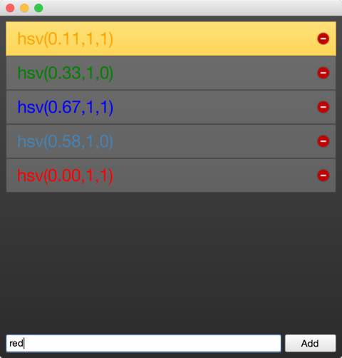

==========
Qt and C++
==========

.. sectionauthor:: `jryannel <https://github.com/jryannel>`_

.. issues:: ch15

.. note::

    Last Build: |today|

    The source code for this chapter can be found in the `assets folder <../../assets>`_.

Qt is a C++ toolkit with an extension for QML and Javascript. There exists many language bindings for Qt, but as Qt is developed in C++, the spirit of C++ can be found throughout the classes. In this section, we will look at Qt from a C++ perspective to build a better understanding how to extend QML with native plugins developed using C++. Through C++, it is possible to extend and control the execution environment provided to QML.

This chapter will, just as Qt, require the reader to have some basic knowledge of C++. Qt does not rely on advanced C++ features, and I generally consider the Qt style of C++ to be very readable, so do not worry if you feel that your C++ knowledge is shaky.

Approaching Qt from a C++ direction, you will find that Qt enriches C++ with a number of modern language features enabled through making introspection data available. This is made possible through the use of the ``QObject`` base class. Introspection data, or meta data, maintains information of the classes at run-time, something that ordinary C++ does not do. This makes it possible to dynamically probe objects for information about such details as their properties and available methods.

Qt uses this meta information to enable a very loosely bound callback concept using signals and slots. Each signal can be connected to any number of slots or even other signals. When a signal is emitted from an object instance, the connected slots are invoked. As the signal emitting object does not need to know anything about the object owning the slot and vise versa, this mechanism is used to create very reusable components with very few inter-component dependencies.

The introspection features are also used to create dynamic language bindings, making it possible to expose a C++ object instance to QML and making C++ functions callable from Javascript. Other bindings for Qt C++ exist and besides the standard Javascript binding a popular one is the Python binding called `PyQt <http://www.riverbankcomputing.co.uk/software/pyqt/intro>`_.

In addition to this central concept, Qt makes it possible to develop cross platform applications using C++. Qt C++ provides a platform abstraction on the different operating systems, which allows the developer to concentrate on the task at hand and not the details of how you open a file on different operating systems. This means you can re-compile the same source code for Windows, OS X and Linux and Qt takes care of the different OS ways of handling certain things. The end result are natively built applications with the look and feel of the target platform. As the mobile is the new desktop, newer Qt versions can also target a number of mobile platforms using the same source code, e.g. iOS, Android, Jolla, BlackBerry, Ubuntu Phone, Tizen.

When it comes to re-use, not only can source code be re-used but developer skills are also reusable. A team knowing Qt can reach out to far more platforms then a team just focusing on a single platform specific technology and as Qt is so flexible the team can create different system components using the same technology.

.. figure:: images/yourapplication.png

For all platform, Qt offers a set of basic types, e.g. strings with full unicode support, lists, vectors, buffers. It also provides a common abstraction to the target platform's main loop, and cross platform threading  and networking support. The general philosophy is that for an application developer Qt comes with all required functionality included. For domain specific tasks such as to interface to your native libraries Qt comes with several helper classes to make this easier.

A Boilerplate Application
=========================

.. issues:: ch15

The best way to understand Qt is to start from a small demonstration application. This application creates a simple ``"Hello World!"`` string and writes it into a file using unicode characters.

.. literalinclude:: src/coreapp/main.cpp
    :language: cpp

The simple example demonstrates the use of file access and the correct way of writing text into a file using text codecs via the text stream. For binary data there is a cross platform binary stream called ``QDataStream``. The different classes we use are included using their class name. Another possibility would be to use a module and class name e.g. ``#include <QtCore/QFile>``. For the lazy there is also the possibility to include a whole module using ``#include <QtCore>``. E.g. in ``QtCore`` you have the most common classes used for an application, which are not UI dependent. Have a look at the `QtCore class list <http://doc.qt.io/qt-5/qtcore-module.html>`_ or the `QtCore overview <http://doc.qt.io/qt-5/qtcore-index.html>`_.

You build the application using qmake and make. QMake reads a project file and generates a Makefile which then can be called using make. The project file is platform independent and qmake has some rules to apply the platform specific settings to the generated make file. The project can also contain platform scopes for platform specific rules, which are required in some specific cases. Here is an example of a simple project file.

.. literalinclude:: src/coreapp/coreapp.pro
    :language: cpp

We will not go into depth into this topic. Just remember Qt uses project files for projects and qmake generates the platform specific make files from these project files.

The simple code example above just writes the text and exits the application. For a command line tool this is good enough. For a user interface you would need an event loop which waits for user input and and somehow schedules re-draw operations. So here follows the same example now uses a desktop button to trigger the writing.

Our ``main.cpp`` suprisingly got smaller. We moved code into an own class to be able to use signal/slots for the user input, e.g. the button click. The signal/slot mechanism normally needs an object instance as you will see shortly.

.. literalinclude:: src/uiapp/main.cpp
    :language: cpp

In the ``main`` function we simply create the application object and start the event loop using ``exec()``. For now the application sits in the event loop and waits for user input.

.. code-block:: cpp

    int main(int argc, char** argv)
    {
        QApplication app(argc, argv); // init application

        // create the ui

        return app.exec(); // execute event loop
    }

Qt offers several UI technologies. For this example we use the Desktop Widgets user interface library using pure Qt C++. We create a main window which will host a push button to trigger the functionality and also the main window will host our core functionality which we know from the previous example.

.. figure:: images/storecontent.png

The main window itself is a widget. It becomes a top level window as it does not have any parent. This comes from how Qt sees a user interface as a tree of ui elements. In this case the main window is the root element, thus becomes a window, while the push button a child of the main window and becomes a widget inside the window.

.. literalinclude:: src/uiapp/mainwindow.h
    :language: cpp

Additionally we define a public slot called ``storeContent()`` which shall be called when the button is clicked. A slot is a C++ method which is registered with the Qt meta object system and can be dynamically called.

.. literalinclude:: src/uiapp/mainwindow.cpp
    :language: cpp

In the main window we first create the push button and then register the signal ``clicked()`` with the slot ``storeContent()`` using the connect method. Every time the signal clicked is emitted the slot ``storeContent()`` is called. As simple as this, objects communicate via signal and slots with loose coupling.

The QObject
===========

.. issues:: ch15

As described in the introduction, the ``QObject`` is what enables Qt's introspection. It is the base class of almost all classes in Qt. Exceptions are value types such as ``QColor``, ``QString`` and ``QList``.

A Qt object is a standard C++ object, but with more abilities. These can be divided into two groups: introspection and memory management. The first means that a Qt object is aware of its class name, its relationship to other classes, as well as its methods and properties. The memory management concept means that each Qt object can be the parent of child objects. The parent *owns* the children, and when the parent is destroyed, it is responsible for destroying its children.

The best way of understanding how the ``QObject`` abilities affect a class is to take a standard C++ class and Qt enable it. The class shown below represents an ordinary such class.

The person class is a data class with a name and gender properties. The person class uses Qt's object system to add meta information to the c++ class. It allows users of a person object to connect to the slots and get notified when the properties get changed.

.. code-block:: cpp

    class Person : public QObject
    {
        Q_OBJECT // enabled meta object abilities

        // property declarations required for QML
        Q_PROPERTY(QString name READ name WRITE setName NOTIFY nameChanged)
        Q_PROPERTY(Gender gender READ gender WRITE setGender NOTIFY genderChanged)

        // enables enum introspections
        Q_ENUMS(Gender)

    public:
        // standard Qt constructor with parent for memory management
        Person(QObject *parent = 0);

        enum Gender { Unknown, Male, Female, Other };

        QString name() const;
        Gender gender() const;

    public slots: // slots can be connected to signals
        void setName(const QString &);
        void setGender(Gender);

    signals: // signals can be emitted
        void nameChanged(const QString &name);
        void genderChanged(Gender gender);

    private:
        // data members
        QString m_name;
        Gender m_gender;
    };

The constructor passes the parent to the super class and initialize the members. Qt's value classes are automatically initialized. In this case ``QString`` will initialize to a null string (``QString::isNull()``) and the gender member will explicitly initialize to the unknown gender.

.. code-block:: cpp

    Person::Person(QObject *parent)
        : QObject(parent)
        , m_gender(Person::Unknown)
    {
    }

The getter function is named after the property and is normally a simple ``const`` function. The setter emits the changed signal when the property really has changed. For this we insert a guard to compare the current value with the new value. And only when the value differs we assign it to the member variable and emit the changed signal.

.. code-block:: cpp

    QString Person::name() const
    {
        return m_name;
    }

    void Person::setName(const QString &name)
    {
        if (m_name != name) // guard
        {
            m_name = name;
            emit nameChanged(m_name);
        }
    }

Having a class derived from ``QObject``, we have gained more meta object abilities we can explore using the ``metaObject()`` method. For example retrieving the class name from the object.

.. code-block:: cpp

    Person* person = new Person();
    person->metaObject()->className(); // "Person"
    Person::staticMetaObject.className(); // "Person"

There are many more features which can be accessed by the ``QObject`` base class and the meta object. Please check out the ``QMetaObject`` documentation.

Build Systems
=============

.. issues:: ch15

Building software reliably on different platforms can be a complex task. You will encounter different environments with different compilers, paths, and library variations. The purpose of Qt is to shield the application developer from these cross platform issues. For this Qt introduced the ``qmake`` build file generator. ``qmake`` operates on a project file with the ending ``.pro``. This project file contains instructions about the application and the sources to be used. Running qmake on this project file will generate a ``Makefile`` for you on unix and mac and even under windows if the mingw compiler toolchain is being used. Otherwise it may create a visual studio project or an xcode project.

A typical build flow in Qt under unix would be::

    $ edit myproject.pro
    $ qmake // generates Makefile
    $ make

Qt allows you also to use shadow builds. A shadow build is a build outside of your source code location. Assume we have a myproject folder with a ``myproject.pro`` file. The flow would be like this::

    $ mkdir build
    $ cd build
    $ qmake ../myproject/myproject.pro

We create a build folder and then call qmake from inside the build folder with the location of our project folder. This will setup the make file in a way that all build artifacts are stored under the build folder instead of inside our source code folder. This allows us to create builds for different qt versions and build configurations at the same time and also it does not clutter our soruce code folder which is always a good thing.

When you are using Qt Creator it does these things behind the scenes for you and you do not have to worry about these steps usually. For larger projects and for adeeper understanding of the flow, it is recommended that you learn to build your qt project from the command line.

QMake
-----

.. issues:: ch15

QMake is the tool which reads your project file and generates the build file. A project file is a simplified write down of your project configuration, external dependencies, and your source files. The simplest project file is probably this::

    // myproject.pro

    SOURCES += main.cpp

Here we build an exectuable application which will have the name ``myproject`` based on the project file name. The build will only contain the ``main.cpp`` source file. And by default we will use the QtCore and QtGui module for this project. If our project were a QML application we would need to add the QtQuick and QtQml module to the list::

    // myproject.pro

    QT += qml quick

    SOURCES += main.cpp

Now the build file knows to link against the QtQml and QtQuick Qt modules. QMake use the concept of ``=``, ``+=`` and ``-=`` to assign, add, remove elements from a list of options, respectively. For a pure console build without UI dependencies you would remove the QtGui module::

    // myproject.pro

    QT -= gui

    SOURCES += main.cpp

When you want to build a library instead of an application, you need to change the build template::

    // myproject.pro
    TEMPLATE = lib

    QT -= gui

    HEADERS += utils.h
    SOURCES += utils.cpp

Now the project will build as a library without UI dependencies and used the ``utils.h`` header and the ``utils.cpp`` source file. The format of the library will depend on the OS you are building the project.

Often you wil have more complicated setups and need to build a set of projects. For this, qmake offers the ``subdirs`` template. Assume we would have a mylib and a myapp project. Then our setup could be like this::

    my.pro
    mylib/mylib.pro
    mylib/utils.h
    mylib/utils.cpp
    myapp/myapp.pro
    myapp/main.cpp

We know already how the mylib.pro and myapp.pro would look like. The my.pro as the overarching project file would look like this::

    // my.pro
    TEMPLATE = subdirs

    subdirs = mylib \
        myapp

    myapp.depends = mylib

This declares a project with two subprojects: ``mylib`` and ``myapp``, where ``myapp`` depends on ``mylib``. When you run qmake on this project file it will generate file a build file for each project in a corresponding folder. When you run the make file for ``my.pro``, all subprojects are also built.

Sometimes you need to do one thing on one platform and another thing on other platforms based on your configuration. For this qmake introduces the concept of scopes. A scope is applied when a configuration option is set to true.

For example to use a unix specific utils implementation you could use::

    unix {
        SOURCES += utils_unix.cpp
    } else {
        SOURCES += utils.cpp
    }

What it says is if the CONFIG variable contains a unix option then apply this scope otherwise use the else path. A typical one is to remove the application bundling under mac::

    macx {
        CONFIG -= app_bundle
    }

This will create your application as a plain executable under mac and not as a ``.app`` folder which is used for application installation.

QMake based projects are normally the number one choice when you start programming Qt applications. There are also other options out there. All have their benefits and drawbacks. We will shortly discuss these other options next.

.. rubric:: References

* :qt5:`QMake Manual <qmake-manual>` - Table of contents of the qmake manual

* :qt5:`QMake Language <qmake-language>` - Value assignment, scopes and so like

* :qt5:`QMake Variables <qmake-variable-reference>` - Variables like TEMPLATE, CONFIG, QT are explained here

CMake
-----

.. issues:: ch15

CMake is a tool create by Kitware. Kitware is very well known for their 3D visualitation software VTK and also CMake, the cross platform makefile generator. It uses a series of ``CMakeLists.txt`` files to generate platform specific make files. CMake is used by the KDE project and as such has a special relationship with the Qt community.

The ``CMakeLists.txt`` is the file used to store the project configuration. For a simple hello world using QtCore the project file would look like this::

    // ensure cmake version is at least 3.0
    cmake_minimum_required(VERSION 3.0)
    // adds the source and build location to the include path
    set(CMAKE_INCLUDE_CURRENT_DIR ON)
    // Qt's MOC tool shall be automatically invoked
    set(CMAKE_AUTOMOC ON)
    // using the Qt5Core module
    find_package(Qt5Core)
    // create excutable helloworld using main.cpp
    add_executable(helloworld main.cpp)
    // helloworld links against Qt5Core
    target_link_libraries(helloworld Qt5::Core)

This will build a helloworld executable using main.cpp and linked agains the external Qt5Core library. The build file can be modified to be more generic::

    // sets the PROJECT_NAME variable
    project(helloworld)
    cmake_minimum_required(VERSION 3.0)
    set(CMAKE_INCLUDE_CURRENT_DIR ON)
    set(CMAKE_AUTOMOC ON)
    find_package(Qt5Core)

    // creates a SRC_LIST variable with main.cpp as single entry
    set(SRC_LIST main.cpp)
    // add an executable based on the project name and source list
    add_executable(${PROJECT_NAME} ${SRC_LIST})
    // links Qt5Core to the project executable
    target_link_libraries(${PROJECT_NAME} Qt5::Core)

You can see that CMake is quite powerful. It takes some time to get used to the syntax. In general, it is said that CMake is better suited for large and complex projects.

.. rubric:: References

* `CMake Help <http://www.cmake.org/documentation/>`_ - available online but also as QtHelp format
* `Running CMake <http://www.cmake.org/runningcmake/>`_
* `KDE CMake Tutorial <https://techbase.kde.org/Development/Tutorials/CMake>`_
* `CMake Book <http://www.kitware.com/products/books/CMakeBook.html>`_
* `CMake and Qt <http://www.cmake.org/cmake/help/v3.0/manual/cmake-qt.7.html>`_

Common Qt Classes
=================

.. issues:: ch15

The ``QObject`` class forms the foundations of Qt, but there are many more classes in the framework. Before we continue looking at QML and how to extend it, we will look at some basic Qt classes that are useful to know about.

The code examples shown in this section are written using the Qt Test library. It offers a great way to explore the Qt API and store it for later reference. ``QVERIFY``, ``QCOMPARE`` are functions provided by the test library to assert a certain condition. We will use ``{}`` scopes to avoid name collisions. So do not get confused.

QString
-------

In general, text handling in Qt is unicode based. For this you use the ``QString`` class. It comes with a variety of great functions which you would expect from a modern framework. For 8-bit data you would use normally the ``QByteArray`` class and for ASCII identifiers the ``QLatin1String`` to preserve memory. For a list of strings you can use a ``QList<QString>`` or simply the ``QStringList`` class (which is derived from ``QList<QString>``).

Here are some examples of how to use the ``QString`` class. QString can be created on the stack but it stores its data on the heap. Also when assigning one string to another, the data will not be copied - only a reference to the data. So this is really cheap and lets the developer concentrate on the code and not on the memory handling. ``QString`` uses reference counters to know when the data can be safely deleted. This feature is called :qt5:`Implicit Sharing <implicit-sharing>` and it is used in many Qt classes.

.. literalinclude:: src/qtfoundation/tst_foundation.cpp
    :language: cpp
    :start-after: M1>>
    :end-before:  M1<<

Here we will show how to convert a number to a string and back. There are also conversion functions for float or double and other types. Just look for the function in the Qt documentation used here and you will find the others.

.. literalinclude:: src/qtfoundation/tst_foundation.cpp
    :language: cpp
    :start-after: M2>>
    :end-before:  M2<<

Often in text you need to have parameterized text. One option could be to use ``QString("Hello" + name)`` but a more flexible method is the ``arg`` marker approach.  It preserves the order also during translation when the order might change.

.. literalinclude:: src/qtfoundation/tst_foundation.cpp
    :language: cpp
    :start-after: M3>>
    :end-before:  M3<<

Sometimes you want to use unicode characters directly in you code. For this you need to remember how to mark them for the ``QChar`` and ``QString`` classes.

.. literalinclude:: src/qtfoundation/tst_foundation.cpp
    :language: cpp
    :start-after: M4>>
    :end-before:  M4<<

This gives you some examples of how to easily treat unicode aware text in Qt. For non-unicode the ``QByteArray`` class also has many helper functions for conversion. Please read the Qt documentation for ``QString`` as it contains tons of good examples.

Sequential Containers
---------------------

A list, queue, vector or linked-list is a sequential container. The mostly used sequential container is the ``QList`` class. It is a template based class and needs to be initialized with a type. It is also implicit shared and stores the data internally on the heap. All container classes should be created on the stack. Normally you never want to use ``new QList<T>()``, which means never use ``new`` with a container.

The ``QList`` is as versatile as the ``QString`` class and offers a great API to explore your data. Below is a small example how to use and iterate over a list using some new C++ 11 features.

.. literalinclude:: src/qtfoundation/tst_foundation.cpp
    :language: cpp
    :start-after: M5>>
    :end-before:  M5<<

Associative Containers
----------------------

A map, a dictionary, or a set are examples of associative containers. They store a value using a key. They are known for their fast lookup. We demonstrate the use of the most used associative container the ``QHash`` also demonstrating some new C++ 11 features.

.. literalinclude:: src/qtfoundation/tst_foundation.cpp
    :language: cpp
    :start-after: M6>>
    :end-before:  M6<<

File IO
-------

It is often required to read and write from files. ``QFile`` is actually a ``QObject`` but in most cases it is created on the stack. ``QFile`` contains signals to inform the user when data can be read. This allows reading chunks of data asynchronously until the whole file is read. For convenience it also allows reading data in blocking mode. This should only be used for smaller amounts of data and not large files. Luckily we only use small amounts of data in these examples.

Besides reading raw data from a file into a ``QByteArray`` you can also read data types using the ``QDataStream`` and unicode string using the ``QTextStream``. We will show you how.

.. literalinclude:: src/qtfoundation/tst_foundation.cpp
    :language: cpp
    :start-after: M7>>
    :end-before:  M7<<

More Classes
------------

.. issues:: ch15

Qt is a rich application framework. As such it has thousands of classes. It takes some time to get used to all of these classes and how to use them. Luckily Qt has a very good documentation with many useful examples includes. Most of the time you search for a class and the most common use cases are already provided as snippets. Which means you just copy and adapt these snippets. Also Qt's examples in the Qt source code are a great help. Make sure you have them available and searchable to make your life more productive. Do not waste time. The Qt community is always helpful. When you ask, it is very helpful to ask exact questions and provide a simple example which displays your needs. This will drastically improve the response time of others. So invest a litte bit of time to make the life of others who want to help you easier :-).

Here some classes whose documentation the author thinks are a must read: :qt5:`QObject <qobject>`, :qt5:`QString <qstring>`, :qt5:`QByteArray <qbytearray>`, :qt5:`QFile <qfile>`, :qt5:`QDir <qdir>`, :qt5:`QFileInfo <qfileinfo>`, :qt5:`QIODevice <qiodevice>`, :qt5:`QTextStream <qtextstream>`, :qt5:`QDataStream <qdatastream>`, :qt5:`QDebug <qdebug>`, :qt5:`QLoggingCategory <qloggingcategory>`, :qt5:`QTcpServer <qtcpserver>`, :qt5:`QTcpSocket <qtcpsocket>`, :qt5:`QNetworkRequest <qnetworkrequest>`, :qt5:`QNetworkReply <qnetworkreply>`, :qt5:`QAbstractItemModel <qabstractitemmodel>`, :qt5:`QRegExp <qregexp>`, :qt5:`QList <qlist>`, :qt5:`QHash <qhash>`, :qt5:`QThread <qthread>`, :qt5:`QProcess <qprocess>`, :qt5:`QJsonDocument <qjsondocument>`, :qt5:`QJSValue <qjsvalue>`.

That should be enough for the beginning.

Models in C++
=============

Models in QML serve the purpose of providing data to ``ListViews``, ``PathViews`` and other views which take a model and create an instance of a delegate for each entry in the model. The view is smart enough to only create these instances which are visible or in the cache range. This makes it possible to have large models with tens of throusands of entries but still have a very slick user interface. The delegate acts like a template to be rendered with the model entries data. So in summary: a view renders entries from the model using a delegate as a template. The model is a data provider to views.

When you do not want to use C++ you can also define models in pure QML. You have several ways to provide a model to the view. For handling of data coming from C++ or large amount of data  the C++ model is more suitable than these pure QML approaches. But often you only need a few entries then these QML models are well suited.

.. code-block:: qml

    ListView {
        // using a integer as model
        model: 5
        delegate: Text { text: 'index: ' + index }
    }

    ListView {
        // using a JS array as model
        model: ['A', 'B', 'C', 'D', 'E']
        delegate: Text { 'Char['+ index +']: ' + modelData }
    }

    ListView {
        // using a dynamic QML ListModel as model
        model: ListModel {
            ListElement { char: 'A' }
            ListElement { char: 'B' }
            ListElement { char: 'C' }
            ListElement { char: 'D' }
            ListElement { char: 'E' }
        }
        delegate: Text { 'Char['+ index +']: ' + model.char }
    }

The QML views knows how to handle these different models. For models coming from the C++ world the view expects a specific protocol to be followed. This protocol is defined in an API (``QAbstractItemModel``) together with documentation for the dynamic behavior. The API was developed for the desktop widget world and is flexible enough to act as a base for trees, or multi column tables as well as lists. In QML, we almost only use the list version of the API (``QAbstractListModel``). The API contains some mandatory functions to be implemented and some are optional. The optional parts mostly handle the dynamic use case of adding or removing of data.

A simple model
--------------

A typical QML C++ model derives from ``QAbstractListModel`` and implements at least the ``data`` and ``rowCount`` function. In this example we will use a series of SVG color names provided by the ``QColor`` class and display them using our model. The data is stored into a ``QList<QString>`` data container.

Our ``DataEntryModel`` is derived form ``QAbstractListModel`` and implementats the mandatory functions. We can ignore the parent in ``rowCount`` as this is only used in a tree model. The ``QModelIndex`` class provides the row and column information for the cell, for which the view wants to retrieve data. The view is pulling information from the model on a row/column and role base. The ``QAbstractListModel`` is defined in ``QtCore`` but ``QColor`` in ``QtGui``. That is why we have the additional ``QtGui`` dependency. For QML applications it is okay to depend on ``QtGui`` but it should normally not depend on ``QtWidgets``.

.. literalinclude:: src/modelview/dataentrymodel.h
    :language: cpp

On the implementation side the most complex part is the data function. We first need to make a range check. And then we check for the display role. The ``Qt::DisplayRole`` is the default text role a view will ask for. There is a small set of default roles defined in Qt which can be used, but normally a model will define its own roles for clarity. All calls which do not contain the display role are ignored at the moment and the default value ``QVariant()`` is returned.

.. literalinclude:: src/modelview/dataentrymodel.cpp
    :language: cpp

The next step would be to register the model with QML using the ``qmlRegisterType`` call. This is done inside the ``main.cpp`` before the QML file was loaded.

.. code-block:: cpp

    #include <QtGui>
    #include <QtQml>

    #include "dataentrymodel.h"

    int main(int argc, char *argv[])
    {
        QGuiApplication app(argc, argv);

        // register the type DataEntryModel
        // under the url "org.example" in version 1.0
        // under the name "DataEntryModel"
        qmlRegisterType<DataEntryModel>("org.example", 1, 0, "DataEntryModel");

        QQmlApplicationEngine engine;
        engine.load(QUrl(QStringLiteral("qrc:/main.qml")));

        return app.exec();
    }

Now you can access the ``DataEntryModel`` using the QML import statement ``import org.example 1.0`` and use it just like other QML item ``DataEntryModel {}``.

We use this in this example to display a simple list of color entries.

.. code-block:: qml

    import org.example 1.0

    ListView {
        id: view
        anchors.fill: parent
        model: DataEntryModel {}
        delegate: ListDelegate {
            // use the defined model role "display"
            text: model.display
        }
        highlight: ListHighlight { }
    }

The ``ListDelegate`` is a custom type to display some text. The ``ListHighlight`` is just a rectangle. The code was extracted to keep the example compact.

The view can now display a list of strings using the C++ model and the display property of the model. It is still very simple, but already usable in QML. Normally the data is provided from outside the model and the model would act as an interface to the view.

More Complex Data
-----------------

In reality the model data is often much more complex. So there is a need to define custom roles so that the view can query other data via properties. For example the model could provide not only the color as hex string, but maybe also the hue, saturation and brightness from the HSV color model as "model.hue", "model.saturation" and "model.brightness" in QML.

.. literalinclude:: src/modelview/roleentrymodel.h
    :language: cpp

In the header we added the role mapping to be used for QML. When QML tries now to access a property from the model (e.g. "model.name") the listview will lookup the mapping for "name" and ask the model for data using the ``NameRole``. User defined roles should start with ``Qt::UserRole`` and need to be unique for each model.

.. literalinclude:: src/modelview/roleentrymodel.cpp
    :language: cpp

The implementation now has changed only in two places. First in the initialization. We now initialize the data list with QColor data types. Additionally we define our role name map to be accessible for QML. This map is returned later in the ``::roleNames`` function.

The second change is in the ``::data`` function. We extend the switch to cover the other roles (e.g hue, saturation, brightness). There is no way to return a SVG name from a color, as a color can take any color and SVG names are limited. So we skip this. Storing the names would require to create a structure ``struct { QColor, QString }`` to be able to identify the named color.

After registering the type we can use the model and its entries in our user interface.

.. code-block:: qml

    ListView {
        id: view
        anchors.fill: parent
        model: RoleEntryModel {}
        focus: true
        delegate: ListDelegate {
            text: 'hsv(' +
                  Number(model.hue).toFixed(2) + ',' +
                  Number(model.saturation).toFixed() + ',' +
                  Number(model.brightness).toFixed() + ')'
            color: model.name
        }
        highlight: ListHighlight { }
    }

We convert the returned type to a JS number type to be able to format the number using fixed-point notation. The code would also work without the Number call (e.g. plain ``model.saturation.toFixed(2)``). Which format to choose, depends how much you trust the incoming data.

Dynamic Data
------------

Dynamic data covers the aspects of inserting, removing and clearing the data from the model. The ``QAbstractListModel`` expect a certain behavior when entries are removed or inserted. The behavior is expressed in signals which needs to be called before and after the manipulation. For example to insert a row into a model you need first to emit the signal ``beginInsertRows``, then manipulate the data and then finally emit ``endInsertRows``.

We will add the following functions to our headers. These functions are declared using ``Q_INVOKABLE`` to be able to call them from QML. Another way would be to declare them a public slots.

.. code-block:: cpp

    // inserts a color at the index (0 at begining, count-1 at end)
    Q_INVOKABLE void insert(int index, const QString& colorValue);
    // uses insert to insert a color at the end
    Q_INVOKABLE void append(const QString& colorValue);
    // removes a color from the index
    Q_INVOKABLE void remove(int index);
    // clear the whole model (e.g. reset)
    Q_INVOKABLE void clear();

Additionally we define a ``count`` property to get the size of the model and a ``get`` method to get a color at the given index. This is useful when you would like to iterate over the model content from QML.

.. code-block:: cpp

    // gives the size of the model
    Q_PROPERTY(int count READ count NOTIFY countChanged)
    // gets a color at the index
    Q_INVOKABLE QColor get(int index);

The implementation for insert checks first the boundaries and if the given value is valid. Only then do we begin inserting the data.

.. code-block:: cpp

    void DynamicEntryModel::insert(int index, const QString &colorValue)
    {
        if(index < 0 || index > m_data.count()) {
            return;
        }
        QColor color(colorValue);
        if(!color.isValid()) {
            return;
        }
        // view protocol (begin => manipulate => end]
        emit beginInsertRows(QModelIndex(), index, index);
        m_data.insert(index, color);
        emit endInsertRows();
        // update our count property
        emit countChanged(m_data.count());
    }

Append is very simple. We reuse the insert function with the size of the model.

.. code-block:: cpp

    void DynamicEntryModel::append(const QString &colorValue)
    {
        insert(count(), colorValue);
    }

Remove is similar to insert but it calls according to the remove operation protocol.

.. code-block:: cpp

    void DynamicEntryModel::remove(int index)
    {
        if(index < 0 || index >= m_data.count()) {
            return;
        }
        emit beginRemoveRows(QModelIndex(), index, index);
        m_data.removeAt(index);
        emit endRemoveRows();
        // do not forget to update our count property
        emit countChanged(m_data.count());
    }

The helper function ``count`` is trivial. It just returns the data count. The ``get`` function is also quite simple.

.. code-block:: cpp

    QColor DynamicEntryModel::get(int index)
    {
        if(index < 0 || index >= m_data.count()) {
            return QColor();
        }
        return m_data.at(index);
    }

You need to be carefull that you only return a value which QML understands. If it is not one of the basic QML types or types kown to QML you need to register the type first with ``qmlRegisterType`` or ``qmlRegisterUncreatableType``. You use ``qmlRegisterUncreatableType`` if the user shall not be able to instantiate its own object in QML.

Now you can use the model in QML and insert, append, remove entries from the model. Here is a small example which allows the user to enter a color name or color hex value and the color is then appended onto the model and shown in the list view. The red circle on the delegate allows the user to remove this entry from the model. After the entry is remove the list view is notified by the model and updates its content.

|

And here is the QML code. You find the full source code also in the assets for this chapter. The example uses the QtQuick.Controls and QtQuick.Layout module to make the code more compact. These controls module provides a set of desktop related ui elements in QtQuick and the layouts module provides some very useful layout managers.

.. literalinclude:: src/modelview/main.qml
    :language: qml

Model view programming is one of the hardest tasks in Qt. It is one of the very few classes where you have to implement an interface as a normal application developer. All other classes you just use normally. The sketching of models should always start on the QML side. You should envision how your users would use your model inside QML. For this it is often a good idea to create a prototype first using the ``ListModel`` to see how this best works in QML. This is also true when it comes to defining QML APIs. Making data available from C++ to QML is not only a technology boundary it is also a programming paradigm change from imperative to declarative style programming. So be prepared for some set backs and aha moments:-).

Advanced Techniques
-------------------

