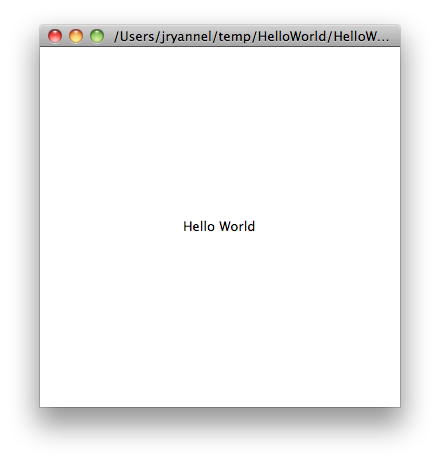

===========
Get Started
===========

.. sectionauthor:: `jryannel <https://github.com/jryannel>`_

.. issues:: ch02

.. |creatorrun| image:: assets/qtcreator-run.png

This chapter will introduce you to developing with Qt 5. We will show you how to install the Qt SDK and how you can create as well as run a simple *hello world* application using the Qt Creator IDE.

.. note::

    The source code of this chapter can be found in the `assets folder <../../assets>`_.

Installing Qt 5 SDK
===================

.. issues:: ch02

The Qt SDK include the tools needed to build desktop or embedded applications. The latest version can be grabbed from the `Qt-Company <http://qt.io>`_ homepage. There are offline and online installer. The author personally prefers the online installer package as it allows you to install and update several Qt releases. This is would be the recommended way to start. The SDK itself has a maintenance tool which will allow you to update the SDK to the latest version.

The Qt SDK is easy to install and comes with its own IDE for rapid development called *Qt Creator*. The IDE is a highly productive environment for Qt coding and recommended to all readers. Many developers use Qt from the command line and you are free to use a code editor of your choice.

When installing the SDK, you should select the default option and ensure that Qt 5.x is enabled. Then you are ready to go.

Hello World
===========

.. issues:: ch02

To test your installation, we will create a small *hello world* application. Please open Qt Creator and create a Qt Quick UI Project ( :menuselection:`File --> New File or Project --> Qt Quick Project --> Qt Quick UI` ) and name the project ``HelloWorld``.

.. note::

    The Qt Creator IDE allows you to create various types of applications. If not otherwise stated, we always use a :guilabeL:`Qt Quick UI` project.

.. hint::

    A typical Qt Quick application is made out of a runtime called the QmlEngine which loads the initial QML code. The developer can register C++ types with the runtime to interface with the native code. These C++ types can also be bundled into a plugin and then dynamically loaded using an import statement. The ``qmlscene`` and ``qml`` tool are pre-made runtimes, which can be used directly. For the beginning we will not cover the native side of development and focus only on the QML aspects of Qt 5.

Qt Creator will create several files for you. The ``HelloWorld.qmlproject`` file is the project file where the relevant project configuration is stored. This file is managed by Qt Creator so don't edit.

Another file, ``HelloWorld.qml``, is our application code. Open it and try to guess what the application does and then continue to read on.

.. code-block:: js

    // HelloWorld.qml

    import QtQuick 2.5

    Rectangle {
        width: 360
        height: 360
        Text {
            anchors.centerIn: parent
            text: "Hello World"
        }
        MouseArea {
            anchors.fill: parent
            onClicked: {
                Qt.quit();
            }
        }
    }

The ``HelloWord.qml`` is written in the QML language. We will discuss the QML language in more depth in the next chapter. QML describes the user interface as a tree of hierarchical elements. In this case, a rectangle of 360 x 360 pixels with a centered text reading "Hello World". To capture user clicks a mouse area spans the whole rectangle and when the user clicks it, the application quits.

To run the application on your own, please press the |creatorrun| :guilabel:`Run` tool on the left side or select :menuselection:`Build --> Run` from the menu.

Qt Creator will start the ``qmlscene`` and passes the QML document as the first argument. The ``qmlscene`` will parse the document and launch the user interface. Now you should see something like this:

Qt 5 seems to be working and we are ready to continue.

.. tip::

    If you are a system integrator, you'll want to have Qt SDK installed to get the latest stable Qt release as well as a Qt version compiled from source code for your specific device target.

.. topic:: Build from Scratch

    If you'd like to build Qt 5 from the command line, you'll first need to grab a copy of the code repository and build it.

    .. code-block:: sh

        git clone git://gitorious.org/qt/qt5.git
        cd qt5
        ./init-repository
        ./configure -prefix $PWD/qtbase -opensource
        make -j4

    After a successful compilation and 2 cups of coffee, Qt 5 will be available in the ``qtbase`` folder. Any beverage will suffice, however, we suggest coffee for best results.

    If you want to test your compilation, simply start ``qtbase/bin/qmlscene`` and select a Qt Quick example to run it ...or follow just us into the next chapter.

    To test your installation, we will create a small hello world application. Please create a simple ``example.qml`` file using your favorite text editor and paste the following content inside:

    .. code-block:: js

        // HelloWorld.qml

        import QtQuick 2.5

        Rectangle {
            width: 360
            height: 360
            Text {
                anchors.centerIn: parent
                text: "Greetings from Qt 5"
            }
            MouseArea {
                anchors.fill: parent
                onClicked: {
                    Qt.quit();
                }
            }
        }

    You can run now the example by using the default runtime which comes with Qt 5::

        $ qtbase/bin/qmlscene

Application Types
=================

.. issues:: ch02

This section is a run through of the different possible application types someone could write with Qt 5. It's not limited to the presented selection but it should give the reader a better idea about what can be done with Qt 5 in general.

Console Application
-------------------

.. issues:: ch02

A console application does not provide any graphical user interface and will normally be called as part of a system service or from the command line. Qt 5 comes with a series of ready-made components which help you to create console cross platform applications very efficiently. For example the networking file APIs. Also string handling and, since Qt 5.1, efficient command line parser. As Qt is a high-level API on top of C++, you get programming speed paired with execution speed. Don't think of Qt as being *just* a UI toolkit -- it has so much more to offer.

.. rubric:: String Handling

In the first example we demonstrate how someone could very simply add 2 constant strings. This is not a very useful application but it gives you an idea of what a native C++ application, without an event loop, could look like.

.. code-block:: cpp

    // module or class includes
    #include <QtCore>

    // text stream is text-codec aware
    QTextStream cout(stdout, QIODevice::WriteOnly);

    int main(int argc, char** argv)
    {
        // avoid compiler warnings
        Q_UNUSED(argc)
        Q_UNUSED(argv)
        QString s1("Paris");
        QString s2("London");
        // string concatenation
        QString s = s1 + " " + s2 + "!";
        cout << s << endl;
    }

.. rubric:: Container Classes

This example adds a list and list iteration to the application. Qt comes with a large collections of container classes which are easy to use and use the same API paradigms as the rest of Qt classes.

.. code-block:: cpp

    QString s1("Hello");
    QString s2("Qt");
    QList<QString> list;
    // stream into containers
    list <<  s1 << s2;
    // Java and STL like iterators
    QListIterator<QString> iter(list);
    while(iter.hasNext()) {
        cout << iter.next();
        if(iter.hasNext()) {
            cout << " ";
        }
    }
    cout << "!" << endl;

Here we show some advanced list function, which allow you to join a list of strings into one string. This is very handy when you need to proceed line based text input. The inverse (string to string-list) is also possible using ``QString::split()`` function.

.. code-block:: cpp

    QString s1("Hello");
    QString s2("Qt");
    // convenient container classes
    QStringList list;
    list <<  s1 << s2;
    // join strings
    QString s = list.join(" ") + "!";
    cout << s << endl;

.. rubric:: File IO

In the next snippet we read a CSV file from the local directory and loop over the rows to extract the cells from each row. Doing this we get the table data from the CSV file in ca. 20 lines of code. File reading gives us just a byte stream, to be able to convert it into a valid Unicode text we need to use the text stream and pass in the file as a lower-level stream. For writing CSV files you would just need to open the file in the write mode and pipe the lines into the text stream.

.. code-block:: cpp

    QList<QStringList> data;
    // file operations
    QFile file("sample.csv");
    if(file.open(QIODevice::ReadOnly)) {
        QTextStream stream(&file);
        // loop forever macro
        forever {
            QString line = stream.readLine();
            // test for null string 'String()'
            if(line.isNull()) {
                break;
            }
            // test for empty string 'QString("")'
            if(line.isEmpty()) {
                continue;
            }
            QStringList row;
            // for each loop to iterate over containers
            foreach(const QString& cell, line.split(",")) {
                row.append(cell.trimmed());
            }
            data.append(row);
        }
    }
    // No cleanup necessary.

This concludes our section about console based application with Qt.

Widget Application
------------------

.. issues:: ch02

Console based applications are very handy but sometimes you need to have a UI to show. In addition, UI-based applications will likely need a back-end to read/write files, communicate over the network, or keep data in a container.

In this first snippet for widget-based applications we do as little as needed to create a window and show it. A widget without a parent in the Qt world is a window. We use the scoped pointer to ensure the widget is deleted when the scoped pointer goes out of scope. The application object encapsulates the Qt runtime and with the ``exec()`` call we start the event loop. From there on the application reacts only on events triggered by mouse or keyboard or other event providers like networking or file IO. The application will only exit when the event loop is exited.  This is done by calling ``quit()`` on the application or by closing the window.

When you run the code you will see a window with the size of 240 x 120 pixel. That's all.

.. code-block:: cpp

    #include <QtGui>

    int main(int argc, char** argv)
    {
        QApplication app(argc, argv);
        QScopedPointer<QWidget> widget(new CustomWidget());
        widget->resize(240, 120);
        widget->show();
        return app.exec();
    }

.. rubric:: Custom Widgets

When you work on user interfaces, you will need to create custom made widgets. Typically a widget is a window area filled with painting calls. Additional the widget has internal knowledge of how to handle keyboard or mouse input and how to react to external triggers. To do this in Qt we need to derive from `QWidget` and overwrite several functions for painting and event handling.

.. code-block:: cpp

    #ifndef CUSTOMWIDGET_H
    #define CUSTOMWIDGET_H

    #include <QtWidgets>

    class CustomWidget : public QWidget
    {
        Q_OBJECT
    public:
        explicit CustomWidget(QWidget *parent = 0);
        void paintEvent(QPaintEvent *event);
        void mousePressEvent(QMouseEvent *event);
        void mouseMoveEvent(QMouseEvent *event);
    private:
        QPoint m_lastPos;
    };

    #endif // CUSTOMWIDGET_H

In the implementation, we draw a small border on our widget and a small rectangle on the last mouse position. This is very typical for a low-level custom widget. Mouse or keyboard events change the internal state of the widget and trigger a painting update. We don't want to go into to much detail into this code, but it is good to know that you have the ability. Qt comes with a large set of ready-made desktop widgets, so that the probability is high that you don't have to do this.

.. code-block:: cpp

    #include "customwidget.h"

    CustomWidget::CustomWidget(QWidget *parent) :
        QWidget(parent)
    {
    }

    void CustomWidget::paintEvent(QPaintEvent *)
    {
        QPainter painter(this);
        QRect r1 = rect().adjusted(10,10,-10,-10);
        painter.setPen(QColor("#33B5E5"));
        painter.drawRect(r1);

        QRect r2(QPoint(0,0),QSize(40,40));
        if(m_lastPos.isNull()) {
            r2.moveCenter(r1.center());
        } else {
            r2.moveCenter(m_lastPos);
        }
        painter.fillRect(r2, QColor("#FFBB33"));
    }

    void CustomWidget::mousePressEvent(QMouseEvent *event)
    {
        m_lastPos = event->pos();
        update();
    }

    void CustomWidget::mouseMoveEvent(QMouseEvent *event)
    {
        m_lastPos = event->pos();
        update();
    }

.. rubric:: Desktop Widgets

The Qt developers have done all of this for you already and provide a set of desktop widgets, which will look native on different operating systems. Your job is then to arrange these different widgets in a widget container into larger panels. A widget in Qt can also be a container for other widgets. This is accomplished by the parent-child relationship. This mean we need to make our ready-made widgets like buttons, check boxes, radio button but also lists and grids a child of another widget. One way to accomplish this is displayed below.

Here is the header file for a so called widget container.

.. code-block:: cpp

    class CustomWidget : public QWidget
    {
        Q_OBJECT
    public:
        explicit CustomWidget(QWidget *parent = 0);
    private slots:
        void itemClicked(QListWidgetItem* item);
        void updateItem();
    private:
        QListWidget *m_widget;
        QLineEdit *m_edit;
        QPushButton *m_button;
    };

In the implementation, we use layouts to better arrange our widgets. Layout managers re-layout the widgets according to some size policies when the container widget is re-sized. In this example we have a list, a line edit, and a button arranged vertically to allow to edit a list of cities. We use Qt's ``signal`` and ``slots`` to connect sender and receiver objects.

.. code-block:: cpp

    CustomWidget::CustomWidget(QWidget *parent) :
        QWidget(parent)
    {
        QVBoxLayout *layout = new QVBoxLayout(this);
        m_widget = new QListWidget(this);
        layout->addWidget(m_widget);

        m_edit = new QLineEdit(this);
        layout->addWidget(m_edit);

        m_button = new QPushButton("Quit", this);
        layout->addWidget(m_button);
        setLayout(layout);

        QStringList cities;
        cities << "Paris" << "London" << "Munich";
        foreach(const QString& city, cities) {
            m_widget->addItem(city);
        }

        connect(m_widget, SIGNAL(itemClicked(QListWidgetItem*)), this, SLOT(itemClicked(QListWidgetItem*)));
        connect(m_edit, SIGNAL(editingFinished()), this, SLOT(updateItem()));
        connect(m_button, SIGNAL(clicked()), qApp, SLOT(quit()));
    }

    void CustomWidget::itemClicked(QListWidgetItem *item)
    {
        Q_ASSERT(item);
        m_edit->setText(item->text());
    }

    void CustomWidget::updateItem()
    {
        QListWidgetItem* item = m_widget->currentItem();
        if(item) {
            item->setText(m_edit->text());
        }
    }

.. rubric:: Drawing Shapes

Some problems are better visualized. If the problem at hand looks faintly like geometrical objects, qt graphics view is a good candidate. A graphics view arranges simple geometrical shapes on a scene.  The user can interact with these shapes or they are positioned using an algorithm. To populate a graphics view you need a graphics view and a graphics scene. The scene is attached to the view and populates with graphics items.
Here is a short example. First the header file with the declaration of the view and scene.

.. code-block:: cpp

    class CustomWidgetV2 : public QWidget
    {
        Q_OBJECT
    public:
        explicit CustomWidgetV2(QWidget *parent = 0);
    private:
        QGraphicsView *m_view;
        QGraphicsScene *m_scene;

    };

In the implementation the scene gets attached to the view first. The view is a widget and get arranged in our container widget. At the end we add a small rectangle to the scene, which then is rendered on the view.

.. code-block:: cpp

    #include "customwidgetv2.h"

    CustomWidget::CustomWidget(QWidget *parent) :
        QWidget(parent)
    {
        m_view = new QGraphicsView(this);
        m_scene = new QGraphicsScene(this);
        m_view->setScene(m_scene);

        QVBoxLayout *layout = new QVBoxLayout(this);
        layout->setMargin(0);
        layout->addWidget(m_view);
        setLayout(layout);

        QGraphicsItem* rect1 = m_scene->addRect(0,0, 40, 40, Qt::NoPen, QColor("#FFBB33"));
        rect1->setFlags(QGraphicsItem::ItemIsFocusable|QGraphicsItem::ItemIsMovable);
    }

Adapting Data
-------------

.. issues:: ch02

Up to now we have mostly covered basic data types and how to use widgets and graphic views. Often in your application you will need larger amount of structured data, which also has to be persistently stored. The data also needs to be displayed. For this Qt uses models. A simple model is the string list model, which gets filled with strings and then attached to a list view.

.. code-block:: cpp

    m_view = new QListView(this);
    m_model = new QStringListModel(this);
    view->setModel(m_model);

    QList<QString> cities;
    cities << "Munich" << "Paris" << "London";
    model->setStringList(cities);

Another popular way to store or retrieve data is SQL. Qt comes with SQLite embedded and also has support for other database engines (MySQL, PostgresSQL, ...). First you need to create your database using a schema, like this:

.. code-block:: sql

    CREATE TABLE city (name TEXT, country TEXT);
    INSERT INTO city value ("Munich", "Germany");
    INSERT INTO city value ("Paris", "France");
    INSERT INTO city value ("London", "United Kingdom");

To use sql we need to add the sql module to our .pro file

.. code-block:: cpp

    QT += sql

And then we can open our database using C++. First we need to retrieve a new database object for the specified database engine. With this database object we open the database. For SQLite it's enough to specify the path to the database file. Qt provides some high-level database model, one of them is the table model, which uses a table identifier and an option where clause to select the data. The resulting model can be attached to a list view as the other model before.

.. code-block:: cpp

    QSqlDatabase db = QSqlDatabase::addDatabase("QSQLITE");
    db.setDatabaseName('cities.db');
    if(!db.open()) {
        qFatal("unable to open database");
    }

    m_model = QSqlTableModel(this);
    m_model->setTable("city");
    m_model->setHeaderData(0, Qt::Horizontal, "City");
    m_model->setHeaderData(1, Qt::Horizontal, "Country");

    view->setModel(m_model);
    m_model->select();

For higher level of model operations Qt provides a sort file proxy model, which allows you in the basic form to sort and filter another model.

.. code-block:: cpp

    QSortFilterProxyModel* proxy = new QSortFilterProxyModel(this);
    proxy->setSourceModel(m_model);
    view->setModel(proxy);
    view->setSortingEnabled(true);

Filtering is done based on the column to be filters and a string as filter argument.

.. code-block:: cpp

    proxy->setFilterKeyColumn(0);
    proxy->setFilterCaseSensitive(Qt::CaseInsensitive);
    proxy->setFilterFixedString(QString)

The filter proxy model is much more powerful than demonstrated here. For now it is enough to remember its exists.

.. note::

    This was an overview of the different kind of classical application you could develop with Qt 5. The desktop is moving and soon the mobile devices will be our desktop of tomorrow. Mobile devices have a different user interface design. They are much more simplistic than desktop applications. They do one thing and they do simply and focused. Animations are an important part of the experience. A user interface needs to feel alive and fluent. The traditional Qt technologies are not well suited for this market.

    Coming next: Qt Quick for the rescue.

Qt Quick Application
--------------------

.. issues:: ch02

There is an inherent conflict in modern software development. The user interface is moving much faster than our back-end services. In a traditional technology you develop the so called front-end at the same pace as the back-end. This results in conflicts when customers want to change the user interface during a project, or develop the idea of an user interface during the project. Agile projects, require agile methods.

Qt Quick provides a declarative environment where your user interface (the front-end) is declared like HTML and your back-end is in native C++ code. This allows you to get the best of both worlds.

This is a simple Qt Quick UI below

.. code-block:: qml

    import QtQuick 2.5

    Rectangle {
        width: 240; height: 1230
        Rectangle {
            width: 40; height: 40
            anchors.centerIn: parent
            color: '#FFBB33'
        }
    }

The declaration language is called QML and it needs a runtime to execute in. Qt provides a standard runtime called ``qmlscene`` but it's also not so difficult to write a custom runtime. For this we need a quick view and set the main QML document as source. The only thing left is to show the user interface.

.. code-block:: cpp

    QQuickView* view = new QQuickView();
    QUrl source = QUrl::fromLocalFile("main.qml");
    view->setSource(source);
    view.show();

Coming back to our earlier examples. In one example we used a C++ city model. It would be great if we could use this model inside our declarative QML code.

To enable this, we first code our front-end to see how we would want to use a city model. In this case the front-end expects a object named ``cityModel`` which we can use inside a list view.

.. code-block:: qml

    import QtQuick 2.5

    Rectangle {
        width: 240; height: 120
        ListView {
            width: 180; height: 120
            anchors.centerIn: parent
            model: cityModel
            delegate: Text { text: model.city }
        }
    }

To enable the ``cityModel`` we can mostly re-use our previous model and add a context property to our root context (the root context is the other root-element in the main document)

.. code-block:: cpp

    m_model = QSqlTableModel(this);
    ... // some magic code
    QHash<int, QByteArray> roles;
    roles[Qt::UserRole+1] = "city";
    roles[Qt::UserRole+2] = "country";
    m_model->setRoleNames(roles);
    view->rootContext()->setContextProperty("cityModel", m_model);

.. hint::

    This is not completely correct, as the SQL table model contains the data in columns and a QML model expects the data as roles. So there needs to be a mapping between columns and roles. Please see `QML and QSqlTableModel <http://wiki.qt.io/QML_and_QSqlTableModel>`_ wiki page.

Summary
=======

.. issues:: ch02

We have seen how to install the Qt SDK and how to create our first application. Then we walked you through the different application types to give you an overview of Qt, showing off some features Qt offers for application development. I hope you got a good impression that Qt is a very rich user interface toolkit and offers everything an application developer can hope for and more. Still, Qt does not lock you into specific libraries, as you always can use other libraries or extend Qt yourself. It is also rich when it comes to supporting different application models: console, classical desktop user interface and touch user interface.

