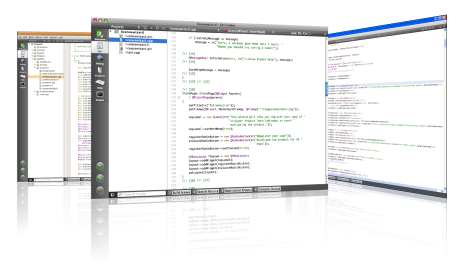
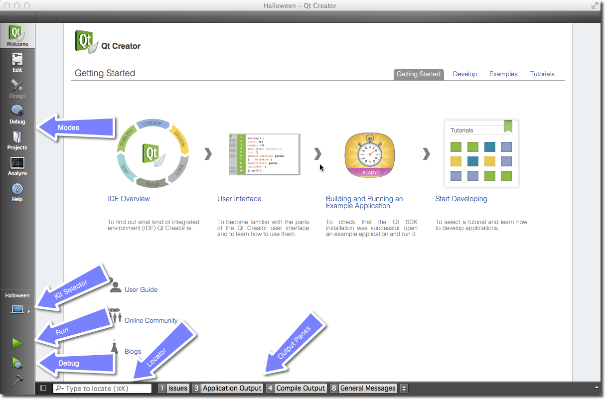
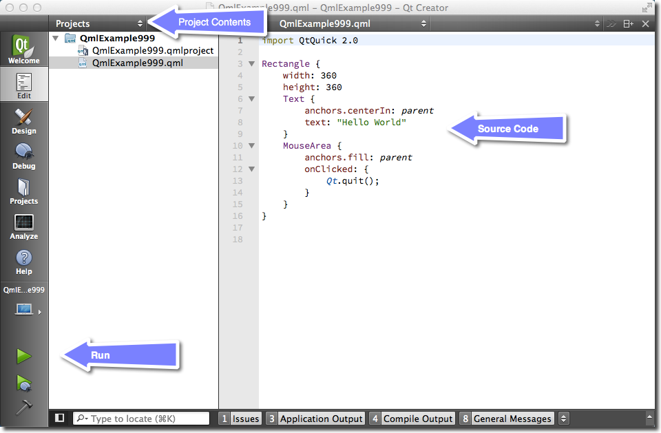
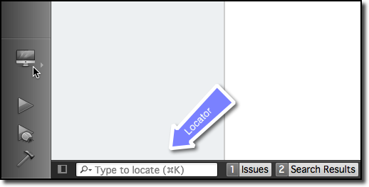
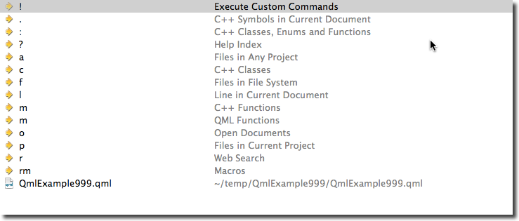

==============
Qt Creator IDE
==============

.. sectionauthor:: `jryannel <https://github.com/jryannel>`_

.. issues:: ch03

Qt Creator is the default integrated development environment for Qt. It's written from Qt developers for Qt developers. The IDE is available on all major desktop platforms, e.g. Windows/Mac/Linux. We have already seen customers using Qt Creator on an embedded device. Qt Creator has a lean efficient user interface and it really shines in making the developer productive. Qt Creator can be used to run your Qt Quick user interface but also to compile c++ code and this for your host system or for another device using a cross-compiler.

.. note::

    The source code of this chapter can be found in the `assets folder <../../assets>`_.

The User Interface
==================

.. issues:: ch03

When starting Qt Creator you are greeted by the *Welcome* screen. There you will find the most important hints on how to continue inside Qt Creator and your recently used projects. You will also see the sessions list, which might be empty for you. A session is a collection of projects stored for your reference. This comes really handy when you have several customers with larger projects.

On the left side you will see the mode-selector. The mode selectors contain typical steps from your work flow.

* Welcome mode: For your orientation.
* Edit mode: Focus on the code
* Design mode: Focus on the UI design
* Debug mode: Retrieve information about a running application
* Projects mode: Modify your projects run and build configuration
* Analyze mode: For detecting memory leaks and profiling
* Help mode: Easy access to the Qt documentation

Below the mode-selectors you will find the actual project-configuration selector and the run/debug

Most of the time you will be in the edit mode with the code-editor in the central panel. From time to time, you will visit the Projects mode when you need to configure your project. And then you press ``Run``. Qt Creator is smart enough to ensure you project is fully built before running it.

In the bottom are the output panes for issues, application messages, compile messages, and other messages.

Registering your Qt Kit
=======================

.. issues:: ch03

The Qt Kit is probably the most difficult aspect when it comes for working with Qt Creator initially. A Qt Kit is a set of a Qt version, compiler and device and some other settings. It is used to uniquely identify the combination of tools for your project build. A typical kit for the desktop would contain a GCC compiler and a Qt version (e.g. Qt 5.1.1) and a device ("Desktop"). After you have created a project you need to assign a kit to a project before qt creator can build the project. Before you are able to create a kit first you need to have a compiler installed and have a Qt version registered. A Qt version is registered by specifying the path to the ``qmake`` executable. Qt Creator then queries ``qmake`` for information required to identify the Qt version.

Adding a kit and registering a Qt version is done in the :menuselection:`Settings --> Build & Run` entry. There you can also see which compilers are registered.

.. note::

	Please first check if your Qt Creator has already the correct Qt version registered and then ensure a Kit for your combination of compiler and Qt and device is specified. You can not build a project without a kit.

Managing Projects
=================

.. issues:: ch03

Qt Creator manages your source code in projects. You can create a new project by using :menuselection:`File --> New File or Project`. When you create a project you have many choices of application templates. Qt Creator is capable of creating desktop, mobile applications. Application which use Widgets or Qt Quick or Qt Quick and controls or even bare-bone projects. Also project for HTML5 and python are supported. For a beginner it is difficult to choose, so we pick three project types for you.

* **Applications / Qt Quick 2.0 UI**: This will create a QML/JS only project for you, without any C++ code. Take this if you want to sketch a new user interface or plan to create a modern UI application where the native parts are delivered by plug-ins.
* **Libraries / Qt Quick 2.0 Extension Plug-in**: Use this wizard to create a stub for a plug-in for your Qt Quick UI. A plug-in is used to extend Qt Quick with native elements.
* **Other Project / Empty Qt Project**: A bare-bone empty project. Take this if you want to code your application with c++ from scratch. Be aware you need to know what you are doing here.

.. note::

	During the first parts of the book we will mainly use the Qt Quick 2.0 UI project type. Later to describe some c++ aspects we will use the Empty-Qt-Project type or something similar. For extending Qt Quick with our own native plug-ins we will use the *Qt Quick 2.0 Extension Plug-in* wizard type.

Using the Editor
================

.. issues:: ch03

When you open a project or you just created a new project Qt Creator will switch to the edit mode. You should see on the left your project files and in the center area the code editor. Selecting files on the left will open them in the editor. The editor provides syntax highlighting, code-completion and quick-fixes. Also it supports several commands for code refactoring. When working with the editor you will have the feeling that everything reacts immediately. This is thanks to the developers of Qt Creator which made the tool feel really snappy.

Locator
=======

.. issues:: ch03

The locator is a central component inside Qt Creator. It allows developers to navigate fast to specific locations inside the source code or inside the help. To open the locator press :kbd:`Ctrl+K`.

A pop-up is coming from the bottom left and shows a list of options. If you just search a file inside your project just hit the first letter from the file name. The locator also accepts wild-cards, so ``*main.qml`` will also work. Otherwise you can also prefix your search to search for specific content type.

Please try it out. For example to open the help for the QML element Rectangle open the locator and type ``? rectangle``. While you type the locator will update the suggestions until you found the reference you are looking for.

Debugging
=========

.. issues:: ch03

Qt Creator comes with C++ and QML debugging support.

.. note::

	Hmm, I just realized I have not used debugging a lot. I hope this is a good sign. Need to ask someone to help me out here. In the meantime have a look at the `Qt Creator documentation <http://http://doc.qt.io/qtcreator/index.html>`_.

Shortcuts
=========

.. issues:: ch03

Shortcuts are the difference between a nice to use system and a professional system. As a professional you spend hundred of hours in front of your application. Each shortcut which makes your work-flow faster counts. Luckily the developers of Qt Creator think the same and have added literally hundreds of shortcuts to the application.

To get started we have collection some basic shortcuts (in Windows notation):

* :kbd:`Ctrl+B` - Build project
* :kbd:`Ctrl+R` - Run Project
* :kbd:`Ctrl+Tab` - Switch between open documents
* :kbd:`Ctrl+K` - Open Locator
* :kbd:`Esc` - Go back (hit several times and you are back in the editor)
* :kbd:`F2` - Follow Symbol under cursor
* :kbd:`F4` - Switch between header and source (only useful for c++ code)

List of `Qt Creator shortcuts <http://doc.qt.io/qtcreator/creator-keyboard-shortcuts.html>`_ from the documentation.

.. note::

	You can edit the shortcuts from inside creator using the settings dialog.

	.. figure:: assets/creator-edit-shortcuts.png
		:scale: 50%

