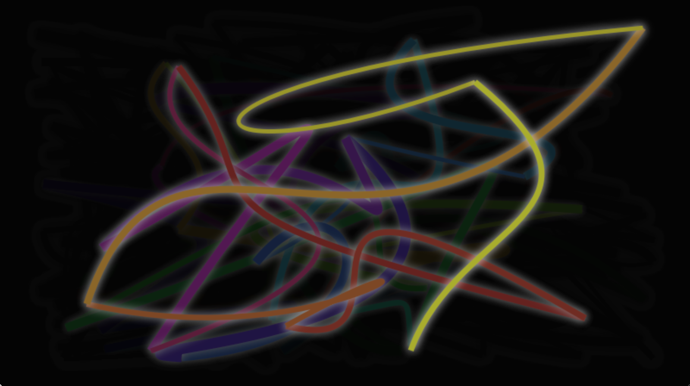
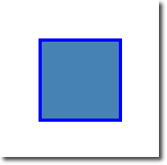
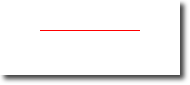
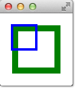
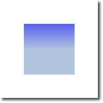
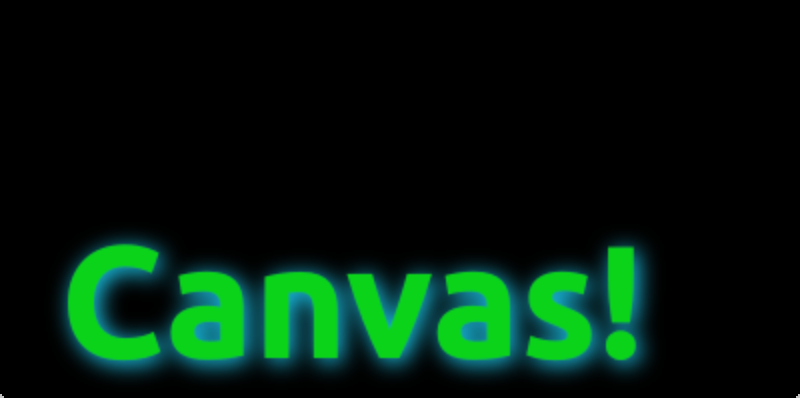
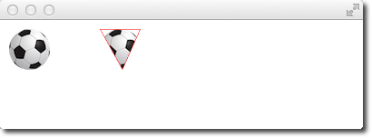
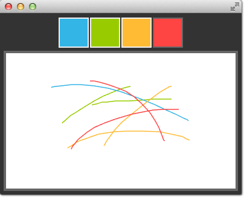
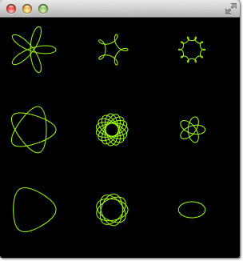
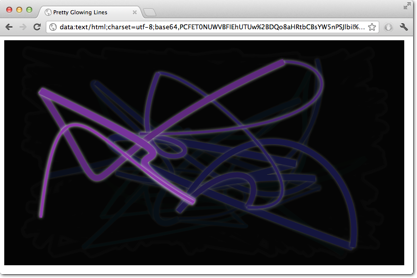

==============
Canvas Element
==============

.. sectionauthor:: `jryannel <https://github.com/jryannel>`_

.. issues:: ch07

.. note::

    Last Build: |today|

    The source code for this chapter can be found in the `assets folder <../../assets>`_.

Early on when QML was introduced in Qt4 there were some discussions about if Qt Quick needs an ellipse. The problem with the ellipse is that others can argue other shapes need also be supported. So there is no ellipse in Qt Quick only rectangular shapes. If you needed one in Qt4 you would need to use an image or write your own C++ ellipse element.

To allow scripted drawings Qt 5 introduces the canvas element. The canvas elements provides a resolution-dependent bitmap canvas, which can be used for graphics, games or to paint other visual images on the fly using JavaScript. The canvas element is based on the HTML5 canvas element.

The fundamental idea of the canvas element is to render paths using a context 2D object. The context 2D object, contains the necessary graphics functions, whereas the canvas acts as the drawing canvas. The 2D context supports strokes, fills, gradients, text and a different sets of path creation commands.

Let's see an example of a simple path drawing:

.. literalinclude:: src/canvas/rectangle.qml
    :start-after: M1>>
    :end-before: <<M1

This produces a filled rectangle with a starring point at 50,50 and a size of 100 and a stroke used as a border decoration.

The stroke width is set to 4 and uses a blue color define by ``strokeStyle``. The final shape is setup to be filled through the ``fillStyle`` to a "steelblue" color. Only by calling ``stroke`` or ``fill`` the actual path will be drawn and they can be used independently from each other. A call to ``stroke`` or ``fill`` will draw the current path. It's not possible to store a path for later reuse only a drawing state can be stored and restored.

In QML the ``Canvas`` element acts as a container for the drawing. The 2D context object provides the actual drawing operation. The actual drawing needs to be done inside the ``onPaint`` event handler.

.. code-block:: js

    Canvas {
        width: 200; height: 200
        onPaint: {
            var ctx = getContext("2d")
            // setup your path
            // fill or/and stroke
        }
    }

The canvas itself provides a typical two dimensional Cartesian coordinate system, where the top-left is the (0,0) point. A higher y-value goes down and a hight x-value goes to the right.

A typical order of commands for this path based API is the following:

#. Setup stroke and/or fill
#. Create path
#. Stroke and/or fill

.. literalinclude:: src/canvas/line.qml
    :start-after: M1>>
    :end-before: <<M1

This produces a horizontal stroked line from point ``P1(50,50)`` to point ``P2(150,50)``.

.. note::

    Typically you always want to set a start point when you reset your path, so the first operation after ``beginPath`` is often ``moveTo``.

Convenient API
--------------

.. issues:: ch07

For operations on rectangles a convenience API is provided which draws directly and does need a stroke or fill call.

.. literalinclude:: src/canvas/convenient.qml
    :start-after: M1>>
    :end-before: <<M1

.. note::

    The stroke area extends half of the line width on both sides of the path. A 4 px lineWidth will draw 2 px outside the path and 2 px inside.

Gradients
---------

.. issues:: ch07

Canvas can fill shapes with color but also with gradients or images.

.. literalinclude:: src/canvas/gradient.qml
    :start-after: M1>>
    :end-before: <<M1

The gradient in this example is defined along the starting point (100,0) to the end point (100,200), which gives a vertical line in the middle of our canvas. The gradient stops can be define as a color from 0.0 (gradient start point) to 1.0 (gradient end point). Here we use a "blue" color at 0.0 (100,0) and a "lightsteelblue" color at the 0.5 (100,200) position. The gradient is defined much larger then the rectangle we want to draw, so the rectangle clips gradient to it's defined geometry.

.. note::

    The gradient is defined in canvas coordinates not in coordinates relative to the path to be painted. A canvas does not have the concept of relative coordinates, as we are used to by now from QML.

Shadows
-------

.. issues:: ch07

A path can be visually enhanced using shadows with the 2D context object. A shadow is an area around the path with an offset, color and specified blurring. For this you need can specify a ``shadowColor``, ``shadowOffsetX``, ``shadowOffsetY`` and a ``shadowBlur``. All of this needs to be defined using the 2D context. The 2D context is your only API to the drawing operations.

A shadow can also be used to create a glow effect around a path. In the next example we create a text "Canvas" with a white glow around. All this on a dark background for better visibility.

First we draw the dark background:

.. literalinclude:: src/canvas/shadow.qml
    :start-after: M1>>
    :end-before: <<M1

then we define our shadow configuration, which will be used for the next path:

.. literalinclude:: src/canvas/shadow.qml
    :start-after: M2>>
    :end-before: <<M2

Finally we draw our "Canvas" text using a large bold 80px font from the *Ubuntu* font family.

.. literalinclude:: src/canvas/shadow.qml
    :start-after: M3>>
    :end-before: <<M3

Images
------

.. issues:: ch07

The QML canvas supports image drawing from several sources. To use an image inside the canvas the image needs to be loaded first. We will use the ``Component.onCompleted`` handler to load the image in our example.

.. literalinclude:: src/canvas/image.qml
    :start-after: M1>>
    :end-before: <<M1

The left shows our ball image painted at the top-left position of 10x10. The right image shows the ball with a clip path applied. Images and any other path can be clipped using another path. The clipping is applied by defining a path and calling the ``clip()`` function. All following drawing operations will now be clipped by this path. The clipping is disabled again by restoring the previous state or by setting the clip region to the whole canvas.

Transformation
--------------

.. issues:: ch07

The canvas allows you to transform the coordinate system in several ways. This is very similar to the transformation offered by QML items. You have the possibility to ``scale``, ``rotate``, ``translate`` the coordinate system. In difference to QML the transform origin is always the canvas origin. For example to scale a path around it's center you would need to translate the canvas origin to the center of the path. It is also possible to apply a more complex transformation using the transform method.

.. literalinclude:: src/canvas/transform.qml
    :start-after: M1>>
    :end-before: <<M1

.. figure:: assets/transform.png

Besides translate the canvas allows also to scale using ``scale(x,y)`` around x and y axis, to rotate using ``rotate(angle)``, where the angle is given in radius (*360 degree = 2*Math.PI*) and to use a matrix transformation using the ``setTransform(m11, m12, m21, m22, dx, dy)``.

.. note::

    To reset any transformation you can call the ``resetTransform()`` function to set the transformation matrix back to the identity matrix::

        ctx.resetTransform()

Composition Modes
-----------------

.. issues:: ch07

Composition allows you to draw a shape and blend it with the existing pixels. The canvas supports several composition modes using the ``globalCompositeOperation(mode)`` operation.

* ``source-over``
* ``source-in``
* ``source-out``
* ``source-atop``

.. literalinclude:: src/canvas/composition.qml
    :start-after: M1>>
    :end-before: <<M1

This little examples iterates over a list of composite modes and generates a rectangle with a circle.

.. literalinclude:: src/canvas/compositeoperation.qml
    :start-after: M1>>
    :end-before: <<M1

Pixel Buffers
-------------

.. issues:: ch07

When working with the canvas you are able to retrieve pixel data from the canvas to read or manipulate the pixels of your canvas. To read the image data use ``createImageData(sw,sh)`` or ``getImageData(sx,sy,sw,sh)``. Both functions return an ``ImageData`` object with a ``width``, ``height`` and a ``data`` variable. The data variable contains a one-dimensional array of the pixel data retrieved in the *RGBA* format, where each value varies in the range of 0 to 255. To set pixels on the canvas you can use the ``putImageData(imagedata,, dx, dy)`` function.

Another way to retrieve the content of the canvas is to store the data into an image. This can be achieved with the ``Canvas`` functions ``save(path)`` or ``toDataURL(mimeType)``, where the later function returns an image url, which can be used to be loaded by an ``Image`` element.

.. literalinclude:: src/canvas/imagedata.qml
    :start-after: M1>>
    :end-before: <<M1

In our little example we paint every second a small circle in the left canvas. When the use clicks on the mouse area the canvas content is stored and a image url is retrieved. On the right side of our example the image is then displayed.

.. note:: Retrieving image data seems not to work currently in the Qt 5 Alpha SDK.

Canvas Paint
------------

.. issues:: ch07

In this example we would like to create a small paint application using the ``Canvas`` element.

For this we arrange four color squares on the top of our scene using a row positioner. A color square is a simple rectangle filled with a mouse area to detect clicks.

.. literalinclude:: src/canvas/paint.qml
    :start-after: M1>>
    :end-before: <<M1

The colors are stored in an array and the paint color. When one the user clicks in one of the squares the color of the square is assigned to the ``paintColor`` property of the row named *colorTools*.

To enable tracking of the mouse events on the canvas we have a ``MouseArea`` covering the canvas element and hooked up the pressed and position changed handlers.

.. literalinclude:: src/canvas/paint.qml
    :start-after: M2>>
    :end-before: <<M2

A mouse press stores the initial mouse position into the *lastX* and *lastY* properties. Every change on the mouse position triggers a paint request on the canvas, which will result into calling the *onPaint* handler.

To finally draw the users stroke, in the *onPaint* handler we begin a new path and move to the last position. Then we gather the new position from the mouse area and draw a line with the selected color to the new position. The mouse position is stored as the new *last* position.

Porting from HTML5 Canvas
-------------------------

.. issues:: ch07

* https://developer.mozilla.org/en/Canvas_tutorial/Transformations
* http://en.wikipedia.org/wiki/Spirograph

It is fairly easy to port a HTML5 canvas graphics over to use the QML canvas. From the thousands of examples, we picked one and tried it ourself.

**Spiro Graph**

We use a `spiro graph <http://en.wikipedia.org/wiki/Spirograph>`_ example from the Mozilla project as our foundation. The original HTML5 was posted as part of the `canvas tutorial <https://developer.mozilla.org/en/Canvas_tutorial/Transformations>`_.

There where a few lines we needed to change:

* Qt Quick requires you to declare variable, so we needed to add some *var* declarations

    .. code-block:: js

        for (var i=0;i<3;i++) {
            ...
        }

* Adapted the draw method to receive the Context2D object

    .. code-block:: js

        function draw(ctx) {
            ...
        }

* we needed to adapt the translation for each spiro due to different sizes

    .. code-block:: js

        ctx.translate(20+j*50,20+i*50);

Finally we inmpleted our ``onPaint`` handler. Inside we acquire a context and call our draw function.

.. literalinclude:: src/canvas/spirograph.qml
    :start-after: M1>>
    :end-before: <<M1

The result is a ported spiro graph graphics running using the QML canvas

That's all.

**Glowing Lines**

Here is another more complicated port from the W3C organization. The original `pretty glowing lines <http://www.w3.org/TR/2dcontext/#examples>`_ has some pretty nice aspects, which makes the porting more challenging.

.. code-block:: xml

    <!DOCTYPE HTML>
    <html lang="en">
    <head>
        <title>Pretty Glowing Lines</title>
    </head>
    <body>

    <canvas width="800" height="450"></canvas>
    
    </body>
    </html>

In HTML5 the Context2D object can paint at any time on the canvas. In QML it can only point inside the ``onPaint`` handler. The timer in usage with ``setInterval`` triggers in HTML5 the stroke of the line or to blank the screen. Due to the different handling in QML it's not possible to just call these functions, because we need to go through the ``onPaint`` handler. Also the color presentations needs to be adapted. Let's go through the changes on by one.

Everything starts with the canvas element. For simplicity we just use the ``Canvas`` element as the root element of our QML file.

.. code-block:: js

    import QtQuick 2.5

    Canvas {
       id: canvas
       width: 800; height: 450

       ...
    }

To untangle the direct call of the functions through the ``setInterval``, we replace the ``setInterval`` calls with two timers which will request a repaint. A ``Timer`` is triggered after a short interval and allows us to execute some code. As we can't tell the paint function which operation we would like trigger we define for each operation a bool flag request an operation and trigger then a repaint request.

Here is the code for the line operation. The blank operation is similar.

.. code-block:: js

    ...
    property bool requestLine: false

    Timer {
        id: lineTimer
        interval: 40
        repeat: true
        triggeredOnStart: true
        onTriggered: {
            canvas.requestLine = true
            canvas.requestPaint()
        }
    }

    Component.onCompleted: {
        lineTimer.start()
    }
    ...

Now we have a an indication which (line or blank or even both) operation we need to perform during the ``onPaint`` operation. As we enter the ``onPaint`` handler for each paint request we need to extract the initialization of the variable into the canvas element.

.. code-block:: js

    Canvas {
        ...
        property real hue: 0
        property real lastX: width * Math.random();
        property real lastY: height * Math.random();
        ...
    }

Now our paint function should look like this:

.. code-block:: js

    onPaint: {
        var context = getContext('2d')
        if(requestLine) {
            line(context)
            requestLine = false
        }
        if(requestBlank) {
            blank(context)
            requestBlank = false
        }
    }

The *line* function was extracted gor a canvas as argument.

.. code-block:: js

    function line(context) {
        context.save();
        context.translate(canvas.width/2, canvas.height/2);
        context.scale(0.9, 0.9);
        context.translate(-canvas.width/2, -canvas.height/2);
        context.beginPath();
        context.lineWidth = 5 + Math.random() * 10;
        context.moveTo(lastX, lastY);
        lastX = canvas.width * Math.random();
        lastY = canvas.height * Math.random();
        context.bezierCurveTo(canvas.width * Math.random(),
            canvas.height * Math.random(),
            canvas.width * Math.random(),
            canvas.height * Math.random(),
            lastX, lastY);

        hue += Math.random()*0.1
        if(hue > 1.0) {
            hue -= 1
        }
        context.strokeStyle = Qt.hsla(hue, 0.5, 0.5, 1.0);
        // context.shadowColor = 'white';
        // context.shadowBlur = 10;
        context.stroke();
        context.restore();
    }

The biggest change was the use of the QML ``Qt.rgba()`` and ``Qt.hsla()`` functions, which required to adapt the values to the used 0.0 ... 1.0 range in QML.

Same applies to the *blank* function.

.. code-block:: js

    function blank(context) {
        context.fillStyle = Qt.rgba(0,0,0,0.1)
        context.fillRect(0, 0, canvas.width, canvas.height);
    }

The final result will look similar to this.

.. seealso::

    * `W3C HTML Canvas 2D Context Specification <http://www.w3.org/TR/2dcontext/>`_
    * `Mozilla Canvas Documentation <https://developer.mozilla.org/en/HTML/Canvas>`_
    * `HTML5 Canvas Tutorial <http://www.html5canvastutorials.com/>`_

