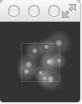
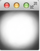
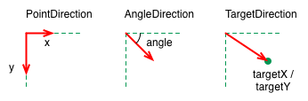
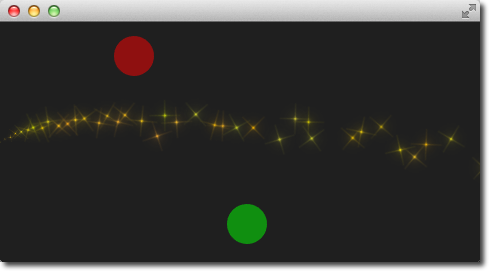

====================
Particle Simulations
====================

.. sectionauthor:: `jryannel <https://github.com/jryannel>`_

.. issues:: ch08

.. note::

    Last Build: |today|

    The source code for this chapter can be found in the `assets folder <../../assets>`_.

Particles are a computer graphics techniques to visualize certain graphics effects. Typical effects could be: falling leaves, fire, explosions, meteors, clouds, etc.

It differs from other graphics rendering as particles rendering is based on fuzzy aspects. The outcome is not exactly predictable on pixel-base. Parameters to the particle system describe the boundaries for the stochastic simulation. The phenomena rendered with particles is often difficult to visualize with traditional rendering techniques. The good thing is you can let QML elements interact with the particles systems. Also as parameters are expressed as properties they can be animated using the traditional animation techniques.

Concept
-------

.. issues:: ch08

In the heart of the particle simulation is the ``ParticleSystem`` which controls the shared time-line. A scene can have several particles systems, each of them with an independent time-line. A particle is emitted using an ``Emitter`` element and visualized with a ``ParticlePainter``, which can be an image, QML item or a shader item.
An emitter provides also the direction for particle using a vector space. A particle ones emitted can't be manipulated by the emitter anymore. The particle module provides the ``Affector``, which allows to manipulate parameters of the particle after is has been emitted.

Particles in a system can share timed transitions using the ``ParticleGroup`` element. By default every particle is on the empty ('') group.

* ``ParticleSystem`` - manages shared time-line between emitters
* ``Emitter`` - emits logical particles into the system
* ``ParticlePainter`` - particles are visualized by a particle painter
* ``Direction`` - vector space for emitted particles
* ``ParticleGroup`` - every particle is a member of a group
* ``Affector`` - manipulates particles after they have been emitted

Simple Simulation
-----------------

.. issues:: ch08

Let us have a look at a very simple simulation to get started. Qt Quick makes it actually very simple to get started with particle rendering. For this we need:

* A ``ParticleSystem`` which binds all elements to an simulation
* An ``Emitter`` which emits particles into the system
* A ``ParticlePainter`` derived element, which visualize the particles

.. literalinclude:: src/particles/simple.qml
    :start-after: M1>>
    :end-before: <<M1

The outcome of the example will look like this:

We start with a a 80x80 pixel dark rectangle as our root element and background. Therein we declare a ``ParticleSystem``. This is always the first step as the system binds all other elements together. Typically the next element is the ``Emitter``, which defines the emitting area based on it's bounding box and basic parameters for the to be emitted particles. The emitter is bound to the system using the ``system`` property.

The emitter in this example emits 10 particles per second (``emitRate: 10``) over the area of the emitter with each a life span of 1000 msecs (``lifeSpan : 1000``) and a life span variation between emitted particles of 500 msec (``lifeSpanVariation: 500``). A particle shall start with a size of 16px (``size: 16``) and at the end of it's life shall be 32px (``endSize: 32``).

The green bordered rectangle is a tracer element to show the geometry of the emitter. This visualizes that also while the particles are emitted inside the emitters bounding box the rendering is not limited to the emitters bounding box. The rendering position depends upon life-span and direction of the particle. This will get more clear when we look into howto change the direction particles.

The emitter emits logical particles. A logical particle is visualized using a ``ParticlePainter`` in this example we use an ``ImageParticle``, which takes an image URL as the source property. The image particle has also several other properties, which control the appearance of the average particle.

* ``emitRate``: particles emitted per second (defaults to 10 per second)
* ``lifeSpan``: milliseconds the particle should last for (defaults to 1000 msecs)
* ``size``, ``endSize``: size of the particles at the beginning and end of their life  (defaults to 16 px)

Changing these properties can influence the result in a drastically way

.. literalinclude:: src/particles/simple2.qml
    :start-after: M1>>
    :end-before: <<M1

Besides increasing the emit rate to 40 and the life span to 2 seconds the size now starts at 64 pixel and decreases 32 pixel at the end of a particle life span.

Increasing the ``endSize`` even more would lead to a more or less white background. Please note also when the particles are only emitted in the area defined by the emitter the rendering is not constrained to it.

Particle Parameters
-------------------

.. issues:: ch08

We saw already how to change the behavior of the emitter to change our simulation. The particle painter used allows us how the particle image is visualized for each particle.

Coming back to our example we update our ``ImageParticle``. First we change our particle image to a small sparking star image::

    ImageParticle {
        ...
        source: 'assets/star.png'
    }

The particle shall be colorized in an gold color which varies from particle to particle by +/- 20%::

    color: '#FFD700'
    colorVariation: 0.2

To make the scene more alive we would like to rotate the particles. Each particle should start by 15 degrees clockwise and varies between particles by +/-5 degrees. Additional the particle should continuously rotate with the velocity of 45 degrees per second. The velocity shall also vary from particle to particle by +/- 15 degrees per second::

    rotation: 15
    rotationVariation: 5
    rotationVelocity: 45
    rotationVelocityVariation: 15

Last but not least, we change the entry effect for the particle. This is the effect used when a particle comes to life. In this case we want to use the scale effect::

    entryEffect: ImageParticle.Scale

So now we have rotating golden stars appearing all over the place.

Here is the code we changed for the image particle in one block.

.. literalinclude:: src/particles/particlevariation.qml
    :start-after: M1>>
    :end-before: <<M1

Directed Particles
------------------

.. issues:: ch08

We have seen particles can rotate. But particles can also have a trajectory. The trajectory is specified as the velocity or acceleration of particles defined by a stochastic direction also named a vector space.

There are different vector spaces available to define the velocity or acceleration of a particle:

* ``AngleDirection`` - a direction that varies in angle
* ``PointDirection`` - a direction that varies in x and y components
* ``TargetDirection`` - a direction towards the target point

Let's try to move the particles over from the left to the right side of our scene by using the velocity directions.

We first try the ``AngleDirection``. For this we need to specify the ``AngleDirection`` as an element of the velocity property of our emitter::

    velocity: AngleDirection { }

The angle where the particles are emitted is specified using the angle property. The angle is provided as value between 0..360 degree and 0 points to the right. For our example we would like the particles to move to the right so 0 is already the right direction. The particles shall spread by +/- 5 degree::

    velocity: AngleDirection {
        angle: 0
        angleVariation: 15
    }

Now we have set our direction, the next thing is to specify the velocity of the particle. This is defined by a magnitude. The magnitude is defined in pixels per seconds. As we have ca. 640px to travel 100 seems to be a good number. This would mean by an average life time of 6.4 secs a particle would cross the open space. To make the traveling of the particles more interesting we vary the magnitude using the ``magnitudeVariation`` and set this to the half of the magnitude::

    velocity: AngleDirection {
        ...
        magnitude: 100
        magnitudeVariation: 50
    }

Here is the full source code, with an average life time set to 6.4 seconds. We set the emitter width and height to 1px. This means all particles are emitted at the same location and from thereon travel based on our given trajectory.

.. literalinclude:: src/particles/angledirection.qml
    :start-after: M1>>
    :end-before: <<M1

So what is then the acceleration doing? The acceleration add a acceleration vector to each particle, which changes the velocity vector over time. For example let's make a trajectory like an arc of stars. For this we change our velocity direction to -45 degree and remove the variations, to better visualize a coherent arc::

    velocity: AngleDirection {
        angle: -45
        magnitude: 100
    }

The acceleration direction shall be 90 degree (down direction) and we choose one fourth of the velocity magnitude for this::

    acceleration: AngleDirection {
        angle: 90
        magnitude: 25
    }

The result is an arc going from the center left to the bottom right.

The values are discovered by try-and-error.

Here is the full code of our emitter.

.. literalinclude:: src/particles/angledirection2.qml
    :start-after: M1>>
    :end-before: <<M1

In the next example we would like that the particles again travel from left to right but this time we use the ``PointDirection`` vector space.

A ``PointDirection`` derived it's vector space from a x and y component. For example if you want the particles travel in a 45 degree vector, you need to specify the same value for x and y.

In our case we want the particles travel from left-to-right building a 15 degree cone. For this we specify a ``PointDirection`` as our velocity vector space::

    velocity: PointDirection { }

To achieve a traveling velocity of 100 px per seconds we set our x component to 100. For the 15 degree (which is 1/6 th of 90 degree) we specify an y variation of 100/6::

    velocity: PointDirection {
        x: 100
        y: 0
        xVariation: 0
        yVariation: 100/6
    }

The result should be particles traveling in a 15 degree cone from right to left.

Now coming to our last contender, the ``TargetDirection``. The target direction allows us to specify a target point as an x and y coordinate relative to the emitter or an item. When an item is specified the center of the item will become the target point. You can achieve the 15 degree cone by specifying a target variation of 1/6 th of the x target::

    velocity: TargetDirection {
        targetX: 100
        targetY: 0
        targetVariation: 100/6
        magnitude: 100
    }

.. note:: Target direction are great to use when you have a specific x/y coordinate you want the stream of particles emitted towards.

I spare you the image as it looks the same as the previous one, instead I have a quest for you.

In the following image the red and the green circle specify each a target item for the target direction of the velocity respective the acceleration property. Each target direction has the same parameters. Here the question: Who is responsible for velocity and who is for acceleration?

Particle Painters
-----------------

.. issues:: ch08

Till now we have only used the image based particle painter to visualize particles. Qt comes also with other particle painters:

* ``ItemParticle``: delegate based particle painter
* ``CustomParticle``: shader based particle painter

The ItemParticle can be used to emit QML items as particles. For this you need to specify your own delegate to the particle.

.. literalinclude:: src/particles/itemparticle.qml
    :start-after: M2>>
    :end-before: <<M2

Our delegate in this case is a random image (using *Math.random()*), visualized with a white border and a random size.

.. literalinclude:: src/particles/itemparticle.qml
    :start-after: M3>>
    :end-before: <<M3

We emit 4 images per second with a life span of 4 seconds each. The particles fade automatically in and out.

For more dynamic cases it is also possible to create an item on your own and let the particle take control of it with ``take(item, priority)``. By this the particle simulation takes control of your particle and handles the item like an ordinary particle. You can get back control of the item by using ``give(item)``. You can influence item particles even more by halt their life progression using ``freeze(item)`` and resume their life using ``unfreeze(item)``.

Affecting Particles
-------------------

.. issues:: ch08

Particles are emitted by the emitter. After a particle was emitted it can't be changed anymore by the emitter. The affectors allows you to influence particles after they have been emitted.

Each type of affector affects particles in a different way:

* ``Age`` - alter where the particle is in its life-cycle
* ``Attractor`` - attract particles towards a specific point
* ``Friction`` - slows down movement proportional to the particle's current velocity
* ``Gravity`` - set's an acceleration in an angle
* ``Turbulence`` - fluid like forces based on a noise image
* ``Wander`` -  randomly vary the trajectory
* ``GroupGoal`` -  change the state of a group of a particle
* ``SpriteGoal`` - change the state of a sprite particle

.. rubric:: Age

Allows particle to age faster. the *lifeLeft* property specified how much life a particle should have left.

.. literalinclude:: src/particles/age.qml
    :start-after: M1>>
    :end-before: <<M1

In the example we shorten the life of the upper particles once, when they reach the age affector to 1200 msecs. As we have set the *advancePosition* to true, we see the particle appearing again on a position when the particle has 1200 msecs left to life.

.. rubric:: Attractor

The attractor attracts particles towards a specific point. The point is specified using ``pointX`` and ``pointY``, which is relative to the attractor geometry. The strength specifies the force of attraction. In our example we let particles travel from left to right. The attractor is placed on the top and half of the particles travel through the attractor. Affector only affect particles while they are in their bounding box. This split allows us to see the normal stream and the affected stream simultaneous.

.. literalinclude:: src/particles/attractor.qml
    :start-after: M1>>
    :end-before: <<M1

It's easy to see that the upper half of the particles are affected by the attracted to the top. The attraction point is set to top-left (0/0 point) of the attractor with a force of 1.0.

.. rubric:: Friction

The friction affector slows down particles by a factor until a certain threshold is reached.

.. literalinclude:: src/particles/friction.qml
    :start-after: M1>>
    :end-before: <<M1

In the upper friction area, the particles are slowed down by a factor of 0.8 until the particle reach 25 pixels per seconds velocity. The threshold act's like a filter. Particles traveling above the threshold velocity are slowed down by the given factor.

.. rubric:: Gravity

The gravity affector applies an acceleration In the example we stream the particles from the bottom to the top using an angle direction. The right side is unaffected, where on the left a gravity affect is applied. The gravity is angled to 90 degree (bottom-direction) with a magnitude of 50.

.. literalinclude:: src/particles/gravity.qml
    :start-after: M1>>
    :end-before: <<M1

Particles on the left side try to climb up, but the steady applied acceleration towards the bottom drags them into the direction of the gravity.

.. rubric:: Turbulence

The turbulence affector, applies a *chaos* map of force vectors to the particles. The chaos map is defined by a noise image, which can be define with the *noiseSource* property. The strength defines how strong the vector will be applied on the particle movements.

.. literalinclude:: src/particles/turbulence.qml
    :start-after: M1>>
    :end-before: <<M1

In the upper area of the example, particles are influenced by the turbulence. Their movement is more erratic. The amount of erratic deviation from the original path is defined by the strength.

.. rubric:: Wander

The wander manipulates the trajectory. With the property *affectedParameter* can be specified which parameter (velocity, position or acceleration) is affector by the wander. The *pace* property specifies the maximum of attribute changes per second. The yVariance and yVariance specifies the influence on x and y component of the particle trajectory.

.. literalinclude:: src/particles/wander.qml
    :start-after: M1>>
    :end-before: <<M1

In the top wander affector particles are shuffled around by random trajectory changes. In this case the position is changed 200 times per second in the y-direction.

.. figure:: assets/wander.png

Particle Groups
---------------

.. issues:: ch08

At the beginning of this chapter we stated particles are in groups, which is by default the empty group (''). Using the ``GroupGoal`` affector is it possible to let the particle change groups. To visualize this we would like to create a small firework, where rockets start into space and explode in the air into a spectacular firework.

The example is divided into 2 parts. The 1st part called "Launch Time" is concerned to setup the scene and introduce particle groups and the 2nd part called "Let there be fireworks" focuses on the group changes.

Let's get start!

.. rubric:: Launch Time

To get it going we create a typical dark scene::

    import QtQuick 2.5
    import QtQuick.Particles 2.0

    Rectangle {
        id: root
        width: 480; height: 240
        color: "#1F1F1F"
        property bool tracer: false
    }

The tracer property will be used to switch the tracer scene wide on and off. The next thing is to declare our particle system::

    ParticleSystem {
        id: particleSystem
    }

And our two image particles (one for the rocket and one for the exhaust smoke)::

    ImageParticle {
        id: smokePainter
        system: particleSystem
        groups: ['smoke']
        source: "assets/particle.png"
        alpha: 0.3
        entryEffect: ImageParticle.None
    }

    ImageParticle {
        id: rocketPainter
        system: particleSystem
        groups: ['rocket']
        source: "assets/rocket.png"
        entryEffect: ImageParticle.None
    }

You can see in on the images, they use the *groups* property to declare to which group the particle belong. It is enough to just declare a name and an implicit group will be created by Qt Quick.

Now it's time to emit some rockets into the air. For this we create an emitter on the bottom of our scene and set the velocity into an upward direction. To simulate some gravity we set an acceleration downwards::

    Emitter {
        id: rocketEmitter
        anchors.bottom: parent.bottom
        width: parent.width; height: 40
        system: particleSystem
        group: 'rocket'
        emitRate: 2
        maximumEmitted: 4
        lifeSpan: 4800
        lifeSpanVariation: 400
        size: 32
        velocity: AngleDirection { angle: 270; magnitude: 150; magnitudeVariation: 10 }
        acceleration: AngleDirection { angle: 90; magnitude: 50 }
        Tracer { color: 'red'; visible: root.tracer }
    }

The emitter is in the group *'rocket'*, the same as our rocket particle painter. Through the group name they are bound together. The emitter emits particles into the group 'rocket' and the rocket particle painter will pain them.

For the exhaust we use a trail emitter, which follows our rocket. It declares an own group called 'smoke' and follows the particles from the 'rocket' group::

    TrailEmitter {
        id: smokeEmitter
        system: particleSystem
        emitHeight: 1
        emitWidth: 4
        group: 'smoke'
        follow: 'rocket'
        emitRatePerParticle: 96
        velocity: AngleDirection { angle: 90; magnitude: 100; angleVariation: 5 }
        lifeSpan: 200
        size: 16
        sizeVariation: 4
        endSize: 0
    }

The smoke tis directed downwards to simulate the force the smoke comes out of the rocket. The *emitHeight* and *emitWidth* specify the are around the particle followed from where the smoke particles shall be emitted. If this is not specified than the are of the particle followed is taken but for this example we want to increase the effect that the particles stem from a central point near the end of the rocket.

If you start the example now you will see the rockets fly up and some are even flying out of the scene. As this is not really wanted we need to slow them down before they leave the screen. A friction affector can be used here to slow the particles down to a minimum threshold::

    Friction {
        groups: ['rocket']
        anchors.top: parent.top
        width: parent.width; height: 80
        system: particleSystem
        threshold: 5
        factor: 0.9
    }

In the friction affector you also need to declare which groups of particles it shall affect. The friction will slow all rockets, which are 80 pixel downwards from the top of the screen down by a factor of 0.9 (try 100 and you will see they almost stop immediately) until they reach a velocity of 5 pixel per second. As the particles have still an acceleration downwards applied the rockets will start sinking toward the ground after they reach the end of their life-span.

As climbing up in the air is hard work and a very unstable situation we want to simulate some turbulences while the ship is climbing::

    Turbulence {
        groups: ['rocket']
        anchors.bottom: parent.bottom
        width: parent.width; height: 160
        system: particleSystem
        strength: 25
        Tracer { color: 'green'; visible: root.tracer }
    }

Also the turbulence need to declare which groups it shall affect. The turbulence it self reaches from the bottom 160 pixel upwards (until it reaches the border of the friction). They also could overlap.

When you start the example now you will see the rockets are climbing up and then will be slowed down by the friction and fall back to ground by the still applied downwards acceleration. The next thing would be to start the firework.

.. figure:: assets/firework_rockets.png

.. note:: The image shows the scene with the tracers enabled to show the different areas. Rocket particles are emitted in the red area and then affected by the turbulence in the blue area. Finally they are slowed down by the friction affector in the green area and start falling again, because of the steady applied downwards acceleration.

.. rubric:: Let there be fireworks

To be able to change the rocket into a beautiful firework we need add a ``ParticleGroup`` to encapsulate the changes::

    ParticleGroup {
        name: 'explosion'
        system: particleSystem
    }

We change to the particle group using a ``GroupGoal`` affector. The group goal affector is placed near the vertical center of the screen and it will affect the group 'rocket'. With the *groupGoal* property we set the target group for the change to 'explosion', our earlier defined particle group::

    GroupGoal {
        id: rocketChanger
        anchors.top: parent.top
        width: parent.width; height: 80
        system: particleSystem
        groups: ['rocket']
        goalState: 'explosion'
        jump: true
        Tracer { color: 'blue'; visible: root.tracer }
    }

The *jump* property states the change in groups shall be immediately and not after a certain duration.

.. note:: In the Qt 5 alpha release we could the *duration* for the group change not get working. Any ideas?

As the group of the rocket now changes to our 'explosion' particle group when the rocket particle enters the group goal area we need to add the firework inside the particle group::

    // inside particle group
    TrailEmitter {
        id: explosionEmitter
        anchors.fill: parent
        group: 'sparkle'
        follow: 'rocket'
        lifeSpan: 750
        emitRatePerParticle: 200
        size: 32
        velocity: AngleDirection { angle: -90; angleVariation: 180; magnitude: 50 }
    }

The explosion emits particles into the 'sparkle' group. We will define soon a particle painter for this group. The trail emitter used follows the rocket particle and emits per rocket 200 particles. The particles are directed upwards and vary by 180 degree.

As the particles are emitted into the 'sparkle' group, we also need to define a particle painter for the particles::

    ImageParticle {
        id: sparklePainter
        system: particleSystem
        groups: ['sparkle']
        color: 'red'
        colorVariation: 0.6
        source: "assets/star.png"
        alpha: 0.3
    }

The sparkles of our firework shall be little red stars with a almost transparent color to allow some shine effects.

To make the firework more spectacular we also add a second trail emitter to our particle group, which will emit particles in a narrow cone downwards::

    // inside particle group
    TrailEmitter {
        id: explosion2Emitter
        anchors.fill: parent
        group: 'sparkle'
        follow: 'rocket'
        lifeSpan: 250
        emitRatePerParticle: 100
        size: 32
        velocity: AngleDirection { angle: 90; angleVariation: 15; magnitude: 400 }
    }

Otherwise the setup is similar to the other explosion trail emitter. That's it.

Here is the final result.

.. figure:: assets/firework_final.png

Here is the full source code of the rocket firework.

.. literalinclude:: src/particles/firework.qml
    :start-after: M1>>
    :end-before: <<M1

Summary
-------

.. issues:: ch08

Particles are a very powerful and fun way to express graphical phenomena like smoke. firework, random visual elements. The extended API in Qt 5 is very powerful and we have just scratched on the surface. There are several elements we haven't yet played with like sprites, size tables or color tables. Also when the particles look very playful they have a great potential when used wisely to create some eye catcher in any user interface. Using to many particle effects inside an user interface will definitely lead to the impression towards a game. Creating games is also the real strength of the particles.

