==============
Shader Effects
==============

.. sectionauthor:: `jryannel <https://github.com/jryannel>`_

.. issues:: ch09

.. note::

    Last Build: |today|

    The source code for this chapter can be found in the `assets folder <../../assets>`_.

.. topic:: Objective

    * http://doc.qt.io/qt-5/qml-qtquick-shadereffect.html
    * http://www.opengl.org/registry/doc/GLSLangSpec.4.20.6.clean.pdf
    * http://www.khronos.org/registry/gles/specs/2.0/GLSL_ES_Specification_1.0.17.pdf
    * http://www.lighthouse3d.com/opengl/glsl/
    * http://wiki.delphigl.com/index.php/Tutorial_glsl
    * :qt5:`qtquick-shaders`

    Give a short introduction to shader effects and then present the shader effects and their use.

Shaders allows us to create awesome rendering effects on top to the SceneGraph API leveraging directly the power of OpenGL running on the GPU. Shaders are implemented using the ShaderEffect and ShaderEffectSource elements. The shader algorithm itself is implemented using the OpenGL Shading Language.

Practically it means you mix QML code with shader code. On execution will the shader code be sent over to the GPU and compiled and executed on the GPU. The shader QML elements allow you to interact through properties with the OpenGL shader implementation.

Let's first have a look what OpenGL shaders are.

OpenGL Shaders
--------------

.. issues:: ch09

OpenGL uses a rendering pipeline split into stages. A simplified OpenGL pipeline would contain a vertex and fragment shader.

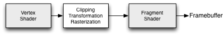

The vertex shader receives vertex data and must assign it to the *gl_Position* at the end of the routine. In the next stage the vertexes are clipped, transformed and rasterized for pixel output. From there the fragments (pixels) arrive in the fragment shader and can further be manipulated and the resulting color needs to be assigned to *gl_FragColor*. The vertex shader is called for each corner point of your polygon (vertex = point in 3D) and is responsible of any 3D manipulation of these points. The fragment (fragment = pixel) shader is called for each pixel and determines the color of that pixel.

Shader Elements
---------------

.. issues:: ch09

For programing shaders Qt Quick provides two elements. The ShaderEffectSource and the ShaderEffect. The shader effect applies custom shaders and the shader effect source renders a QML item into a texture and renders it. As shader effect can apply a custom shaders to it's rectangular shape and can use sources for the shader operation. A source can be an image, which is used as a texture or a shader effect source.

The default shader uses the source and renders it unmodified.

.. literalinclude:: src/effects/defaultshader.qml
    :start-after: M1>>
    :end-before: <<M1

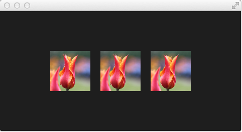

In the above example we have a row of 3 images. The first is the real image. The second is rendered using the default shader and the third is rendered using the default shader code for the fragment and vertex extracted from the Qt 5 source code.

.. note::

    If you don't want to see the source image and only the effected image you can set the *Image* to invisible (``visible : false``). The shader effects will still use the image data just the *Image* element will not be rendered.

Let's have a closer look at the shader code.

.. code-block:: js

    vertexShader: "
        uniform highp mat4 qt_Matrix;
        attribute highp vec4 qt_Vertex;
        attribute highp vec2 qt_MultiTexCoord0;
        varying highp vec2 qt_TexCoord0;
        void main() {
            qt_TexCoord0 = qt_MultiTexCoord0;
            gl_Position = qt_Matrix * qt_Vertex;
        }"

Both shaders are from the Qt side a string bound to the *vertexShader* and *fragmentShader* property. Every shader code has to have a *main() { ... }* function, which is executed by the GPU. Variable starting with *qt_* are provided by default by Qt already.

Here a short rundown on the variables:

========== ==========================================
uniform     value does not change during processing
attribute   linkage to external data
varying     shared value between shaders
highp       high precision value
lowp        low precision value
mat4        4x4 float matrix
vec2        2=dim float vector
sampler2D   2D texture
float       floating scalar
========== ==========================================

A better reference is the `OpenGL ES 2.0 API Quick Reference Card <http://www.khronos.org/opengles/sdk/docs/reference_cards/OpenGL-ES-2_0-Reference-card.pdf>`_

Now we might be better able to understand what the variable are:

* qt_Matrix: model-view-projection matrix
* qt_Vertex: current vertex position
* qt_MultiTexCoord0: texture coordinate
* qt_TexCoord0: shared texture coordinate

So we have available the projection matrix, the current vertex and the texture coordinate. The texture coordinate relates to the texture given as source. In the *main()* function we store the texture coordinate for later use in the fragment shader. Every vertex shader need to assign the *gl_Position* this is done using here by multiplying the project matrix with the vertex, our point in 3D.

The fragment shader receives our texture coordinate from the vertex shader and also the texture from our QML source property. It shall be noted how easy it is to pass variable between the shader code and QML. Beautiful. Additional we have the opacity of the shader effect available as *qt_Opacity*. Every fragment shader needs to assign the *gl_FragColor* variable, this is done in the default shader code by picking the pixel from the source texture and multiplying it with the opacity.

.. code-block:: js

    fragmentShader: "
        varying highp vec2 qt_TexCoord0;
        uniform sampler2D source;
        uniform lowp float qt_Opacity;
        void main() {
            gl_FragColor = texture2D(source, qt_TexCoord0) * qt_Opacity;
        }"

During the next examples we will playing around with some simple shader mechanics. First we concentrate on the fragment shader and then we will come back to the vertex shader.

Fragment Shaders
----------------

.. issues:: ch09

The fragment shader is called for every pixel to be rendered. We will develop a small red lens, which will increase the red color channel value of the image.

.. rubric:: Setting up the scene

First we setup our scene, with a grid centered in the field and our source image be displayed.

.. literalinclude:: src/effects/redlense1.qml
    :start-after: M1>>
    :end-before: <<M1

.. figure:: assets/redlense1.png

.. rubric:: A red shader

Next we will add a shader, which displays a red rectangle by providing for each fragment a red color value.

.. literalinclude:: src/effects/redlense2.qml
    :start-after: M1>>
    :end-before: <<M1

In the fragment shader we simply assign a *vec4(1.0, 0.0, 0.0, 1.0)* which represents a red color with full opacity (alpha=1.0) to the *gl_FragColor* for each fragment.

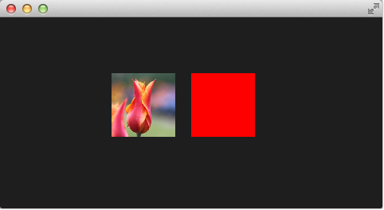

.. rubric:: A red shader with texture

Now we want to apply the red color to each texture pixel. For this we need the texture back in the vertex shader. As we don't do anything else in the vertex shader the default vertex shader is enough for us.

.. literalinclude:: src/effects/redlense2.qml
    :start-after: M2>>
    :end-before: <<M2

The full shader contains now back our image source as variant property and we have left out the vertex shader, which if not specified is the default vertex shader.

In the fragment shader we pick the texture fragment *texture2D(source, qt_TexCoord0)* and apply the red color to it.

.. figure:: assets/redlense3.png

.. rubric:: The red channel property

It's not really nice to hard code the red channel value, so we would like to control the value from the QML side. For this we add a *redChannel* property to our shader effect and also declare a *uniform lowp float redChannel* inside our fragment shader. That's all to make a value from the shader code available to the QML side. Very simple.

.. literalinclude:: src/effects/redlense2.qml
    :start-after: M3>>
    :end-before: <<M3

To make the lens really a lens, we change the *vec4* color to be *vec4(redChannel, 1.0, 1.0, 1.0)* so that the other colors are multiplied by 1.0 and only the red portion is multiplied by our *redChannel* variable.

.. figure:: assets/redlense4.png

.. rubric:: The red channel animated

As the *redChannel* property is just a normal property it can also be animated as all properties in QML. So we can use QML properties to animate values on the GPU to influence our shaders. How cool is that!

.. literalinclude:: src/effects/redlense2.qml
    :start-after: M4>>
    :end-before: <<M4

Here the final result.

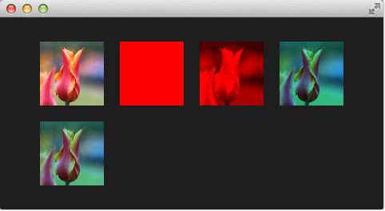

The shader effect on the 2nd row is animated from 0.0 to 1.0 with a duration of 4 seconds. So the image goes from no red information (0.0 red) over to a normal image (1.0 red).

Wave Effect
-----------

.. issues:: ch09

In this more complex example we will create a wave effect with the fragment shader. The wave form is based on the sinus curve and it influences the texture coordinates used for the color.

.. literalinclude:: src/effects/wave.qml
    :start-after: M1>>
    :end-before: <<M1

The wave calculation is based on a pulse and the texture coordinate manipulation. The pulse equation gives us a sine wave depending on the current time and the used texture coordinate::

    highp vec2 pulse = sin(time - frequency * qt_TexCoord0);

Without the time factor we would just have a distortion but not a traveling distortion, like waves are.

For the color we use the color at a different texture coordinate::

    highp vec2 coord = qt_TexCoord0 + amplitude * vec2(pulse.x, -pulse.x);

The texture coordinate is influences by our pulse x-value. The result of this is a moving wave.

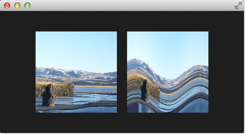

Also if we haven't moved pixels in this fragment shader the effect would look at first like a job for a vertex shader.

Vertex Shader
-------------

.. issues:: ch09

The vertex shader can be used to manipulated the vertexes provided by the shader effect. In normal cases the shader effect has 4 vertexes (top-left, top-right, bottom-left and bottom-right). Each vertex reported is from type vec4. To visualize the vertex shader we will program a genie effect. This effect is often used to let a rectangular window area vanish into one point.

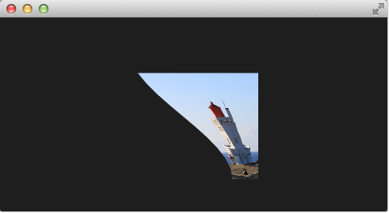

.. rubric:: Setting up the scene

First we will setup our scene again.

.. literalinclude:: src/effects/genie0.qml
    :start-after: M1>>
    :end-before: <<M1

This provides as a scene with a dark background and a shader effect using an image as the source texture. The original image is not visible on the image produced by our genie effect. Additional we added a dark rectangle on the same geometry as the shader effect so we can better detect where we need to click to revert the effect.

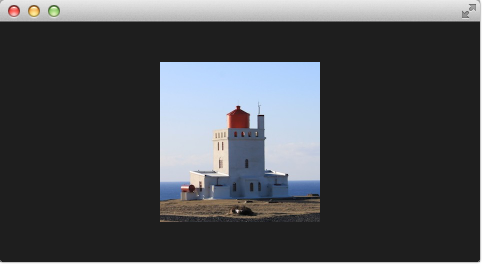

The effect is triggered by clicking on the image, this is defined by the mouse area covering the effect. In the *onClicked* handler we toggle the custom boolean property *minimized*. We will use this property later to toggle the effect.

.. rubric:: Minimize and normalize

After we have setup the scene, we define a property of type real called *minimize*, the property will contain the current value of our minimization. The value will vary from 0.0 to 1.0 and is controlled by a sequential animation.

.. literalinclude:: src/effects/genie1.qml
    :start-after: M1>>
    :end-before: <<M1

The animation is triggered by the togling of the *minimized* property. Now that we have setup all our surroundings we finally can look at our vertex shader.

.. literalinclude:: src/effects/genie1.qml
    :start-after: M2>>
    :end-before: <<M2

The vertex shader is called for each vertex so four times, in our case. The default qt defined parameters are provided, like *qt_Matrix*, *qt_Vertex*, *qt_MultiTexCoord0*, *qt_TexCoord0*. We have discussed the variable already earlier. Additional we link the *minimize*, *width* and *height* variables from our shader effect into our vertex shader code. In the main function we store the current texture coordinate in our *qt_TexCoord0* to make it available to the fragment shader. Now we copy the current position and modify the x and y position of the vertex::

    highp vec4 pos = qt_Vertex;
    pos.y = mix(qt_Vertex.y, height, minimize);
    pos.x = mix(qt_Vertex.x, width, minimize);

The *mix(...)* function provides a linear interpolation between the first 2 parameters on the point (0.0-1.0) provided by the 3rd parameter. So in our case we interpolate for y between the current y position and the hight based on the current minimize value, similar for x. Bear in mind the minimize value is animated by our sequential animation and travels from 0.0 to 1.0 (or vice versa).

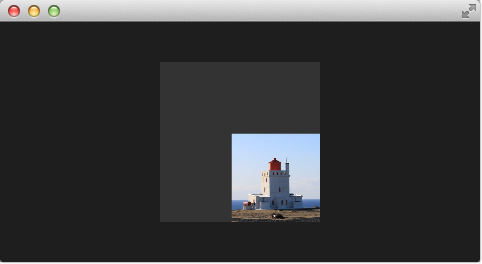

The resulting effect is not really the genie effect but is already a great step towards it.

.. todo:: better explanation, maybe draw the 4 vertexes and their interpolation

.. rubric:: Primitive Bending

So minimized the x and y components of our vertexes. Now we would like to slightly modify the x manipulation and make it depending of the current y value. The needed changes are pretty small. The y-position is calculated as before. The interpolation of the x-position depends now on the vertexes y-position::

    highp float t = pos.y / height;
    pos.x = mix(qt_Vertex.x, width, t * minimize);

This results into an x-position tending towards the width when the y-position is larger. In other words the upper 2 vertexes are not affect ed at all as they have an y-position of 0 and the lower two vertexes x-positions both bend towards the width, so they bend towards the same x-position.

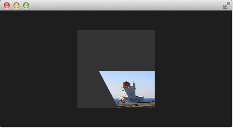

.. literalinclude:: src/effects/genie2.qml
    :start-after: M1>>
    :end-before: <<M1

.. rubric:: Better Bending

As the bending is not really satisfying currently we will add several parts to improve the situation.
First we enhance our animation to support an own bending property. This is necessary as the bending should happen immediately and the y-minimization should be delayed shortly. Both animation have in the sum the same duration (300+700+1000 and 700+1300).

.. literalinclude:: src/effects/genie3.qml
    :start-after: M1>>
    :end-before: <<M1

Additional to make the bending a smooth curve the y-effect on the x-position is not modified by a curved function from 0..1 and the ``pos.x`` depends now on the new bend property animation::

    highp float t = pos.y / height;
    t = (3.0 - 2.0 * t) * t * t;
    pos.x = mix(qt_Vertex.x, width, t * bend);

The curve starts smooth at the 0.0 value, grows then and stops smoothly towards the 1.0 value. Here is a plot of the function in the specified range. For us only the range from 0..1 is from interest.

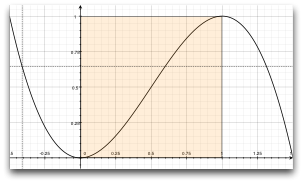

The most visual change is by increasing our amount of vertex points. The vertex points used can be increased by using a mesh::

    mesh: GridMesh { resolution: Qt.size(16, 16) }

The shader effect now has an equality distributed grid of 16x16 vertexes instead of the 2x2 vertexes used before. This makes the interpolation between the vertexes look much smoother.

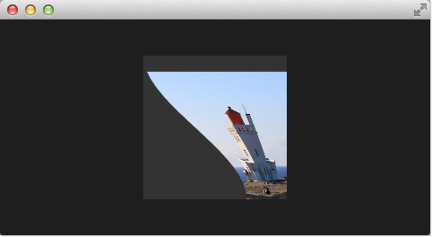

You can see also the influence of the curve being used, as the bending smoothes at the end nicely. This is where the bending has the strongest effect.

.. rubric:: Choosing Sides

As a final enhancement we want to be able to switch sides. The side is towards which point the genie effect vanishes. Till now it vanishes always towards the width. By adding a *side* property we are able to modify the point between 0 and width.

.. code-block:: js

    ShaderEffect {
        ...
        property real side: 0.5

        vertexShader: "
            ...
            uniform highp float side;
            ...
            pos.x = mix(qt_Vertex.x, side * width, t * bend);
        "
    }

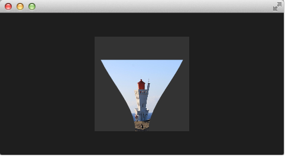

.. rubric:: Packaging

The last thing to-do is package our effect nicely. For this we extract our genie effect code into an own component called *GenieEffect*. It has the shader effect as the root element. We removed the mouse area as this should not be inside the component as the triggering of the effect can be toggled by the *minimized* property.

.. literalinclude:: src/effects/GenieEffect.qml
    :start-after: M1>>
    :end-before: <<M1

You can use now the effect simply like this:

.. literalinclude:: src/effects/geniedemo.qml
    :start-after: M1>>
    :end-before: <<M1

We have simplified the code by removing our background rectangle and we assigned the image directly to the effect, instead of loading it inside a standalone image element.

Curtain Effect
--------------

.. issues:: ch09

In the last example for custom shader effects I would like to bring you the curtain effect. This effect was published first in May 2011 as part of `Qt labs for shader effects <http://labs.qt.nokia.com/2011/05/03/qml-shadereffectitem-on-qgraphicsview/>`_.

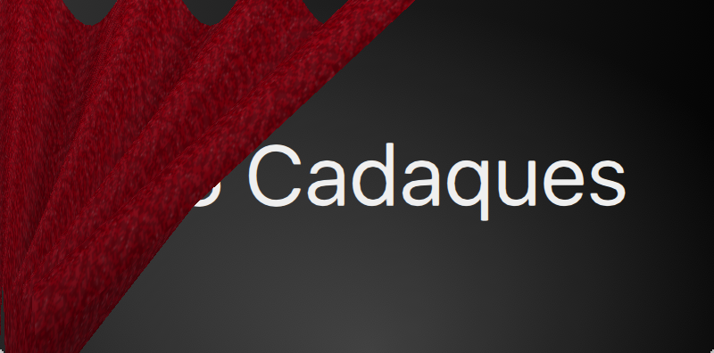

At that time I really loved these effects and the curtain effect was my favorite out of them. I just love how the curtain opens and hide the background object.

I took the code and adapted it towards Qt 5, which was straightforward. Also O did some simplifications to be able to use it better for a showcase. So if you are interested in the full example, please visit the labs blog.

Just a little bot for the background, the curtain is actually an image called *fabric.jpg* and it is the source for a shader effect. The effect uses the vertex shader to swing the curtain and uses the fragment shader to provide some shades. Here is a simple diagram to make you hopefully better understand the code.

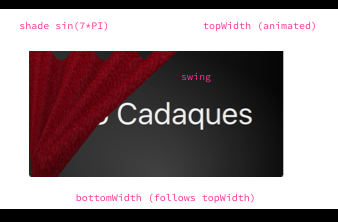

The waved shades of the curtain are computed through a sin curve with 7 up/downs (7*PI=21.99...) on the width of the curtain. The other important part is the swing. The *topWidth* of the curtain is animated when the curtain is opened or closed. The *bottomWidth* follows the *topWidth* with a *SpringAnimation*. By this we create the effect of the swinging bottom part of the curtain. The calculated *swing* provides the strength of this swing interpolated over the y-component of the vertexes.

The curtain effect is located in the ``CurtainEffect.qml`` component where the fabric image act as the texture source. There is nothing new on the use of shaders here, only a different way to manipulate the *gl_Position* in the vertex shader and the *gl_FragColor* in the fragment shader.

.. literalinclude:: src/effects/CurtainEffect.qml
    :start-after: M1>>
    :end-before: <<M1

The effect is used in the ``curtaindemo.qml`` file.

.. literalinclude:: src/effects/curtaindemo.qml
    :start-after: M1>>
    :end-before: <<M1

The curtain is opened through a custom *open* property on the curtain effect. We use a *MouseArea* to trigger the opening and closing of the curtain.

Qt GraphicsEffect Library
-------------------------

.. issues:: ch09

The graphics effect library is a collection of shader effects. Ready made by the Qt developers. It's a great tool-set to be used in your application but also a great source to learn how to build shaders.

The graphics effects library comes with a so called manual testbed which is a great tool to interactively discover the different effects.

The testbed is located under ``$QTDIR/qtgraphicaleffects/tests/manual/testbed``.

.. figure:: assets/graphicseffectstestbed.png

The effects library contains ca 20 effects. A list of the effect and a short description can be found below.

.. rubric:: Graphics Effects List

.. csv-table:: Graphics Effects List
    :header: "Category", "Effect", "Description"
    :widths: 15, 10, 30
    :file: assets/graphicseffects.csv

Here is a example using the *FastBlur* effect from the *Blur* category:

.. literalinclude:: src/effects/fastblur.qml
    :start-after: M1>>
    :end-before: <<M1

The image to the left is the original image. Clicking the image on the right will toggle blurred property and animated the blur radius from 0 to 32 during 1 second. The image on the left show the blurred image.

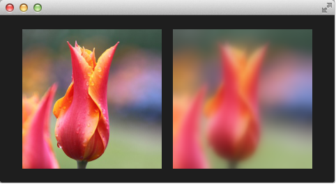

