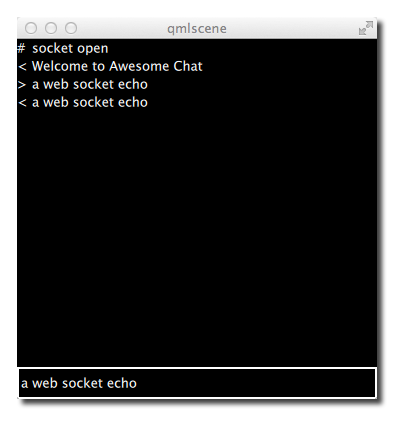

==========
Networking
==========

.. sectionauthor:: `jryannel <https://github.com/jryannel>`_

.. issues:: ch11

.. note::

    Last Build: |today|

    The source code for this chapter can be found in the `assets folder <../../assets>`_.

Qt 5 comes with a rich set of networking classes on the C++ side. There are for example high level classes on the http protocol layer in a request-reply fashion such as ``QNetworkRequest``, ``QNetworkReply`` and ``QNetworkAccessManager``. But also lower levels classes on the TCP/IP or UDP protocol layer such as ``QTcpSocket``, ``QTcpServer`` and ``QUdpSocket``. Additional classes exists to manage proxies, network cache and also the systems network configuration.

This chapter will not be about C++ networking, this chapter is about Qt Quick and networking. So how can I connect my QML/JS user interface directly with a network service or how can I serve my user interface via a network service. There are good books and references out there to cover network programming with Qt/C++. Then it is just a manner to read the chapter about C++ integration to come up with an integration layer to feed your data into the Qt Quick world.

Serving UI via HTTP
===================

.. issues:: ch11

To load a simple user interface via HTTP we need to have a web-server, which serves the UI documents. We start of with our own simple web-server using a python one-liner. But first we need to have our demo user interface. For this we create a small ``main.qml`` file in our project folder and create a red rectangle inside.

.. literalinclude:: src/http_v1/main.qml
    :start-after: M1>>
    :end-before: <<M1

To serve this file we launch a small python script::

    $ cd <PROJECT>
    # python -m SimpleHTTPServer 8080

Now our file should be reachable via ``http://localhost:8080/main.qml``. You can test it with::

    $ curl http://localhost:8080/main.qml

Or just point your browser to the location. Your browser does not understand QML and will not be able to render the document through. We need to create now such a browser for QML documents. To render the document we need to point our ``qmlscene`` to the location. Unfortunately the ``qmlscene`` is limited to local files only. We could overcome this limitation by writing our own ``qmlscene`` replacement or simple dynamically load it using QML. We choose the dynamic loading as it works just fine. For this we use a loader element to retrieve for us the remote document.

.. literalinclude:: src/http_v1/remote.qml
    :start-after: M1>>
    :end-before: <<M1

Now we can ask the ``qmlscene`` to load the local ``remote.qml`` loader document. There is one glitch still. The loader will resize to the size of the loaded item. And our ``qmlscene`` needs also to adapt to that size. This can be accomplished using the ``--resize-to-root`` option to the ``qmlscene``::

    $ qmlscene --resize-to-root remote.qml

Resize to root tells the qml scene to resize its window to the size of the root element. The remote is now loading the ``main.qml`` from our local server and resizes itself to the loaded user interface. Sweet and simple.

.. note::

    If you do not want to run a local server you can also use the gist service from GitHub. Gist is a clipboard like online service like PasteBin and others. It is available under https://gist.github.com . I created for this example a small gist under the url https://gist.github.com/jryannel/7983492 . This will reveal a green rectangle. As the gist url will provide the web-site as HTML code we need to attach a ``/raw`` to the url to retrieve the raw file and not the HTML code.

    .. literalinclude:: src/http_v1/remote2.qml
        :start-after: M1>>
        :end-before: <<M1

To load another file over the network you just need to reference the component name. For example a ``Button.qml`` can be accessed as normal, as long it is in the same remote folder.

.. todo:: Is this true? What are the rules?

Networked Components
--------------------

Let us create a small experiment. We add to our remote side a small button as a reusable component.

::

    - src/main.qml
    - src/Button.qml

We modify our ``main.qml`` to use the button and save it as ``main2.qml``::

    import QtQuick 2.5

    Rectangle {
        width: 320
        height: 320
        color: '#ff0000'

        Button {
            anchors.centerIn: parent
            text: 'Click Me'
            onClicked: Qt.quit()
        }
    }

And launch our web-server again::

    $ cd src
    # python -m SimpleHTTPServer 8080

And our remote loader loads the main QML via http again::

    $ qmlscene --resize-to-root remote.qml

What we see is an error::

    http://localhost:8080/main2.qml:11:5: Button is not a type

So QML can not resolve the button component when it is loaded remotely. If the code would be locally ``qmlscene src/main.qml`` this would be no issue. Locally Qt can parse the directory and detect which components are available but remotely there is no "list-dir" function for http. We can force QML to load the element using the import statement inside ``main.qml``::

    import "http://localhost:8080" as Remote

    ...

    Remote.Button { ... }

This will work then when the ``qmlscene`` is run again::

    $ qmlscene --resize-to-root remote.qml

Here the full code:

.. literalinclude:: src/http_v1/main2.qml
    :start-after: M1>>
    :end-before: <<M1

A better option is to use the ``qmldir`` file on the server side to control the export.

.. literalinclude:: src/http_v1/qmldir

And then updating the ``main.qml``::

    import "http://localhost:8080" 1.0 as Remote

    ...

    Remote.Button { ... }

.. note:: Loading

When using components from a local file system, they are created immediately without a latency. When components are loaded via the network they are created asynchronously. This has the effect that the time of creation is unknown and an element may not yet be fully loaded when others are already completed. Take this into account when working with components loaded over the network.

Templating
==========

.. issues:: ch11

When working with HTML projects they often use template driven development. A small HTML stub is expanded on the server side with code generated by the server using a template mechanism. For example for a photo list the list header would be coded in HTML and the dynamic image list would be dynamically generated using a template mechanism. In general this can also be done using QML but there are some issues with it.

First it is not necessary. The reason HTML developers are doing this is to overcome limitations on the HTML backend. There is no component model yet in HTML so dynamic aspects have to be covered using these mechanism or using programmatically javascript on the client side. Many JS frameworks are out there (jQuery, dojo, backbone, angular, ...) to solve this issue and put more logic into the client-side browser to connect with a network service. The client would then just use a web-service API (e.g. serving JSON or XML data) to communicate with the server. This seems also the better approach for QML.

The second issue is the component cache from QML. When QML accesses a component it caches the render-tree and just loads the cached version for rendering. A modified version on disk or remote would not be detected without restarting the client. To overcome this issue we could use a trick. We could use URL fragments to load the url (e.g. http://localhost:8080/main.qml#1234), where '#1234' is the fragment. The HTTP server serves always the same document but QML would store this document using the full URL, including the fragment. Every time we would access this URL the fragment would need to change and the QML cache would not get a positive hit. A fragment could be for example the current time in milli seconds or a random number.

::

    Loader {
        source: 'http://localhost:8080/main.qml#' + new Date().getTime()
    }

In summary templating is possible but not really recommended and does not play to the strength of QML. A better approach is to use web-services which serve JSON or XML data.

HTTP Requests
=============

.. issues:: ch11

A http request is in Qt typically done using ``QNetworkRequest`` and ``QNetworkReply`` from the c++ site and then the response would be pushed using the Qt/C++ integration into the QML space. So we try to push the envelope here a little bit to use the current tools Qt Quick gives us to communicate with a network endpoint. For this we use a helper object to make http request, response cycle. It comes in the form of the java script ``XMLHttpRequest`` object.

The ``XMLHttpRequest`` object allows the user to register a response handle function and a url. A request can be sent using one of the http verbs (get, post, put, delete, ...) to make the request. When the response arrive the handle function is called. The handle function is called several times. Every-time the request state has changed (for example headers have arrived or request is done).

Here a short example::

    function request() {
        var xhr = new XMLHttpRequest();
        xhr.onreadystatechange = function() {
            if (xhr.readyState === XMLHttpRequest.HEADERS_RECEIVED) {
                print('HEADERS_RECEIVED');
            } else if(xhr.readyState === XMLHttpRequest.DONE) {
                print('DONE');
            }
        }
        xhr.open("GET", "http://example.com");
        xhr.send();
    }

For a response you can get the XML format or just the raw text. It is possible to iterate over the resulting XML but more commonly used is the raw text nowadays for a JSON formatted response. The JSON document will be used to convert text to a JS object using ``JSON.parse(text)``.

::

    ...
    } else if(xhr.readyState === XMLHttpRequest.DONE) {
        var object = JSON.parse(xhr.responseText.toString());
        print(JSON.stringify(object, null, 2));
    }

In the response handler, we access the raw response text and convert it into a javascript object. This JSON object is now a valid JS object (in javascript an object can be an object or an array).

.. note::

    It seems the ``toString()`` conversion first makes the code more stable. Without the explicit conversion I had several times parser errors. Not sure what the cause it.

Flickr Calls
------------

Let us have a look on a more real world example. A typical example is to use the Flickr service to retrieve a public feed of the new uploaded pictures. For this we can use the ``http://api.flickr.com/services/feeds/photos_public.gne`` url. Unfortunately it returns by default an XML stream, which could be easily parsed by the ``XmlListModel`` in qml. For the sake of the example we would like to concentrate on JSON data. To become a clean JSON response we need to attach some parameters to the request: ``http://api.flickr.com/services/feeds/photos_public.gne?format=json&nojsoncallback=1``. This will return a JSON response without the JSON callback.

.. note::

    A JSON callback wraps the JSON response into a function call. This is a shortcut used on HTML programming where a script tag is used to make a JSON request. The response will trigger a local function defined by the callback. There is no mechanism which works with JSON callbacks in QML.

Let us first examine the response by using curl:

::

    curl "http://api.flickr.com/services/feeds/photos_public.gne?format=json&nojsoncallback=1&tags=munich"

The response will be something like this:

::

    {
        "title": "Recent Uploads tagged munich",
        ...
        "items": [
            {
            "title": "Candle lit dinner in Munich",
            "media": {"m":"http://farm8.staticflickr.com/7313/11444882743_2f5f87169f_m.jpg"},
            ...
            },{
            "title": "Munich after sunset: a train full of \"must haves\" =",
            "media": {"m":"http://farm8.staticflickr.com/7394/11443414206_a462c80e83_m.jpg"},
            ...
            }
        ]
        ...
    }

The returned JSON document has a defined structure. An object which has a title and an items property. Where the title is a string and items is an array of objects. When converting this text into a JSON document you can access the individual entries, as it is a valid JS object/array structure.

::

    // JS code
    obj = JSON.parse(response);
    print(obj.title) // => "Recent Uploads tagged munich"
    for(var i=0; i<obj.items.length; i++) {
        // iterate of the items array entries
        print(obj.items[i].title) // title of picture
        print(obj.items[i].media.m) // url of thumbnail
    }

As a valid JS array we can use the ``obj.items`` array also as a model for a list view. We will try to accomplish this now. First we need to retrieve the response and convert it into a valid JS object. And then we can just set the ``response.items`` property as a model to a list view.

::

    function request() {
        var xhr = new XMLHttpRequest();
        xhr.onreadystatechange = function() {
            if(...) {
                ...
            } else if(xhr.readyState === XMLHttpRequest.DONE) {
                var response = JSON.parse(xhr.responseText.toString());
                // set JS object as model for listview
                view.model = response.items;
            }
        }
        xhr.open("GET", "http://api.flickr.com/services/feeds/photos_public.gne?format=json&nojsoncallback=1&tags=munich");
        xhr.send();
    }

Here is the full source code, where we create the request, when the component is loaded. The request response is then used as model for our simple list view.

.. literalinclude:: src/httprequest/httprequest.qml

When the document is fully loaded ( ``Component.onCompleted`` ) we request the latest feed content from Flickr. On arrival we parse the JSON response and set the ``items`` array as the model for our view. The list view has a delegate, which displays the thumbnail icon and the title text in a row.

An other option would be to have a placeholder ``ListModel`` and append each item onto the list model. To support larger models it is required to support pagination (e.g page 1 of 10) and lazy content retrieval.

Local files
===========

.. issues:: ch11

Is it also possible to load local (XML/JSON) files using the XMLHttpRequest. For example a local file named "colors.json" can be loaded using:

::

	xhr.open("GET", "colors.json");

We use this to read a color table and display it as a grid. It is not possible to modify the file from the Qt Quick side. To store data back to the source we would need a small REST based HTTP server or a native Qt Quick extension for file access.

.. literalinclude:: src/localfiles/localfiles.qml

Instead of using the ``XMLHttpRequest`` is is also possible to use the XmlListModel to access local files.

::

    import QtQuick.XmlListModel 2.0

    XmlListModel {
        source: "http://localhost:8080/colors.xml"
        query: "/colors"
        XmlRole { name: 'color'; query: 'name/string()' }
        XmlRole { name: 'value'; query: 'value/string()' }
    }

With the XmlListModel it is only possible to read XML files and not JSON files.

REST API
========

.. issues:: ch11

To use a web-service, we first need to create one. We will use Flask (http://flask.pocoo.org) a simple HTTP app server based on python to create a simple color web-service. You could also use every other web server which accepts and returns JSON data. The idea is to have a list of named colors, which can be managed via the web-service. Managed in this case means CRUD (create-read-update-delete).

A simple web-service in Flask can be written in one file. We start with an empty ``server.py`` file. Inside this file, we create some boiler-code and load our initial colors from an external JSON file. See also the Flask `quickstart <http://flask.pocoo.org/docs/quickstart/>`_ documentation.

.. code-block:: py

    from flask import Flask, jsonify, request
    import json

    colors = json.load(file('colors.json', 'r'))

    app = Flask(__name__)

    # ... service calls go here

    if __name__ == '__main__':
        app.run(debug = True)

When you run this script, it will provide a web-server at http://localhost:5000, which does not serve anything useful yet.

We will now start adding our CRUD (Create,Read,Update,Delete) endpoints to our little web-service.

Read Request
------------

To read data from our web-server, we will provide a GET method for all colors.

.. code-block:: py

    @app.route('/colors', methods = ['GET'])
    def get_colors():
        return jsonify( { "colors" :  colors })

This will return the colors under the '/colors' endpoint. To test this we can use curl to create a http request.

::

    curl -i -GET http://localhost:5000/colors

Which will return us the list of colors as JSON data.

Read Entry
----------

To read an individual color by name we provide the details endpoint, which is located under '/colors/<name>'. The name is a parameter to the endpoint, which identifies an individual color.

.. code-block:: py

    @app.route('/colors/<name>', methods = ['GET'])
    def get_color(name):
        for color in colors:
            if color["name"] == name:
                return jsonify( color )

And we can test it with using curl again. For example to get the red color entry.

.. code-block:: sh

    curl -i -GET http://localhost:5000/colors/red

It will return one color entry as JSON data.

Create Entry
------------

Till now we have just used HTTP GET methods. To create an entry on the server side, we will use a POST method and pass the new color information with the POST data. The endpoint location is the same as to get all colors. But this time we expect a POST request.

.. code-block:: py

    @app.route('/colors', methods= ['POST'])
    def create_color():
        color = {
            'name': request.json['name'],
            'value': request.json['value']
        }
        colors.append(color)
        return jsonify( color ), 201

Curl is flexible enough to allow us to provide JSON data as the new entry inside the POST request.

.. code-block:: sh

    curl -i -H "Content-Type: application/json" -X POST -d '{"name":"gray1","value":"#333"}' http://localhost:5000/colors

Update Entry
------------

To update an individual entry we use the PUT HTTP method. The endpoint is the same as to retrieve an individual color entry. When the color was updated successfully we return the updated color as JSON data.

.. code-block:: py

    @app.route('/colors/<name>', methods= ['PUT'])
    def update_color(name):
        for color in colors:
            if color["name"] == name:
                color['value'] = request.json.get('value', color['value'])
                return jsonify( color )

In the curl request we only provide the values to be updated as JSON data and the a named endpoint to identify the color to be updated.

.. code-block:: sh

    curl -i -H "Content-Type: application/json" -X PUT -d '{"value":"#666"}' http://localhost:5000/colors/red

Delete Entry
------------

Deleting an entry is done using the DELETE HTTP verb. It also uses the same endpoint for an individual color, but this time the DELETE HTTP verb.

.. code-block:: py

    @app.route('/colors/<name>', methods=['DELETE'])
    def delete_color(name):
        success = False
        for color in colors:
            if color["name"] == name:
                colors.remove(color)
                success = True
        return jsonify( { 'result' : success } )

This request looks similar like the GET request for an individual color.

.. code-block:: sh

    curl -i -X DELETE http://localhost:5000/colors/red

Now we can read all colors, read a specific color, create a new color, update a color and delete a color. Also we know the HTTP endpoints to our API.

.. list-table::
    :widths: 40 20 40
    :header-rows: 1

    *   - Action
        - HTTP
        - Endpoint
    *   - Read All
        - GET
        - http://localhost:5000/colors
    *   - Create Entry
        - POST
        - http://localhost:5000/colors
    *   - Read Entry
        - GET
        - http://localhost:5000/colors/<name>
    *   - Update Entry
        - PUT
        - http://localhost:5000/colors/<name>
    *   - Delete Entry
        - DELETE
        - http://localhost:5000/colors/<name>

Our little REST server is complete now and we can focus on QML and the client side. To create an easy to use API we need to map each action to an individual HTTP request and provide a simple API to our users.

Client REST
-----------

To demonstrate a REST client we write a small color grid. The color grid displays the colors retrieved from the web-service via HTTP requests. Our user interface provides the following commands:

* Get color list
* Create color
* Read last color
* Update last color
* Delete last color

We bundle our API into an own JS file called ``colorservice.js`` and import it into our UI as ``Service``. Inside the service module we create a helper function to make the HTTP requests for us:

::

    // colorservice.js
    function request(verb, endpoint, obj, cb) {
        print('request: ' + verb + ' ' + BASE + (endpoint?'/' + endpoint:''))
        var xhr = new XMLHttpRequest();
        xhr.onreadystatechange = function() {
            print('xhr: on ready state change: ' + xhr.readyState)
            if(xhr.readyState === XMLHttpRequest.DONE) {
                if(cb) {
                    var res = JSON.parse(xhr.responseText.toString())
                    cb(res);
                }
            }
        }
        xhr.open(verb, BASE + (endpoint?'/' + endpoint:''));
        xhr.setRequestHeader('Content-Type', 'application/json');
        xhr.setRequestHeader('Accept', 'application/json');
        var data = obj?JSON.stringify(obj):''
        xhr.send(data)
    }

It takes four arguments. The ``verb``, which defines the HTTP verb to be used (GET, POST, PUT, DELETE). The second parameter is the endpoint to be used as postfix to the BASE address (e.g. 'http://localhost:5000/colors'). The third parameter is the optional obj, to be send as JSON data to the service. The last parameter defines a callback to be called, when the response returns. The callback receives a response object with the response data. Before we send the request, we indicate that we send and accept JSON data by modifying the request header.

Using this request helper function we can implement the simple commands we defined earlier (create, read, update, delete):

::

    // colorservice.js
    function get_colors(cb) {
        // GET http://localhost:5000/colors
        request('GET', null, null, cb)
    }

    function create_color(entry, cb) {
        // POST http://localhost:5000/colors
        request('POST', null, entry, cb)
    }

    function get_color(name, cb) {
        // GET http://localhost:5000/colors/<name>
        request('GET', name, null, cb)
    }

    function update_color(name, entry, cb) {
        // PUT http://localhost:5000/colors/<name>
        request('PUT', name, entry, cb)
    }

    function delete_color(name, cb) {
        // DELETE http://localhost:5000/colors/<name>
        request('DELETE', name, null, cb)
    }

This code resides in the service implementation. In the UI we use the service to implement our commands. We have a ``ListModel`` with the id ``gridModel`` as data provider for the ``GridView``. The commands are indicated using a ``Button`` ui element.

Reading the color list from the server.

::

    // rest.qml
    import "colorservice.js" as Service
    ...
    // read colors command
    Button {
        text: 'Read Colors';
        onClicked: {
            Service.get_colors( function(resp) {
                print('handle get colors resp: ' + JSON.stringify(resp));
                gridModel.clear();
                var entries = resp.data;
                for(var i=0; i<entries.length; i++) {
                    gridModel.append(entries[i]);
                }
            });
        }
    }

Create a new color entry on the server.

::

    // rest.qml
    import "colorservice.js" as Service
    ...
    // create new color command
    Button {
        text: 'Create New';
        onClicked: {
            var index = gridModel.count-1
            var entry = {
                name: 'color-' + index,
                value: Qt.hsla(Math.random(), 0.5, 0.5, 1.0).toString()
            }
            Service.create_color(entry, function(resp) {
                print('handle create color resp: ' + JSON.stringify(resp))
                gridModel.append(resp)
            });
        }
    }

Reading a color based on its name.

::

    // rest.qml
    import "colorservice.js" as Service
    ...
    // read last color command
    Button {
        text: 'Read Last Color';
        onClicked: {
            var index = gridModel.count-1
            var name = gridModel.get(index).name
            Service.get_color(name, function(resp) {
                print('handle get color resp:' + JSON.stringify(resp))
                message.text = resp.value
            });
        }
    }

Update a color entry on the server based on the color name.

::

    // rest.qml
    import "colorservice.js" as Service
    ...
    // update color command
    Button {
        text: 'Update Last Color'
        onClicked: {
            var index = gridModel.count-1
            var name = gridModel.get(index).name
            var entry = {
                value: Qt.hsla(Math.random(), 0.5, 0.5, 1.0).toString()
            }
            Service.update_color(name, entry, function(resp) {
                print('handle update color resp: ' + JSON.stringify(resp))
                var index = gridModel.count-1
                gridModel.setProperty(index, 'value', resp.value)
            });
        }
    }

Delete a color by the color name.

::

    // rest.qml
    import "colorservice.js" as Service
    ...
    // delete color command
    Button {
        text: 'Delete Last Color'
        onClicked: {
            var index = gridModel.count-1
            var name = gridModel.get(index).name
            Service.delete_color(name)
            gridModel.remove(index, 1)
        }
    }

This concludes the CRUD (create, read, update, delete) operations using a REST API. There are also other possibilities to generate a Web-Service API. One could be module based and each module would have an one endpoint. And the API could be defined using JSON RPC (http://www.jsonrpc.org/). Sure also XML based API are possible and but the JSON approach has great advantages as the parsing is build into the QML/JS as part of JavaScript.

Authentication using OAuth
==========================

.. issues:: ch11

OAuth is an open protocol to allow secure authorization in a simple and standard method from web, mobile and desktop applications. OAuth is used to authenticate a client against common web-services such as Google, Facebook and Twitter.

.. note::

	For a custom web-service you could also use the standard HTTP authentication for example by using the ``XMLHttpRequest`` username and password in the get method (e.g. ``xhr.open(verb, url, true, username, password)``)

OAuth is currently not part of a QML/JS API. So you would need to write some C++ code and export the authentication to QML/JS. Another issue would be the secure storage of the access token.

Here are some links which we find useful:

* http://oauth.net/
* http://hueniverse.com/oauth/
* https://github.com/pipacs/o2
* http://www.johanpaul.com/blog/2011/05/oauth2-explained-with-qt-quick/

Engin IO
========

.. issues:: ch11

Engin.IO is a web-service run by DIGIA. It enables to access from inside Qt/QML application to the NoSQL storage from Engin.IO. It is a cloud based storage object store with an easy access Qt/QML API and an administration console. If you want to store some data in the cloud from a QML application, this would be an easy entry path with an excellent QML/JS support.

Please refer to the `EnginIO <http://engin.io>`_ documentation for further help.

Web Sockets
===========

.. issues:: ch11

The WebSockets module provides an impementation of the WebSockets protocol for WebSockets clients and servers. It mirrors the Qt CPP module. It allows to send string and binary messages using a full duplex communication channel. A websocket is normally established by making a HTTP connection to the server and the server then "upgrades" the connection to a WebSocket connection.

In Qt/QML you can also simple use the `WebSocket` and `WebSocketServer` objects to creates direct websocket connection. The websocket protocol uses the "ws" url schema or "wss" for a secure connection.

You can use the web socket qml module by importing it first.

::

    import Qt.WebSockets 1.0

    WebSocket {
        id: socket
    }

To test your web socket we will use the echo server from http://websocket.org.

.. literalinclude:: src/wsecho/wsecho.qml

You should see the ping message we send ``socket.sendTextMessage("ping")`` as response in the text field.

.. figure:: images/ws_echo.png

WS Server
---------

You can easily create your own WS server using the C++ part of the Qt WebSocket or use a different WS implementation, which I find very interesting. It is interesting because it allows to connect the amazing rendering quality of QML with the great expanding web application servers. In this example we will use a Node JS based web socket server using the `ws <https://npmjs.org/package/ws>`_ module. For this you first need to install `node js <http://nodejs.org/>`_. Afterwards create a ``ws_server`` folder and install the ws package using the node package manager (npm).

The code shall create a simple echo server in NodeJS to echo our messages back to our QML client.

.. code-block:: sh

    $ cd ws_server
    $ npm install ws

The npm tool downloads and installs the ws package and dependencies into you local folder.

A ``server.js`` file will be our server implementation. The server code will create a web socket server on port 3000 and listens to an incoming connection. On an incoming connection it will send out a greeting and waits for client messages. Each message a client sends on a socket will be send back to the client.

.. literalinclude:: src/ws/ws_server/server.js

You need to get used to the notation of JavaScript and the function callbacks.

WS Client
---------

On the client side we need a list view to display the messages and a TextInput for the user to enter a new chat message.

We will use a label with white color in the example.

.. literalinclude:: src/ws/ws_client/Label.qml

Our chat view is a list view, where the text is appended to a list model. Each entry is displayed using a row of prefix and message label. We use a cell width ``cw`` factor to split the with into 24 columns.

.. literalinclude:: src/ws/ws_client/ChatView.qml

The chat input is just a simple text input wrapped with a colored border.

.. literalinclude:: src/ws/ws_client/ChatInput.qml

When the web socket receives a message it appends the message to the chat view. Same applies for a status change. Also when the user enters a chat message a copy is appended to the chat view on the client side and the message is send to the server.

.. literalinclude:: src/ws/ws_client/ws_client.qml

You need first run the server and then the client. There is no retry connection mechanism in our simple client.

Running the server

.. code-block:: js

    $ cd ws_server
    $ node server.js

Running the client

.. code-block:: js

    $ cd ws_client
    $ qmlscene ws_client.qml

When entering text and pressing enter you should see something like this.

Summary
=======

This concludes our chapter about QML networking. Please bear in mind Qt has on the native side a much richer networking API as on the QML side currently. But the idea of the chapter is to push the boundaries of QML networking and how to integrate with cloud based services.

