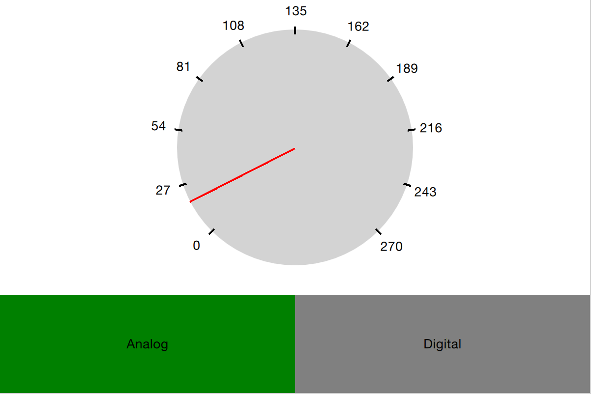
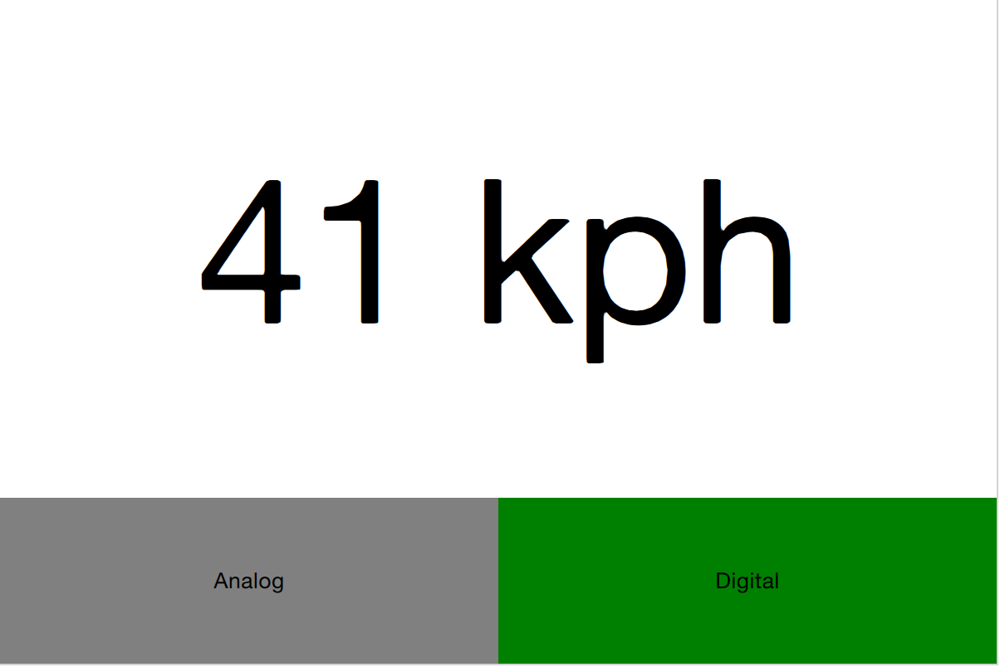
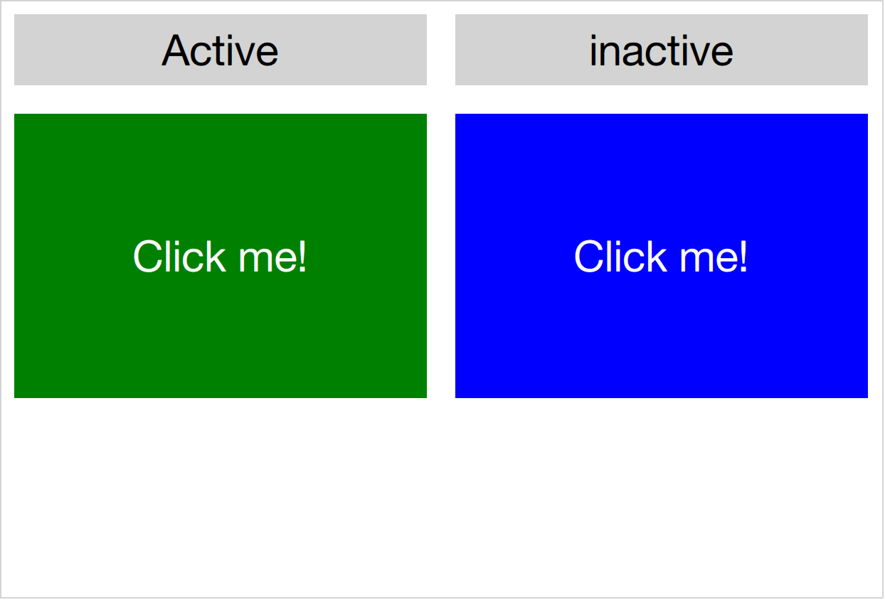

===========
Dynamic QML
===========

.. sectionauthor:: `e8johan <https://bitbucket.org/e8johan>`_

.. issues:: ch13

.. note::

    Last Build: |today|

    The source code for this chapter can be found in the `assets folder <../../assets>`_.

Until now, we have treated QML as a tool for constructing a static set of scenes and navigating between them. Depending on various states and logic rules, a live and dynamic user interface is constructed. By working with QML and JavaScript in a more dynamic manner, the flexibility and possibilities expand even further. Components can be loaded and instantiated at run-time, elements can be destroyed. Dynamically created user interfaces can be saved to disk and later restored.

Loading Components Dynamically
==============================

.. issues:: ch13

The easiest way to dynamically load different parts of QML is to use the ``Loader`` element. It serves as a placeholder to the item that is being loaded. The item to load is controlled through either the ``source`` property or the ``sourceComponent`` property. The former loads the item from a given URL, while the latter instantiates a component.

As the loader serves as a placeholder for the item being loaded, its size depends on the size of the item, and vise versa. If the ``Loader`` element has a size, either by having set ``width`` and ``height`` or through anchoring, the loaded item will be given the loader's size. If the ``Loader`` has no size, it is resized in accordance to the size of the item being loaded.

The example described below demonstrates how two separate user interface parts can be loaded into the same space using a ``Loader`` element. The idea is to have a speed dial that can be either digital or analog, as shown in the illustration below. The code surrounding the dial is unaffected by which item that is loaded for the moment.

The first step in the application is to declare a ``Loader`` element. Notice that the ``source`` property is left out. This is because the ``source`` depends on which state the user interface is in.

.. code-block:: js

    Loader {
        id: dialLoader

        anchors.fill: parent
    }

In the ``states`` property of the parent of ``dialLoader`` a set of ``PropertyChanges`` elements drives the loading of different QML files depending on the ``state``. The ``source`` property happens to be a relative file path in this example, but it can just as well be a full URL, fetching the item over the web.

.. literalinclude:: src/loader/main.qml
    :language: js
    :start-after: M3>>
    :end-before: <<M3

In order to make the loaded item come alive, its ``speed`` property must be bound to the root ``speed`` property. This cannot be done as a direct binding as the item not always is loaded and changes over time. Instead a ``Binding`` element must be used. The ``target`` property of the binding is changed every time the ``Loader`` triggers the ``onLoaded`` signal.

.. literalinclude:: src/loader/main.qml
    :language: js
    :start-after: M1>>
    :end-before: <<M1

The ``onLoaded`` signal lets the loading QML act when the item has been loaded. In a similar fashion, the QML being loaded can rely on the ``Component.onCompleted`` signal. This is signal actually available for all components, regardless how they are loaded. For instance, the root component of an entire application can us it to kick-start itself when the entire user interface has been loaded.

Connecting Indirectly
---------------------

.. issues:: ch13

When creating QML elements dynamically, you cannot connect to signals using the ``onSignalName`` approach used for static setup. Instead, the ``Connections`` element must be used. It connects to any number of signals of a ``target`` element.

Having set the ``target`` property of a ``Connections`` element, the signals can be connected as usual, that is, using the ``onSignalName`` approach. However, by altering the ``target`` property, different elements can be monitored at different times.

In the example show above, a user interface consisting of two clickable areas is presented to the user. When either area is clicked, it is flashed using an animation. The left area is shown in the code snippet below. In the ``MouseArea``, the ``leftClickedAnimation`` is triggered, causing the area to flash.

.. literalinclude:: src/connections/main.qml
    :language: js
    :start-after: M1>>
    :end-before: <<M1

In addition to the two clickable areas, a ``Connections`` element is used. This triggers a third animation when the active, i.e. the ``target`` of the element, is clicked.

.. literalinclude:: src/connections/main.qml
    :language: js
    :start-after: M2>>
    :end-before: <<M2

To determine which ``MouseArea`` to target, two states are defined. Notice that we cannot set the ``target`` property using a ``PropertyChanges`` element, as it already contains a ``target`` property. Instead a ``StateChangeScript`` is utilized.

.. literalinclude:: src/connections/main.qml
    :language: js
    :start-after: M3>>
    :end-before: <<M3

When trying out the example, it is worth noticing that when multiple signal handlers are used, all are invoked. The execution order of these is, however, undefined.

When creating a ``Connections`` element without setting the ``target`` property, the property defaults to ``parent``. This means that it explicitly has to be set to ``null`` to avoid catching signals from the ``parent`` until the ``target`` is set. This behavior does make it possible to create custom signal handler components based on a ``Connections`` element. This way, the code reacting to the signals can be encapsulated and re-used.

In the example below, the ``Flasher`` component can be put inside any ``MouseArea``. When clicked, it triggers an animation, causing the parent to flash. In the same ``MouseArea`` the actual task being triggered can also be carried out. This separates the standardized user feedback, i.e. the flashing, from the actual action.

.. literalinclude:: src/connections-parent/Flasher.qml
    :language: js
    :start-after: M1>>
    :end-before: <<M1

To use the ``Flasher``, simply instantiate a Flasher within each MouseArea, and it all works.

.. literalinclude:: src/connections-parent/main.qml
    :language: js
    :start-after: M1>>
    :end-before: <<M1

When using a ``Connections`` element to monitor the signals of multiple types of ``target`` elements, you sometimes find yourself in a situation where the available signals vary between the targets. This results in the ``Connections`` element outputting run-time errors as signals are missed. To avoid this, the ``ignoreUnknownSignal`` property can be set to ``true``. This ignores all such errors.

.. note:: It is usually a bad idea to supress error messages.

Binding Indirectly
------------------

.. issues:: ch13

Just as it is not possible to connect to signals of dynamically created elements directly, nor it is possible to bind properties of a dynamically created element without working with a bridge element. To bind a property of any element, including dynamically created elements, the ``Binding`` element is used.

The ``Binding`` element lets you specify a ``target`` element, a ``property`` to bind and a ``value`` to bind it to. Through using a `Binding`` element, it is, for instance, possible to bind properties of a dynamically loaded element. This was demonstrated in the introductory example in this chapter, as shown below.

.. literalinclude:: src/loader/main.qml
    :language: js
    :start-after: M1>>
    :end-before: <<M1

As the ``target`` element of a ``Binding`` not always is set, and perhaps not always has a given property, the ``when`` property of the ``Binding`` element can be used to limit the time when the binding is active. For instance, it can be limited to specific modes in the user interface.

Creating and Destroying Objects
===============================

.. issues:: ch13

The ``Loader`` element makes it possible to populate part of a user interface dynamically. However, the overall structure of the interface is still static. Through JavaScript it is possible to take one more step and to instantiate QML elements completely dynamically.

Before we dive into the details of creating elements dynamically, we need to understand the workflow. When loading a piece of QML from a file or even over the Internet, a component is created. The component encapsulates the interpreted QML code and can be used to create items. This means that loading a piece of QML code and instantiating items from it is a two stage process. First the QML code is parsed into a component. Then the component is used to instantiate actual item objects.

In addition to creating elements from QML code stored in files or on servers, it is also possible to create QML objects directly from text strings containing QML code. The dynamically created items are then treated in a similar fashion once instantiated.

Dynamically Loading and Instantiating Items
-------------------------------------------

.. issues:: ch13

When loading a piece of QML, it is first interpreted into a component. This includes loading dependencies and validating the code. The location of the QML being loaded can be either a local file, a Qt resource, or even a distance network location specified by a URL. This means that the loading time can be everything from instant, for instance a Qt resource located in RAM without any non-loaded dependencies, to very long, meaning a piece of code located on a slow server with multiple dependencies that needs to be loaded.

The status of a component being created can be tracked by its ``status`` property. The available values are ``Component.Null``, ``Component.Loading``, ``Component.Ready`` and ``Component.Error``. The ``Null`` to ``Loading`` to ``Ready`` is the usual flow. At any stage the ``status`` can change to ``Error``. In that case, the component cannot be used to create new object instances. The ``Component.errorString()`` function can be used to retrieve a user readable error description.

When loading components over slow connections, the ``progress`` property can be of use. It ranges from ``0.0``, meaning nothing has been loaded, to ``1.0`` indicating that all has been loaded. When the component's ``status`` changes to ``Ready``, the component can be used to instantiate objects. The code below demonstrates how that can be achieved, taking into account the event of the component becoming ready or failing to be created directly, as well as the case where to component is ready slightly later.

.. literalinclude:: src/load-component/create-component.js
    :language: js
    :start-after: M1>>
    :end-before: <<M1

The code above is kept in a separate JavaScript source file, referenced from the main QML file.

.. literalinclude:: src/load-component/main.qml
    :language: js
    :start-after: M1>>
    :end-before: <<M1

The ``createObject`` function of a component is used to create object instances, as shown above. This not only applies to dynamically loaded components, but also ``Component`` elements inlined in the QML code. The resulting object can be used in the QML scene like any other object. The only difference is that it does not have an ``id``.

The ``createObject`` function takes two arguments. The first is a ``parent`` object of the type ``Item``. The second is a list of properties and values on the format ``{"name": value, "name": value}``. This is demonstrated in the example below. Notice that the properties argument is optional. ::

        var image = component.createObject(root, {"x": 100, "y": 100});

.. note:: A dynamically created component instance is not different to an in-line ``Component`` element. The in-line ``Component`` element also provides functions to instantiate objects dynamically.

Dynamically Instantiating Items from Text
-------------------------------------------

.. issues:: ch13

Sometimes, it is convenient to be able to instantiate an object from a text string of QML. If nothing else, it is quicker than putting the code in a separate source file. For this, the ``Qt.createQmlObject`` function is used.

qThe function takes three arguments: ``qml``, ``parent`` and ``filepath``. The ``qml`` argument contains the string of QML code to instantiate. The ``parent`` argument provides a parent object to the newly created object. The ``filepath`` argument is used when reporting any errors from the creation of the object. The result returned from the function is either a new object, or ``null``.

.. warning::

    The ``createQmlObject`` function always returns immediately. For the function to succeed, all the dependencies of the call must be loaded. This means that if the code passed to the function refers to a non-loaded component, the call will fail and return ``null``. To better handle this, the ``createComponent`` / ``createObject`` approach must be used.

The objects created using the ``Qt.createQmlObject`` function resembles any other dynamically created object. That means that it is identical to every other QML object, apart from not having an ``id``. In the example below, a new ``Rectangle`` element is instantiated from in-line QML code when the ``root`` element has been created.

.. literalinclude:: src/create-object/main.qml
    :language: js
    :start-after: M1>>
    :end-before: <<M1

Managing Dynamically Created Elements
-------------------------------------

.. issues:: ch13

Dynamically created objects can be treated as any other object in a QML scene. However, there are some pitfalls that needs to be handled. The most important is the concept of creation contexts.

The creation context of a dynamically created object is the context within it is being created. This is not necessarily the same context as the parent exists in. When the creation context is destroyed, so is the bindings concerning the object. This means that it is important to implement the creation of dynamic objects in a place in the code which will be instantiated during the entire life-time of the objects.

Dynamically created objects can also be dynamically destroyed. When doing this, there is a rule of thumb: never attempt to destroy an object that you have not created. This also includes elements that you have created, but not using a dynamic mechanism such as ``Component.createObject`` or ``createQmlObject``.

An object is destroyed by calling its ``destroy`` function. The function takes an optional argument which is an integer specifying how many milliseconds the objects shall exist before being destroyed. This is useful to, for instance, let the object complete a final transition. ::

    item = Qt.createQmlObject(...);
    ...
    item.destroy();

.. note:: It is possible to destroy on object from within, making it possible to create self-destroying popup windows for instance.

Tracking Dynamic Objects
========================

.. issues:: ch13

Working with dynamic objects, it is often necessary to track the created objects. Another common feature is to be able to store and restore the state of the dynamic objects. Both these tasks are easily handled using a ``ListModel`` that we populate dynamically.

In the example shown below two types of elements, rockets and ufos, can be created and moved around by the user. In order to be able to manipulate the entire scene of dynamically created elements, we use a model to track the items.

.. todo:: illustration

The model, a ``ListModel``, is populated as the items are created. The object reference is tracked along side the source URL used when instantiating it. The latter is not strictly needed for tracking the objects, but will come in handy later.

.. literalinclude:: src/dynamic-scene/main.qml
    :language: js
    :start-after: M1>>
    :end-before: <<M1

As you can tell from the example above, the ``create-object.js`` is a more generalized form of the JavaScript introduced earlier. The ``create`` method uses three arguments: a source URL, a root element and a callback to invoke when finished. The callback gets called with two arguments: a reference to the newly created object and the source URL used.

This means that each time ``addUfo`` or ``addRocket`` functions are called, the ``itemAdded`` function will be called when the new object has been created. The latter will append the object reference and source URL to the ``objectsModel`` model.

The ``objectsModel`` can be used in many ways. In the example in question, the ``clearItems`` function relies on it. This function demonstrates two things. First, how to iterate over the model and perform a task, i.e. calling the ``destroy`` function for each item to remove it. Secondly, it highlights the fact that the model is not updated as objects are destroyed. Instead of removing the model item connected to the object in question, the ``obj`` property of that model item is set to ``null``. To remedy this, the code explicitly has to clear the model item as the objects are removed.

.. literalinclude:: src/dynamic-scene/main.qml
    :language: js
    :start-after: M2>>
    :end-before: <<M2

Having a model representing all dynamically created items, it is easy to create a function that serializes the items. In the example code, the serialized information consists of the source URL of each object along its ``x`` and ``y`` properties. These are the properties that can be altered by the user. The information is used to build an XML document string.

.. literalinclude:: src/dynamic-scene/main.qml
    :language: js
    :start-after: M3>>
    :end-before: <<M3

The XML document string can be used with a ``XmlListModel`` by setting the ``xml`` property of the model. In the code below, the model is shown along the ``deserialize`` function. The ``deserialize`` function kickstarts the deserialization by setting the ``dsIndex`` to refer to the first item of the model and then invoking the creation of that item. The callback, ``dsItemAdded`` then sets that ``x`` and ``y`` properties of the newly created object. It then updates the index and creates the nexts object, if any.

.. literalinclude:: src/dynamic-scene/main.qml
    :language: js
    :start-after: M4>>
    :end-before: <<M4

The example demonstrates how a model can be used to track created items, and how easy it is to serialize and deserialize such information. This can be used to store a dynamically populated scene such as a set of widgets. In the example, a model was used to track each item.

An alterante solution would be to use the ``children`` property of the root of a scene to track items. This, however, requres the items themselves to know the source URL to use to re-create them. It also requires the scene to consist only of dynamically created items, to avoid attempting to serialize and later deserialize any statically allocated objects.

Summary
=======

.. issues:: ch13

In this chapter we have looked at creating QML elements dynamically. This lets us create QML scenes freely, opening the door for user configurability and plug-in based architectures.

The easiest way to dynamically load a QML element is to use a ``Loader`` element. This acts as a placeholder for the contents being loaded.

For a more dynamic approach, the ``Qt.createQmlObject`` function can be used to instantiate a string of QML. This approach does, however, have limitations. The full blown solution is to dynamically create a ``Component`` using the ``Qt.createComponent`` function. Objects are then created by calling the ``createObject`` function of a ``Component``.

As bindings and signal connections rely on the existence of an object ``id``, or access to the object instantiation, an alternate approach must be used for dynamically created objects. To create a binding, the ``Binding`` element is used. The ``Connections`` element makes it possible to connect to signals of a dynamically created object.

One of the challenges of working with dynamically created items is to keep track of them. This can be done using a ``ListModel``. By having a model tracking the dynamically created items, it is possible to implement functions for serialization and deserialization, making it possible to store and restore dynamically created scenes.
