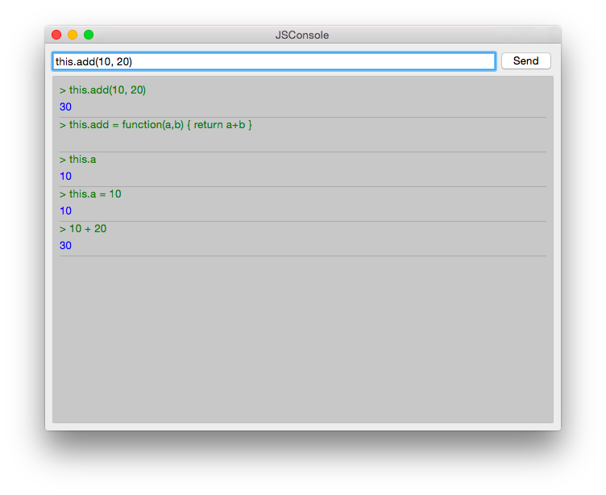

==========
JavaScript
==========

.. sectionauthor:: `jryannel <https://github.com/jryannel>`_

.. issues:: ch14

.. note::

    Last Build: |today|

    The source code for this chapter can be found in the `assets folder <../../assets>`_.

JavaScript is the lingua-franca on web client development. It also starts to get traction on web server development mainly by node js. As such it is a well suited addition as an imperative language onto the side of declarative QML language. QML itself as a declarative language is used to express the user interface hierachy but is limited to express operational code. Sometimes you need a way to express operations, here JavaScript comes into play.

.. note::

  There is an open question in the Qt community about the right mixture about QML/JS/QtC++ in a modern Qt application. The commonly agreed recommended mixture is to limit the JS part of your application to a minimum and do your business logic inside QtC++ and the UI logic inside QML/JS.

  This book pushes the boundaries, which is not always the right mix for a product development and not for everyone. It is important to follow your team skills and your personal taste. In doubt follow the recommendation.

Here a short example how JS looks like, mixtured in QML::

  Button {
    width: 200
    height: 300
    property bool checked: false
    text: "Click to toggle"

    // JS function
    function doToggle() {
      checked = !checked
    }

    onTriggered: {
      // this is also JavaScript
      doToggle();
      console.log('checked: ' + checked)
    }
  }

So JavaScript can come in many places inside QML as a standalone JS function, as a JS module and it can be on every right side of a property binding.

::

  import "util.js" as Util // import a pure JS module

  Button {
    width: 200
    height: width*2 // JS on the right side of property binding

    // standalone function (not really useful)
    function log(msg) {
      console.log("Button> " + msg);
    }

    onTriggered: {
      // this is JavaScript
      log();
      Qt.quit();
    }
  }

Within QML you declare the user interface, with JavaScript you make it functional. So how much JavaScript should you write? It depends on your style and how familar you are with JS development. JS is a loosely typed language, which makes it difficult to spot type defects. Also functions expect all argument variations, which can be a very nasty bug to spot. The way to spot defects is rigorous unit testing or acceptance testing. So if you develop real logic (not some glue lines of code) in JS you should really start using the test-first approach. In general mixed teams (Qt/C++ and QML/JS) are very successfull when they minimize the amount of JS in the frontend as the domain logic and do the heavy lifting in Qt C++ in the backend. The backend should then be rigorous unit tested so that the frontend developers can trust the code and focus on all these little user interface requirements.

.. note::

  In general: backend developers are functional driven and frontend developers are user story driven.

Browser/HTML vs QtQuick/QML
===========================

The browser is the runtime to render HTML and execute the Javascript associated with the HTML. Nowadays modern web applications contain much more JavaScript then HTML. The Javascript inside the browser is a standard ECMAScript environment with some browser additions. A typical JS environment inside the browser knows the ``window`` object to access the browser window. There are also the basic DOM selectors which are used by jQuery to provide the CSS selectors. Additional there is a ``setTimeout`` function to call a function after a certain time. Besides these the environment is a standard JavaScript environment similar to QML/JS.

What is also different is where JS can appear inside HTML and QML. In HTML you can only add JS on event handlers (e.g. page loaded, mouse pressed). For example your JS initializes normally on page load, which is comparable to ``Component.onCompleted`` in QML. For example you can not use JS for property bindings (at least not directly, AngularJS enhances the DOM tree to allow these, but this is far away from standard HTML).

So in QML JS is much more a first-class citizen and much deeper integrated into the QML render tree. Which makes the syntax much more readable. Besides this people which have developed HTML/JS applications will feel at home inside QML/JS.

The Language
============

This chapter will not give you a general introducton to JavaScript. There are other books out there for for a general introduction to JavaScript, please visit this great side on `Mozilla Developer Network <https://developer.mozilla.org/en-US/docs/Web/JavaScript/A_re-introduction_to_JavaScript>`_.

On the surface JavaScript is a very common language and does not differ a lot from other languages::

  function countDown() {
    for(var i=0; i<10; i++) {
      console.log('index: ' + i)
    }
  }

  function countDown2() {
    var i=10;
    while( i>0 ) {
      i--;
    }
  }

But be warned JS has function scope and not block scope as in C++ (see `Functions and function scope <https://developer.mozilla.org/it/docs/Web/JavaScript/Reference/Functions_and_function_scope>`_).

The statements ``if ... else``, ``break``, ``continue`` also work as expected. The switch case can also compare other types and not just integer values::

  function getAge(name) {
    // switch over a string
    switch(name) {
    case "father":
      return 58;
    case "mother":
      return 56;
    }
    return unknown;
  }

JS knows several values which can be false, e.g. ``false``, ``0``, ``""``, ``undefined``, ``null``). For example a function returns by default ``undefined``. To test for false use the ``===`` identity operator. The ``==`` equality operator will do type conversion to test for equality. If possible use the faster and better ``===`` strict equality operator which will test for identity (see `Comparison operators <https://developer.mozilla.org/en-US/docs/Web/JavaScript/Reference/Operators/Comparison_Operators>`_.

Under the hood javascript has its own ways of doing things. For example arrays::

  function doIt() {
    var a = [] // empty arrays
    a.push(10) // addend number on arrays
    a.push("Monkey") // append string on arrays
    console.log(a.length) // prints 2
    a[0] // returns 10
    a[1] // returns Monkey
    a[2] // returns undefined
    a[99] = "String" // a valid assignment
    console.log(a.length) // prints 100
    a[98] // contains the value undefined
  }

Also for people coming from C++ or Java which are used to a OO language JS just works different. JS is not purely an OO language it is a so called prototype based language. Each object has a prototype object. An object is created based on his prototype object. Please read more about this in the book `Javascript the Good Parts by Douglas Crockford <http://javascript.crockford.com>`_ or watch the video below.

.. youtube:: hQVTIJBZook

To test some small JS snippets you can use the online `JS Console <http://jsconsole.com>`_ or just build a little piece of QML code::

  import QtQuick 2.5

  Item {
    function runJS() {
      console.log("Your JS code goes here");
    }
    Component.onCompleted: {
      runJS();
    }
  }

JS Objects
==========

While working with JS there are some objects and methods which are more frequently used. This is a small collection of them.

* ``Math.floor(v)``, ``Math.ceil(v)``, ``Math.round(v)`` - largest, smallest, rounded integer from float
* ``Math.random()`` - create a random number between 0 and 1
* ``Object.keys(o)`` - get keys from object (including QObject)
* ``JSON.parse(s)``, ``JSON.stringify(o)`` - conversion between JS object and JSON string
* ``Number.toFixed(p)`` - fixed precision float
* ``Date`` - Date manipulation

You can find them also at: `JavaScript reference <https://developer.mozilla.org/en-US/docs/Web/JavaScript/Reference>`_

Here some small and limited examples how to use JS with QML. They should give you an idea how you can use JS inside QML

.. rubric:: Print all keys from QML Item

::

  Item {
    id: root
    Component.onCompleted: {
      var keys = Object.keys(root);
      for(var i=0; i<keys.length; i++) {
        var key = keys[i];
        // prints all properties, signals, functions from object
        console.log(key + ' : ' + root[key]);
      }
    }
  }

.. rubric:: Parse an object to a JSON string and back

::

  Item {
    property var obj: {
      key: 'value'
    }

    Component.onCompleted: {
      var data = JSON.stringify(obj);
      console.log(data);
      var obj = JSON.parse(data);
      console.log(obj.key); // > 'value'
    }
  }

.. rubric:: Current Date

::

  Item {
    Timer {
      id: timeUpdater
      interval: 100
      running: true
      repeat: true
      onTriggered: {
        var d = new Date();
        console.log(d.getSeconds());
      }
    }
  }

.. rubric:: Call a function by name

::

  Item {
    id: root

    function doIt() {
      console.log("doIt()")
    }

    Component.onCompleted: {
      // Call using function execution
      root["doIt"]();
      var fn = root["doIt"];
      // Call using JS call method (could pass in a custom this object and arguments)
      fn.call()
    }
  }

Creating a JS Console
=====================

As a little example we will create a JS console. We need an input field where the user can enter his JS expressions and ideally there should be a list of output results. As this should more look like a desktop application we use the QtQuick Controls module.

.. note::

  A JS console inside your next project can be really beneficial for testing. Enhanced with a Quake-Terminal effect it is also good to impress customers. To use it wisely you need to control the scope the JS console evaluates in, e.g. the current visible screen, the main data model, a singleton core object or all together.

We use Qt Creator to create a Qt Quick UI project using QtQuick controls. We call the project `JSConsole`. After the wizard has finished we have already a basic structure for the application with an application window and a menu to exit the application.

For the input we use a TextField and a Button to send the input for evaluation. The result of the expression evaluation is displayed using a ListView with a ListModel as the model and two labels to display the expression and the evaluated result.

::

  // part of JSConsole.qml
  ApplicationWindow {
    id: root

    ...

    ColumnLayout {
        anchors.fill: parent
        anchors.margins: 9
        RowLayout {
            Layout.fillWidth: true
            TextField {
                id: input
                Layout.fillWidth: true
                focus: true
                onAccepted: {
                    // call our evaluation function on root
                    root.jsCall(input.text)
                }
            }
            Button {
                text: qsTr("Send")
                onClicked: {
                    // call our evaluation function on root
                    root.jsCall(input.text)
                }
            }
        }
        Item {
            Layout.fillWidth: true
            Layout.fillHeight: true
            Rectangle {
                anchors.fill: parent
                color: '#333'
                border.color: Qt.darker(color)
                opacity: 0.2
                radius: 2
            }

            ScrollView {
                id: scrollView
                anchors.fill: parent
                anchors.margins: 9
                ListView {
                    id: resultView
                    model: ListModel {
                        id: outputModel
                    }
                    delegate: ColumnLayout {
                        width: ListView.view.width
                        Label {
                            Layout.fillWidth: true
                            color: 'green'
                            text: "> " + model.expression
                        }
                        Label {
                            Layout.fillWidth: true
                            color: 'blue'
                            text: "" + model.result
                        }
                        Rectangle {
                            height: 1
                            Layout.fillWidth: true
                            color: '#333'
                            opacity: 0.2
                        }
                    }
                }
            }
        }
    }
  }

The evaluation function ``jsCall`` does the evaluation not by itself this has been moved to a JS module (``jsconsole.js``) for clearer separation.

::

  // part of JSConsole.qml

  import "jsconsole.js" as Util

  ...

  ApplicationWindow {
    id: root

    ...

    function jsCall(exp) {
        var data = Util.call(exp);
        // insert the result at the beginning of the list
        outputModel.insert(0, data)
    }
  }

For safety we do not use the ``eval`` function from JS as this would allow the user to modify the local scope. We use the Function constructor to create a JS function on runtime and pass in our scope as this variable. As the function is created every time it does not act as a closure and stores its own scope, we need to use ``this.a = 10`` to store the value inside the this scope of the function. The this scope is set by the script to the scope variable.

::

  // jsconsole.js
  .pragma library

  var scope = {
    // our custom scope injected into our function evaluation
  }

  function call(msg) {
      var exp = msg.toString();
      console.log(exp)
      var data = {
          expression : msg
      }
      try {
          var fun = new Function('return (' + exp + ');');
          data.result = JSON.stringify(fun.call(scope), null, 2)
          console.log('scope: ' + JSON.stringify(scope, null, 2) + 'result: ' + result)
      } catch(e) {
          console.log(e.toString())
          data.error = e.toString();
      }
      return data;
  }

The data return from the call function is a JS object with a result, expression and error property: ``data: { expression: {}, result: {}, error: {} }``. We can use this JS object directly inside the ListModel and access it then from the delegate, e.g. ``model.expression`` gives us the input expression. For the simplicity of the example we ignore the error result.
